# Troubleshooting Software Factory errors

It is possible when running the Software Factory that one or more errors can occur, when this happens the Software Factory remains on the Execution tab for you to be able to review the logs to resolve them.

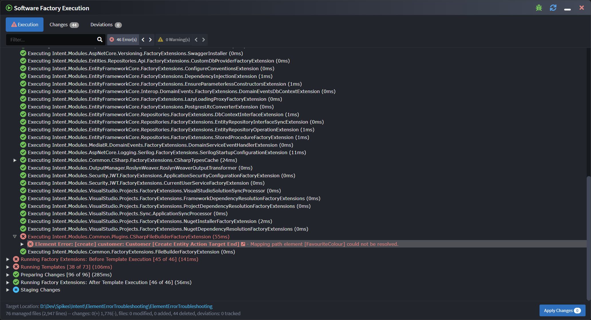

> [!TIP]
>
> You can quickly drill into the logs to the first error by clicking the "\<number\> Error(s)" button above the log.
>
> 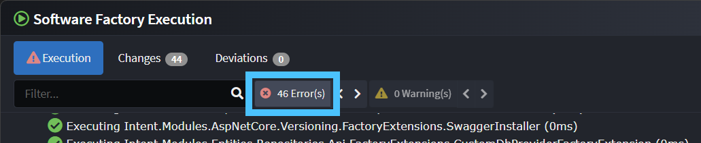

Errors can occur for a variety of reasons, the most common being invalid modelling in a designer (e.g. an element was intentionally deleted in the domain designer but it was still mapped to from the services designer). Sometimes errors can occur due to a bug in a Module or Intent Architect itself.

Sometimes a single error can cause a cascade of other errors, so it is recommended to look at the first error, resolve that, then run the Software Factory to see if there are more errors to still be resolved, again, by looking at the first error and repeating until all errors are resolved.

## Element Errors

An _Element Error_ is typically very easy to resolve, it is a special kind of error which occurs when the Software Factory has been able to determine that an error occurred when processing a particular element from a designer, very often due to an invalid modelling scenario in a designer.

The bolded text on these errors can be clicked on which will cause Intent Architect to navigate to the designer and the element within for which the error occurred:

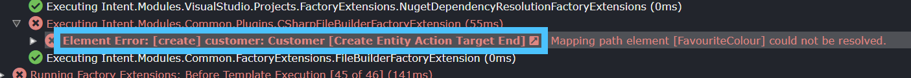

Very often just looking at the element that was navigated to in the designer is enough to quickly see how to resolve the issue and prevent the same error for the next Software Factory execution.

In this example it has jumped to the following and if we hover over the red triangle with the exclamation mark it has some additional information:

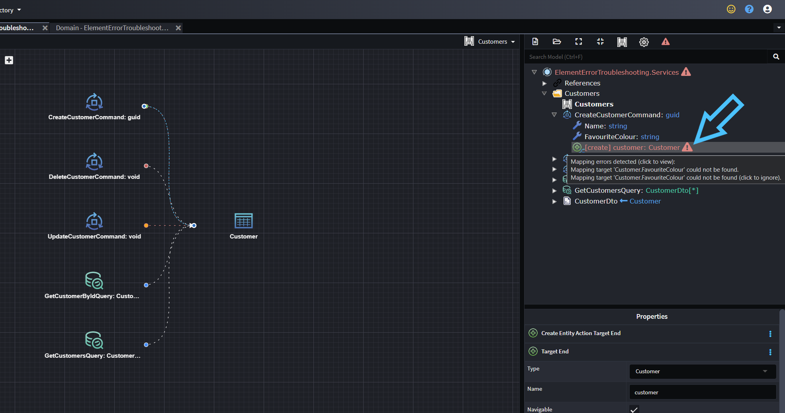

In this case we can click the triangle which will open the mapping screen:

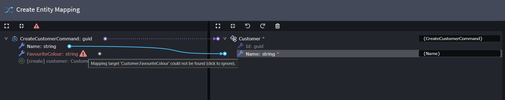

We can see from the error that the mapping target could not be found, in this example it is because the `FavouriteColour` attribute on the `Customer` class was deleted. A solution here is to delete the field:

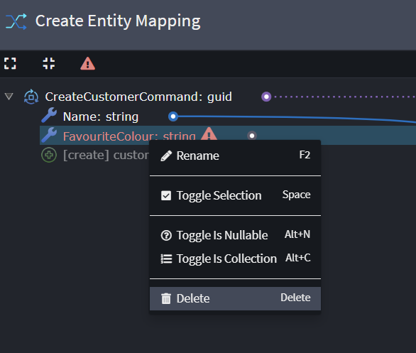

We can then press _DONE_ on the dialogue to apply the changes.

After doing so we can see by the red triangle above the designer tree view that there is at least one more error still, we can click the red triangle to select all elements with errors:

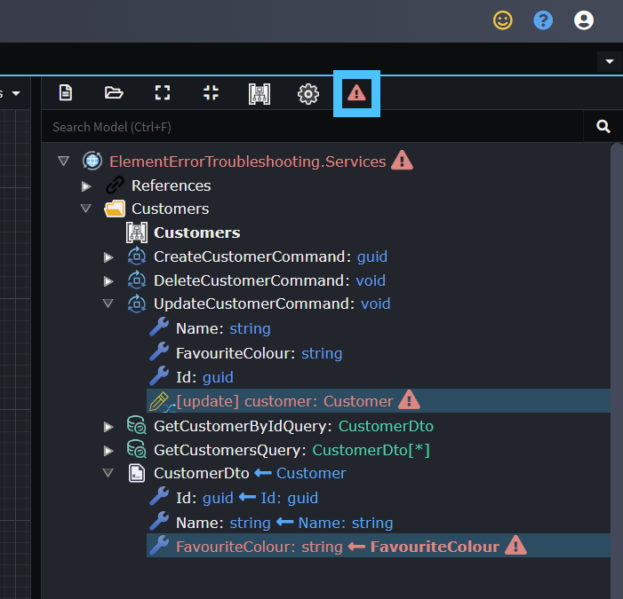

The first error on the `[update]` mapping under the `UpdateCustomerCommand` can be fixed in the same way as the `[create]` mapping above.

For the `FavouriteColour` field under `CustomerDto`, the field can simply be deleted.

In this example after doing the above actions the red triangle is now gone and we can see there are no more errors:

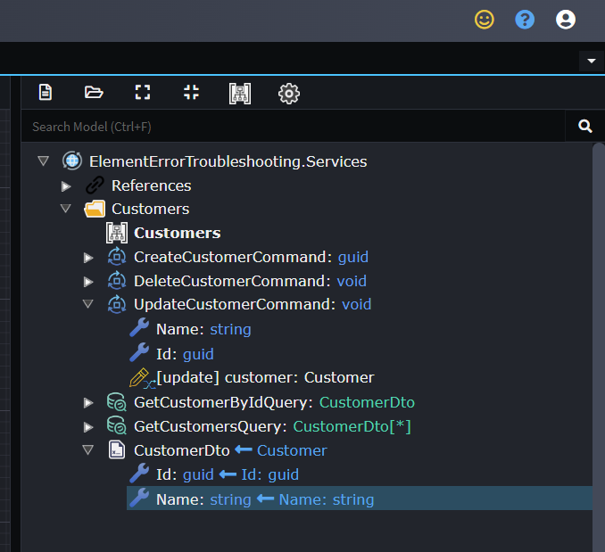

We can now save the designer, run the Software Factory, and we should see it no longer shows errors during execution:

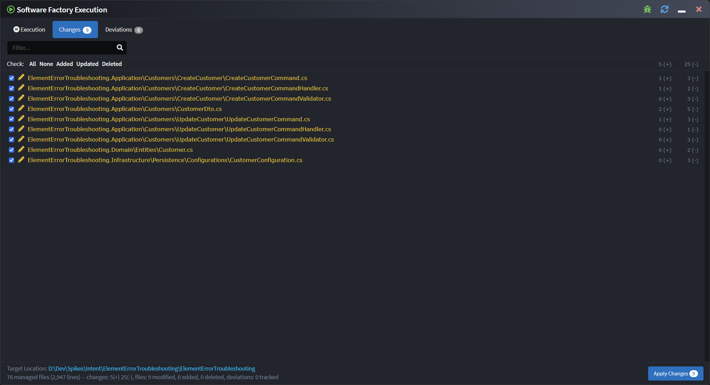

### What to do if there are no errors visible in the designer

Sometimes when you navigate to the element causing the error it may not show an error in the designer and there is no obvious problem, in such cases you should look at additional details on the error by expanding its log tree node and treating it as you would a ["general" error](#general-errors).

## "General" errors

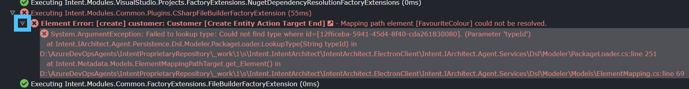

Sometimes looking at just the error text can be enough to find a resolution yourself, other times you may want to contact [Intent Architect support](https://github.com/IntentArchitect/Support) or the module's author with the error details to receive additional help.

Errors can be copied to your clipboard by right-clicking the particular log entry and selecting the "Copy" option or using the Ctrl+C keyboard shortcut:

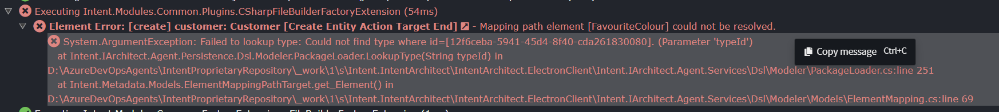
