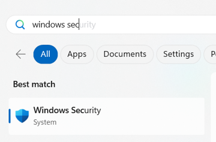
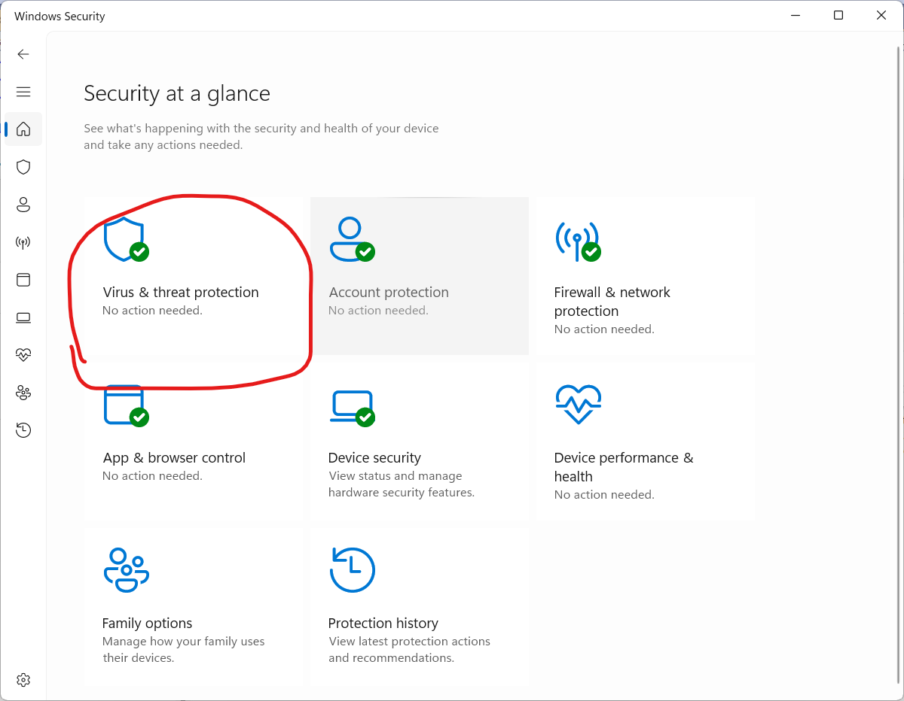
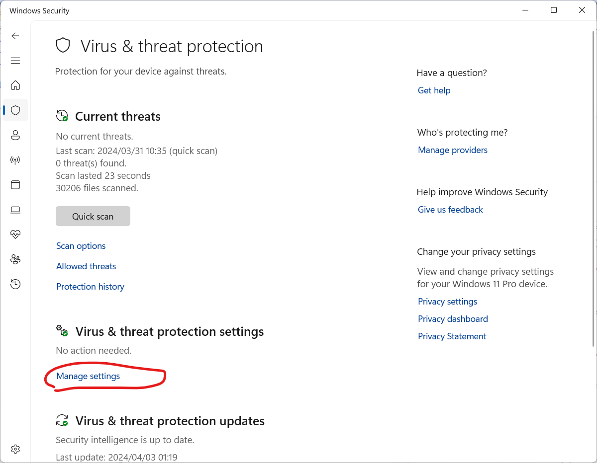
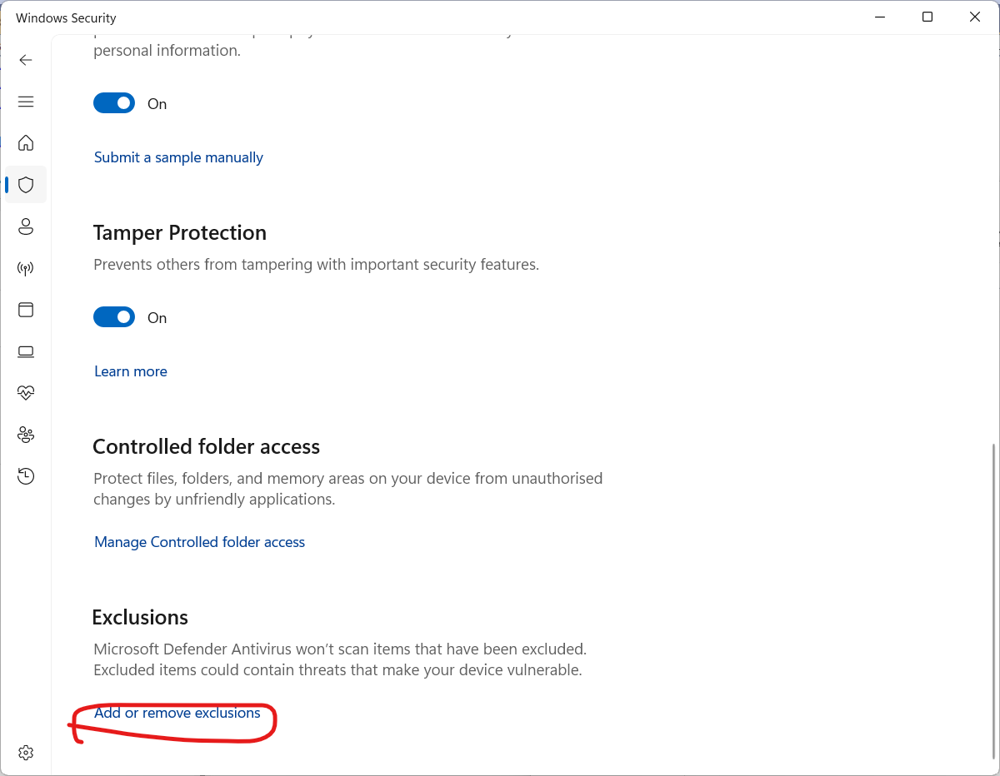

# Windows Defender Exclusions

## Overview

Windows Defender is a built-in antivirus and anti-malware component of Windows 10 and Windows 11. It provides real-time protection against a wide range of threats, including viruses, malware, and spyware. However, in some cases, Windows Defender might interfere with Intent Architect leading to slow Software Factory startup times.
This article will guide you through the process of adding file and directory exclusions to Windows Defender which will instruct it not to scan those files or folders when they are being executed or accessed.

## Adding Exclusions in Windows 11

* Open Windows Security by clicking on the Start menu and selecting the shield icon to open Windows Security. Alternatively, you can search for "Windows Security" in the search bar.
  
* In the Windows Security window, click on "Virus & threat protection" on the left sidebar.
  
* Scroll down to the "Virus & threat protection settings" section and click on "Manage settings."
  
* In the settings window, scroll down to the "Exclusions" section. Here, you will find options to add exclusions for files, folders, file types, and process exclusions.
  
* Add Exclusions:
  * For Folders: Click on "Add or remove exclusions" under the "Folders" section. In the window that opens, click on "Add an exclusion," then browse to the folder you want to exclude (e.g., C:\Program Files or your Dev folder) and select it. Click "Select Folder" and then "OK."
  * For Files: Click on "Add an exclusion" under the "Files" section. Browse to the file you want to exclude (e.g., Intent.SoftwareFactory.Host.exe or dotnet.exe), select it, and click "Open."
  * For Processes: Click on "Add an exclusion" under the "Processes" section. Type the name of the process you want to exclude (e.g., Intent.SoftwareFactory.Host.exe or dotnet.exe) and click "Add."
* After adding the exclusions, you will be prompted to confirm. Click "OK" to save your changes.

By following these steps, you can effectively manage Windows Defender's behavior and ensure that it does not interfere with your system's performance or your development work.

> [!NOTE]
> You may need to consult your IT department in providing access in order to perform these exclusions. You are also opening up areas of vulnerability so caution should be exercised.
