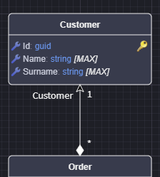
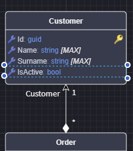
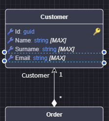
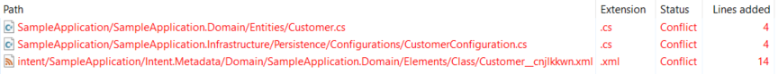
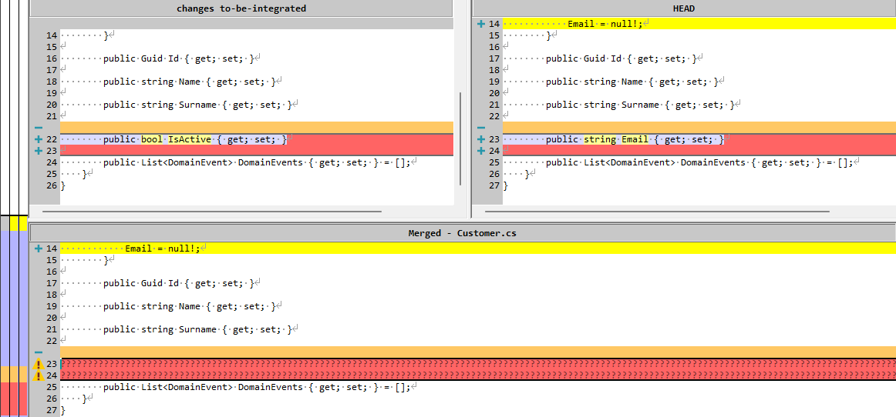
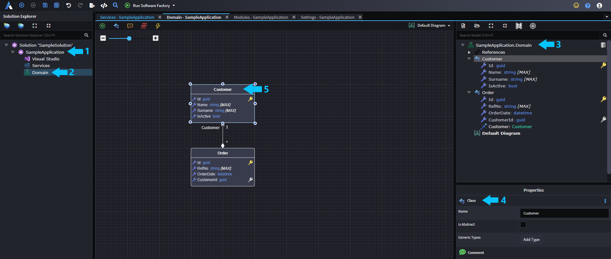
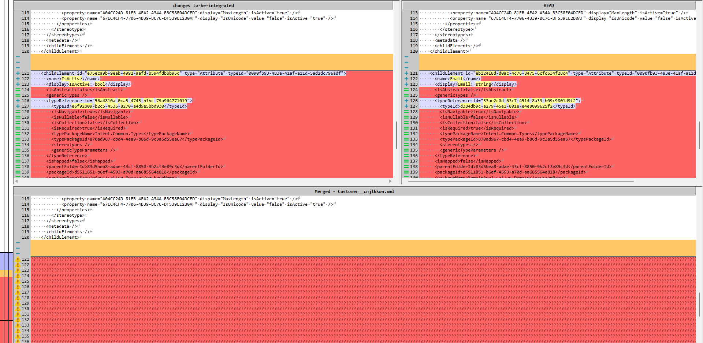
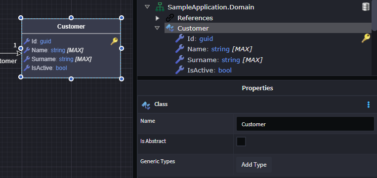
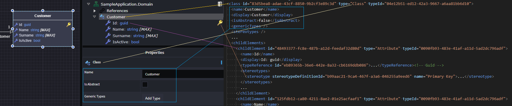
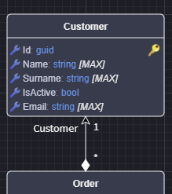

# Understanding and Resolving Merge Conflicts involving Intent Architect Metadata Files

Everything you design within Intent Architect is persisted as `xml` files in the **intent**. As with any files stored in a repository it is possible for the same file to be edited in different ways across branches or users, if which case you will end up with a **merge conflict** you will need to resolved. This is not unlike have to resolve merge conflicts in a **csproj** file, it can be intimidating merging a file you are nto familiar with, but once you understand the contents it's straight forward.

We do endeavour to make our metadata file human readable and appropriately sized to minimize conflicts.

You can apply standard development practices to reduce the frequency and the complexity of merge conflicts, for example:

- **Pull frequently**, regularly fetch and merge changes from the main branch to stay in sync.
- **Keep branches short-lived**, work in small, focused branches and merge them quickly.
- **Communicate with your team**,  coordinate when multiple people are working on related areas.
- **Avoid large commits**,  make atomic commits that are easier to review and merge.
- **Rebase instead of merging (when appropriate)**, Keeps history clean and conflicts easier to manage.
- **Use tools for visual diffing**, tools like Beyond Compare, Meld, or built-in IDE tools help clarify changes

## Understanding a Merge Conflict by Example

Assume you have a `Customer` entity, and this design is a already committed in the `development` branch.



Now you want to make a change to the `Customer`, in this example the **IsActive** `Attribute` has been added.



Now lets assume another developer made the following change, they have added an `Email` attribute to and `Customer` and pushed it into the `development` branch.



Now when want to get my changes into development I will get a merge conflict which would look something like this.



Looking at the files involved we can see there are 2 categories of conflict:

- **Codebase files**,  **...Customer.cs** and **...CustomerConfiguration.cs**.
- **Intent Architect Metadata files**, **Customer__cnjlkkwn.xml**.

### Merging Codebase files

Lets look at the **Customers.cs** as an example.



This is just a standard merge conflict developers would be accustomed to dealing with, here the resolution is simply to add both properties to the `Customer` class.

> [!NOTE]
> If these codebase changes are **fully automated** i.e. the code is fully generated with no deviations or customizations, it doesn't really matter how you resolve these files as they will re-generate them once you have resolved the Intent Architect metadata file conflicts.

### Merging Intent Architect Metadata files

Now lets look at merging the **Customer__cnjlkkwn.xml** file, before we look at the content, there is already a lot of context available to us in the file name.

There is a lot of information in the file name which can assist with understanding what part of the design has a merge conflict.

```text
...\intent\SampleApplication\Intent.Metadata\Domain\SampleApplication.Domain\Elements\Class\Customer__cnjlkkwn.xml
```

Here is what the various folders represent:

```text
...\intent\{Application Name}\Intent.Metadata\{Designer Name}\{Package Name}\Elements\{Element Type}\{Instance Name}__cnjlkkwn.xml
```

Extracting the data

|No|Concept|Value|
|--|----------------|--------------|
|1 |Application Name|SampleApplication|
|2 |Designer|Domain|
|3 |Package Name|SampleApplication.Domain|
|4 |Element Type|Class|
|5 |Instance Name|Customer|

And Visually we can locate this in Intent Architect as follows:



In this example, you knew the nature of what the conflict was going to be because the entire scenario had been explain, but if you had no context on what other developer had done, at this point you could reason, based on the file name, that both you you have made changes to the `Customer` `Entity` in the `Domain` in the `SampleApplication` application.

Looking at the actual merge conflict we would see the following:



Before getting into the resolution, lets explore this file a little to understand what we are looking at:

This is what we have modelled:



And this is what the **Customer metadata file** looks like.

```xml

<?xml version="1.0" encoding="utf-8"?>
<class id="83d5bea8-adae-43cf-8850-9b2cf3e89c3d" type="Class" typeId="04e12b51-ed12-42a3-9667-a6aa81bb6d10">
  <name>Customer</name>
  <display>Customer</display>
  <isAbstract>false</isAbstract>
  <genericTypes />
  <stereotypes />
  ...
  <childElements>
    <childElement id="48493377-fc8e-487b-a12d-feedaf32d80d" type="Attribute" typeId="0090fb93-483e-41af-a11d-5ad2dc796adf">
      <name>Id</name>
      <display>Id: guid</display>
      <typeReference id="eb89365b-36e6-442e-8a32-cb6169ddb086">...</typeReference><!-- Guid -->
      <stereotypes>
        <stereotype stereotypeDefinitionId="b99aac21-9ca4-467f-a3a6-046255a9eed6" name="Primary Key">...</stereotype>
      </stereotypes>
      ...
    </childElement>
    <childElement id="125fdb12-ca80-4211-8ae2-01e25acfaaf1" type="Attribute" typeId="0090fb93-483e-41af-a11d-5ad2dc796adf">
      <name>Name</name>
      <display>Name: string</display>
      ...
    </childElement>
    <childElement id="8495e09c-999a-40b9-b72d-1b77c49e0627" type="Attribute" typeId="0090fb93-483e-41af-a11d-5ad2dc796adf">
      <name>Surname</name>
      <display>Surname: string</display>
      ...
    </childElement>
```

Looking at the Xml Metadata file you can see how it structurally translates to the visuals you are seeing in the `Tree View` and if you select `Element`s like the `Entity` or an `Attribute` and look at the `Property Pane` you'll start seeing some of the elements from the Xml file.



Now that we understand what is going on in the file, lets revisit the merge conflict.


Looking at the merge conflict with a better understanding of the file, you easily reason that 2 attributes have been added,  `IsActive` which you added and `Email` which another developer has added. And now you are well positioned to resolve the conflict. In this case you would choose to keep both attributes.

### After Resolution, run the Software Factory

Once you have resolved the conflicts, you should go back to Intent Architect and it will prompt you to reload the designers as teh underlying files have changed.
Going to the Domain Designer you will see the update `Customer` in the domain model.



NextRe-run the Software, to ensure the generated code base is correctly aligned with the design after merging.

## The Structure of the Intent Architect Metadata folder

### Navigating from model to Metadata file