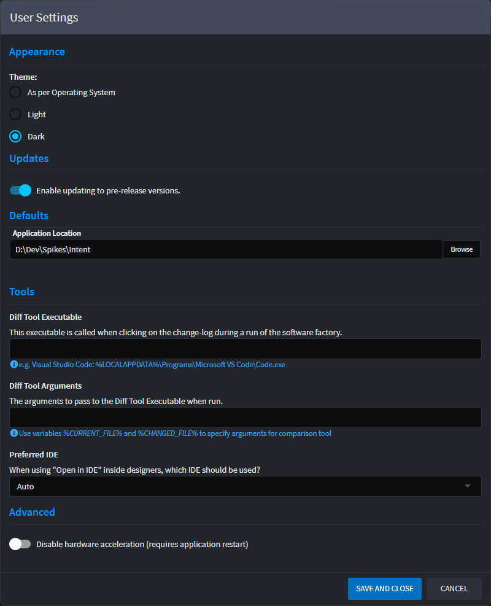

# How to change user settings

To access the user settings:

1. Click your user Display Name dropdown at the top right-hand corner of the screen.
2. Click on `Settings`

## Theme

Choose between dark theme or light. By default Intent Architect will use your operating systems' theme settings.

## Updates

From time to time, Intent Architect may release pre-release versions of the product. To be notified and able to update to a new pre-release, enable the `Enable updating to pre-release versions` toggle. It is recommended that you keep this setting disabled as pre-releases can be less stable than official ones.

## Default Application locations

This is the default location that Intent Architect will use when creating a new Application from the home view.

## Diff Tools

Intent Architect supports the use of any Diff tool that can be executed from the CLI. By default (if blank), Intent Architect will use Visual Studio Code if it has been installed. It will fall back to using Visual Studio, and finally, if neither can be found, a Diff tool will need to be specified manually here.
