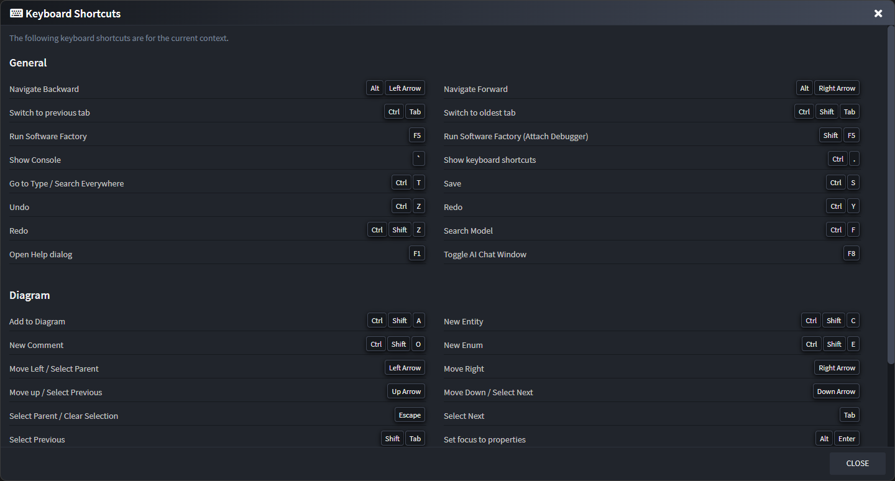

<!-- Workaround to align the column widths consistently -->

# Keyboard Shortcuts

>[!NOTE]
>For Apple users the `Ctrl` button is substituted by the `⌘` (command) key.

At any point you can bring up the Keyboard shortcuts legend by pressing `Ctrl` + `.`. This will give an overview of all the available shortcuts for the current view you're on.

## Special usages

### Create new element of selected type

[!Video-Loop videos/new-of-selected-type.mp4]

### Mouse Panning

[!Video-Loop videos/panning.mp4]
