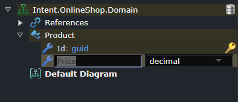
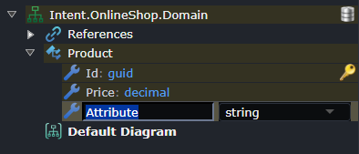

<!-- Workaround to align the column widths consistently -->

# Keyboard Shortcuts

At any point you can bring up the Keyboard shortcuts legend by pressing `Ctrl + .`. This will give an overview of all the available shortcuts for the current view you're on.

> [!NOTE]
>
> For macOS users the `Ctrl` button is substituted by the `⌘` (command) key.

## Special usages

### Create new element of selected type

When on an element the `Ctrl + Enter` shortcut can be used to make a new element of the same type, this can be very useful when needing to create lots of elements of the same type, for example domain class attributes or DTO fields.

For example, while having typed in the name of an element, before having even pressed enter to complete the change:

Press `Ctrl + Enter` which completes the creation of the previous element, creates a new element of the same type and is ready for you immediately start typing the name for the new element:

### Mouse Panning

To pan a diagram click and hold the middle button on it and move your mouse.

If you're on a touch pad or middle-clicking is not conveniently available, you can alternatively `Ctrl + Left-Click` and move your mouse on the diagram.
