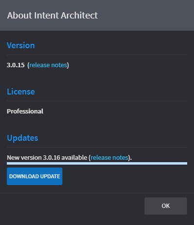

# The About Dialog

The About Dialog:

- Shows the version of Intent Architect you are running and a link to the release notes for it.
- Shows the license assigned to your account at the time you logged into Architect Architect.
- Shows if a new update is available along with its version and a link to its release notes.

## Accessing the About Dialog

The About Dialog can be accessed by clicking on your user display name in the top-right corner of the window and then clicking the `About` option:

