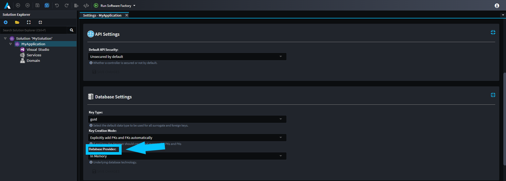
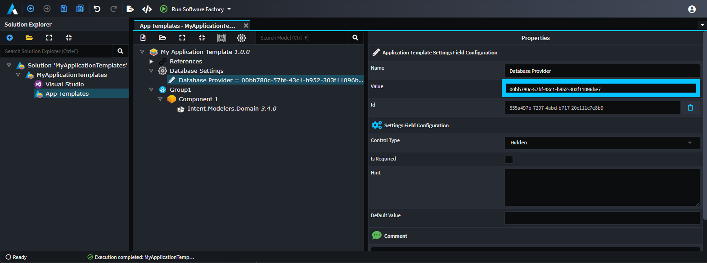

# How to create Application Templates

This how-to guide will walk you through creating your own [Application Template](xref:application-templates.overview) using the `Intent Application Template Builder` [Designer](xref:application-development.modelling.about-designers).

## Create a new Application

Create a new `Intent Application Template Builder` application and give it the name `MyApplicationTemplates`:


- Click `NEXT`.
- Leave the ticked options as is and click `CREATE`:


Once the `Application Installation` is complete, you will see a 'Ready' message.

## Create a new Package

- Click on the `App Templates` Designer on the left.
- Click `CREATE NEW PACKAGE`.
- Give the package a name of `My Application Template`.
- Click `DONE`.
- Click the root Package element and in the Properties pane on the right:
  - For `Display Name` enter `My Application Template`:

[!Video-Loop videos/create-package.mp4]

## Specify a Group and a Component

- Right-click the root Package element and click the `New Group` option.
- Give the new element a name of `Group 1`.
- Right-click the `Group 1` element and click the `Add Component` option.
- Give the new element a name of `Component 1`.
- Click the root `Component 1` element and in the Properties pane on the right:
  - For `Icon` use the ellipses to [choose an icon](xref:application-development.user-interface.how-to-use-the-change-icon-dialogue):

[!Video-Loop videos/create-group-and-component.mp4]

## Add a Module

- Right-click the `Component 1` element and click the `Add Module` option.
- Give the new element a name of `Intent.Modelers.Domain`.

    > [!IMPORTANT]
    > This must be the exact name of a [module](xref:application-development.applications-and-solutions.about-modules) which is to be installed by the Application Template.
- Click the root `Intent.Modelers.Domain` element and in the Properties pane on the right:
  - For `Version` enter `3.4.0`.

    > [!IMPORTANT]
    > This must be a valid version for the Module name chosen above.


## Run the Software Factory to generate the module

Run the Software Factory and optionally review the proposed changes:


Click `APPLY CHANGES`.

Before you dismiss the Software Factory Execution dialog (after it's completed applying all the changes) expand the second last item called `Finalizing Execution`, then `Execution Life Cycle` to see that a `dotnet build` was executed on the generated `Visual Studio` solution:


Take note of the following line in the output for the following step:

```text
Successfully created application template C:\Dev\.Intent-modules\My Application Template.1.0.0.iat
```
> [!IMPORTANT]
> This output location may be different depending on your environment configuration. 
 
Click on the close button.

## Test your Application Template

Ensure you have added the output path as noted in the above step as a repository in the [Repository Manager](xref:application-development.applications-and-solutions.how-to-manage-repositories).

Add a new Asset Repository with the name `My Modules` and address `C:\Dev\.Intent-modules` (this is the folder where your `.iat` file is located), then click `Save`.


In the Solution Explorer click to add a new application.
Ensure your module repository is selected in the drop down and you should see your application template:


Give it a name and click `NEXT`.


Notice that it's showing all the elements we created in the [Specify a Group and a Component](#specify-a-group-and-a-component) and [Add a Module](#add-a-module) steps.

## Defining user configurable settings

Application Templates also allow defining of user configurable options, for example in the following screen shot, the contents of the highlighted box is configurable:


### Settings Configurations

In the above screenshot, the `Basic Settings` is a Settings Configuration which can one or more Fields. An Application Template can have multiple Settings Configurations defined with each one having in a separate "heading" for itself.

To create a Settings Configuration, right-click the Package node in the Application Template Designer and use the `New Settings Configuration` option.

> [!NOTE]
> If you try run the Software Factory to test the updated Application Template you will not see any effect yet as the New Application wizard hides Settings Configurations with no fields or where all fields for it are `Hidden`.

### Field Configurations

Each Settings Configuration can have one or more `Field Configuration`s within it. A Field Configuration's `Name` is used as the display label presented on the wizard's UI and a Field Configuration's `Value` setting is the logical setting name that can be referred to for consuming the value of the Field Configuration which was captured by the user in the wizard.

To create a Field Configuration, right-click a `Settings Configuration` and use the `Add Field` option.

#### Control Type

The `Control Type` property is used to control what kind of control is used in the wizard UI for the field. The following options are available:

| Control Type | Description |
| ------------ | ----------- |
| Text Box     | A single line text field. |
| Number       | Allows capturing of numeric only values. |
| Checkbox     | A checkbox for capturing boolean values. |
| Switch       | An alternative to the `Checkbox` control for capturing boolean values which instead looks like a switch. |
| Text Area    | A text box which allows capturing text with multiple lines. |
| Select       | A combo-box which allows selecting a single [](#field-options). |
| Multi-Select | A combo-box which allows selecting multiple [](#field-options). |
| Hidden       | The field will not display in the wizard UI, but its default value can still be consumed. |

#### Is Required

When set, the wizard UI will not allow the user to proceed unless a value for the Field Configuration has been captured.

#### Hint

Text which appears below the field which can be used to further explain how the captured value for the Field Configuration should be used or what it is for.

#### Default Value

Used to set the default value for the Field Configuration.

### Field Options

Are presented as available options for `Select` and `Multi-Select` [Control Types](#control-type).

A Field Option's `Name` controls the display name of the Field Option in the UI and the Field Option's `Value` is used to to define the value that is ultimately consumed when a Field Option is selected.

To create a Field Option, right-click a Field Configuration and use the `Add Option` option.

### Consuming values captured during the wizard

#### For Metadata `.installation.config` files

All Field Configuration values are available as [template strings](xref:module-building.application-templates.metadata-installation#template-strings) for use in `.installation.config` files. Use a Field Configuration's `Value` using the `${<value>}` format and it will be substituted with the user captured (or otherwise default) value. For example, for a [Field Configuration](#field-configurations) with a `Name` of `Custom Field` and a `Value` of `custom-field`:


You would use `${custom-field}` in `.installation.config` files to have the user captured value substituted.

#### For Module Settings

Application Templates can set initial Module Setting field values with values from `Field Configuration`s.

The Field Configuration's value as configured in the Application Template builder will need to match the `id` of the Module Setting's field.

A quick way of finding this `id` is to install the Module in an Application and then look at the Application's `.application.config` file to find the field with its `id`.

An Application's `.application.config` file path can be located on the `Settings` screen and the path can be clicked on to have the file revealed in your OS's file system browser:


Make note of the Module Setting Field's label from Settings screen to be able to search for it in the `.application.config` file, for example if we want to set the value for `Database Provider` field, we make note of the label being that name:



Then search for the text of the label in the `.application.config` file and on the same element is the `id` attribute with the value that we need:


We then use the `id` value as the `Value` for the `Field Configuration`:



Because Module Settings can still be changed after using the Application Template wizard, it's common to simply give these fields a default value and set their `Control Type` to `Hidden`:


## Next steps

You can use the `App Templates` Designer to add/change Groups, Components, Modules and Settings Configuration, re-run the Software Factory and see the affect it has on your Application Template when used in Intent Architect.

Using the [metadata installation](xref:module-building.application-templates.metadata-installation) system, new applications created with your template can have default metadata installed, for example you could have the Visual Studio designer on the new application pre-configured with your desired solution and project layout.

## See also

- [](xref:application-templates.overview)
- [](xref:module-building.application-templates.metadata-installation)
- [](xref:module-building.application-settings)
