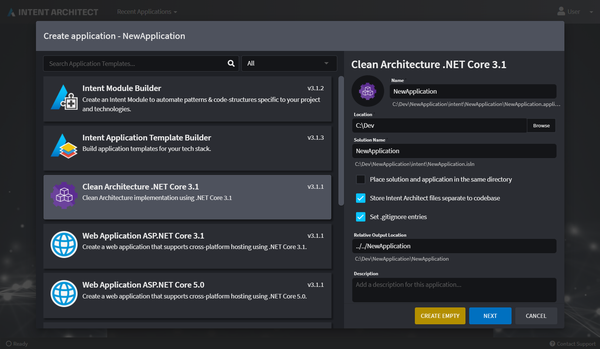

# About Applications

Applications in Intent Architect represent a _scope of code files_ that we want to automate. It could be a full-stack monolithic application, a microservice, or even just a single folder in which we wish to generate and manage files.

Applications are fundamentally composed of installed [Modules](xref:references.modules), [Designers](xref:references.designers) and some high-level configuration settings.

Creating a new application in Intent Architect can be done by clicking on the "Create a new application" button in the home view to launch the _Create application_ wizard.

The first page of the wizard lists the available [Application Templates](xref:applications.about-application-templates) in the selected Repository (by default this will be Intent Architect's website [https://intentarchitect.com/](https://intentarchitect.com/) but could be a local directory or network location. [Learn how to change your default repositories here](xref:how-to-guides.change-user-settings)).

Here you can search and choose which application template you want and directly set key settings like the Application's name, location and [solution](xref:applications.about-solutions) name.

> [!NOTE]
> It is possible to create an empty application by clicking on the `CREATE EMPTY` button instead of `NEXT`. This would create a new application without any Modules or metadata installed.
