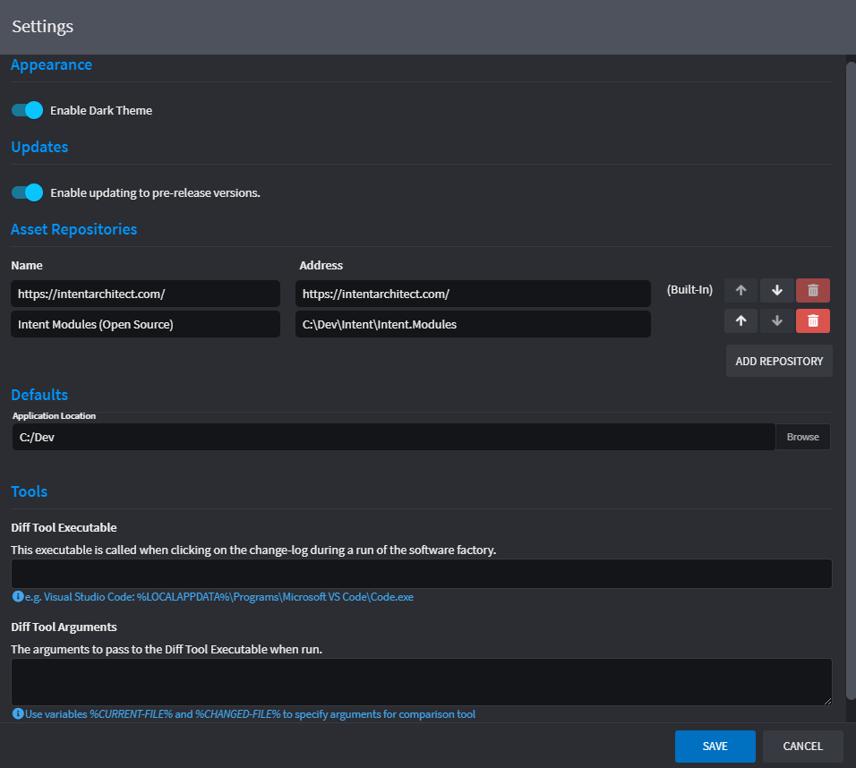
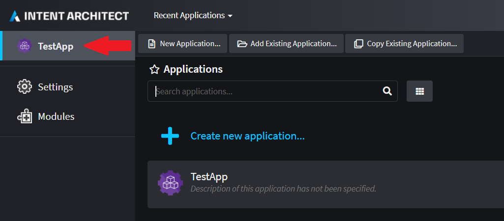
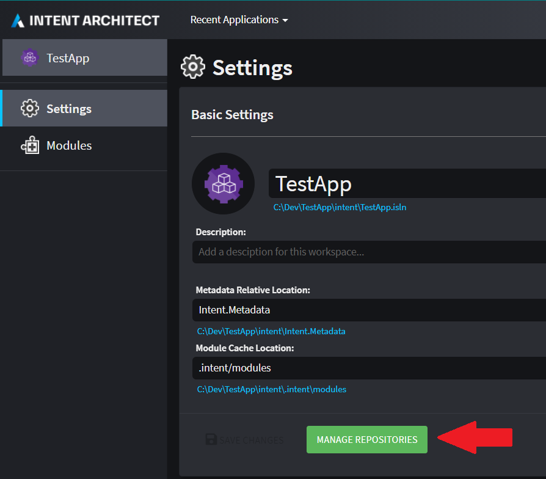
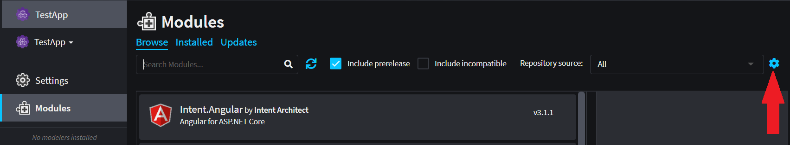

# How to manage Repositories

Asset Repositories represent the default available repositories that are searched when discovering Modules and Application Templates. By default the Intent Architect server is available `https://intentarchitect.com`, which hosts all the official Open Source modules.

Repositories can also point to local folders and network locations, and can be overridden at the Intent Solution level and Application level. Local folders need to be fully qualified for User Settings, but can be relative locations for Intent Solutions and Applications.

## Managing on a global level

Open up your user settings to specify Repositories on a global level so that you can make use of those Modules and Application Templates irrespective of which solution or application you are working on in Intent Architect:

* Click your user Display Name dropdown at the top right-hand corner of the screen.
* Click on `Settings`

See [here](xref:user-interface.about-asset-repositories) on how the Asset Management dialog works.

## Managing on a solution level

Repositories can be specified on a solution level of Intent Architect. This will ensure that Repositories specified on a global level will not be scanned in addition to the Repositories that are specified on a solution level.

Click on your Intent Architect solution icon in the top left corner.

Click on `Settings` and then on `Manage Repositories`.

See [here](xref:user-interface.about-asset-repositories) on how the Asset Management dialog works.

> [!NOTE]
> A `intent.repositories.config` file will be created in the same folder as your `.isln` file for Intent Architect. Deleting this file will reset behaviour so that Intent Architect will scan your global level repositories again.
> [!NOTE]
> In almost all cases [global level](#managing-on-a-global-level) repositories should be used. Solution level repositories should only be used when you want to use a relative path to assets which is consistent across different developer computers, such as when the modules solution is in the same source code repository as the solution which uses the modules.

## Managing on an application level

Repositories can be specified on an application level of Intent Architect. This will ensure that Repositories specified on a global or solution level will not be scanned in addition to the Repositories that are specified on an application level.

Navigate to the application found in Intent Architect where the Repository will be added. Click on `Modules` and then on the gear icon located on the right hand side of the screen.

See [here](xref:user-interface.about-asset-repositories) on how the Asset Management dialog works.

> [!NOTE]
> A `intent.repositories.config` file will be created in the same folder as your Application's `.application.config` file for Intent Architect. Deleting this file will reset behaviour so that Intent Architect will scan your solution or global level repositories again.
> [!NOTE]
> In almost all cases [global level](#managing-on-a-global-level) repositories should be used. Application level repositories should only be used when you want to use a relative path to assets which is consistent across different developer computers, such as when the modules solution is in the same source code repository as the solution which uses the modules.