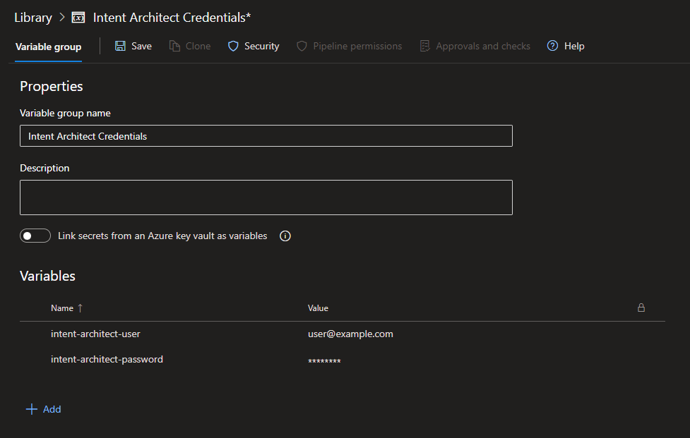

<!-- Workaround to align the column widths consistently -->
<style>
table th:first-of-type {
    width: 375px;
}
</style>

# Software Factory CLI

A CLI (Command Line Interface) version of the Intent Architect Software Factory is available. The Software Factory CLI does not support applying Software Factory changes as it is intended for use on CI (continuous integration) servers to bring to attention that code has been committed which is out of alignment with what is generated by Intent Architect.

It will output warnings when a file has been ignored and it will output an error when there are any non-ignored outstanding changes to be applied, thus it can be used to "break the build" as a quality gate on your CI server.

## Pre-requisites

Latest Long Term Support (LTS) version of [.NET](https://dotnet.microsoft.com/download).

## Installation

The Software Factory CLI is available as a [.NET Tool](https://docs.microsoft.com/dotnet/core/tools/global-tools) and can be installed with the following command:

```powershell
dotnet tool install Intent.SoftwareFactory.CLI --global
```

> [!NOTE]
> If `dotnet tool install` fails with an error to the effect of `The required NuGet feed can't be accessed, perhaps because of an Internet connection problem.` and it shows a private NuGet feed URL, you can try add the `--ignore-failed-sources` command line option ([source](https://learn.microsoft.com/dotnet/core/tools/troubleshoot-usage-issues#nuget-feed-cant-be-accessed)).

You should see output to the effect of:

```text
You can invoke the tool using the following command: intent-cli
Tool 'intent.softwarefactory.cli' (version 'x.x.x') was successfully installed.
```

## Usage

`intent-cli <username> <password> <isln-path> <application-id> [options]`

### Arguments

|Argument|Description|
|-|-|
|`<username>`        |Username for an active Intent Architect account.|
|`<password>`        |Password for the Intent Architect account.|
|`<isln-path>`       |Path to the Intent Architect solution (.isln) file.|
|`<application-id>`  |The Id of the Intent Architect application. This can be obtained by right-clicking the application in the solution view.|

### Options

|Option|Description|
|-|-|
|`--warning-logging-command <warning-logging-command>`  |Command to use for logging a warning. Some continuous integration environments watch output for "commands" for logging of warnings. See the documentation on [Serilog.Expressions ExpressionTemplate](https://github.com/serilog/serilog-expressions#formatting-with-expressiontemplate) for formatting options.|
|`--error-logging-command <error-logging-command>`      |Command to use for logging an error. Some continuous integration environments watch output for "commands" for logging of errors. See the documentation on [Serilog.Expressions ExpressionTemplate](https://github.com/serilog/serilog-expressions#formatting-with-expressiontemplate) for formatting options.|
|`--attach-debugger`                                    |The Software Factory will pause at startup giving you chance to attach a .NET debugger.|
|`--version`                                            |Show version information|
|`-?`, `-h`, `--help`                                   |Show help and usage information|

## Example: Azure Pipelines

### Create a variable group with the Intent Architect account details

[Create a variable group](https://docs.microsoft.com/azure/devops/pipelines/library/variable-groups#create-a-variable-group) with the Intent Architect account details, for example:



### Link the variable group to the pipeline you want to use it in

Variable groups are defined globally for an Azure DevOps project, to be able to access a variable group for a particular pipeline, it needs to be [linked to it](https://docs.microsoft.com/azure/devops/pipelines/library/variable-groups#use-a-variable-group).

### Add the variable group and other variables to the pipeline YAML file

To make the variable group available to a stage within your pipeline, it will need to be added to its variables. You may also want to define variables for the other command line arguments and options:

```yml
variables:
- group: 'Intent Architect Credentials'
- name: 'intent-solution'
  value: 'intent/MySolution.isln'
- name: 'intent-application-id'
  value: '3b49b159-05a0-4016-aa1b-4c8da4636cf2'
- name: 'warning-logging-command'
  value: '##vso[task.logissue type=warning;]{@m} {@x}\n'
- name: 'error-logging-command'
  value: '##vso[task.logissue type=error;]{@m} {@x}\n'
```

### Create a step to install the CLI

```yml
- task: PowerShell@2
  displayName: 'Install Intent Architect Software Factory CLI'
  inputs:
    targetType: 'inline'
    pwsh: true
    script: 'dotnet tool install Intent.SoftwareFactory.CLI --global'
```

### Create a step to run the CLI

```yml
- task: PowerShell@2
  displayName: 'Run Intent Architect Software Factory CLI'
  inputs:
    targetType: 'inline'
    pwsh: true
    script: 'intent-cli "$(intent-architect-user)" "$(intent-architect-password)" "$(intent-solution)" "$(intent-application-id)" "--warning-logging-command" "$(warning-logging-command)" "--error-logging-command" "$(error-logging-command)"'
```

### A complete YAML file

```yml
trigger:
  batch: 'true'
  branches:
    include:
    - '*'

pool:
  vmImage: 'ubuntu-latest'

variables:
- group: 'Intent Architect Credentials'
- name: 'intent-solution'
  value: 'intent/MySolution.isln'
- name: 'intent-application-id'
  value: '3b49b159-05a0-4016-aa1b-4c8da4636cf2'
- name: 'warning-logging-command'
  value: '##vso[task.logissue type=warning;]{@m} {@x}\n'
- name: 'error-logging-command'
  value: '##vso[task.logissue type=error;]{@m} {@x}\n'

steps:

- task: PowerShell@2
  displayName: 'Install Intent Architect Software Factory CLI'
  inputs:
    targetType: 'inline'
    pwsh: true
    script: 'dotnet tool install Intent.SoftwareFactory.CLI --global'

- task: PowerShell@2
  displayName: 'Run Intent Architect Software Factory CLI'
  inputs:
    targetType: 'inline'
    pwsh: true
    script: 'intent-cli "$(intent-architect-user)" "$(intent-architect-password)" "$(intent-solution)" "$(intent-application-id)" "--warning-logging-command" "$(warning-logging-command)" "--error-logging-command" "$(error-logging-command)"'
```

### Run the pipeline

When you run the pipeline, it should now install the CLI and run it.
