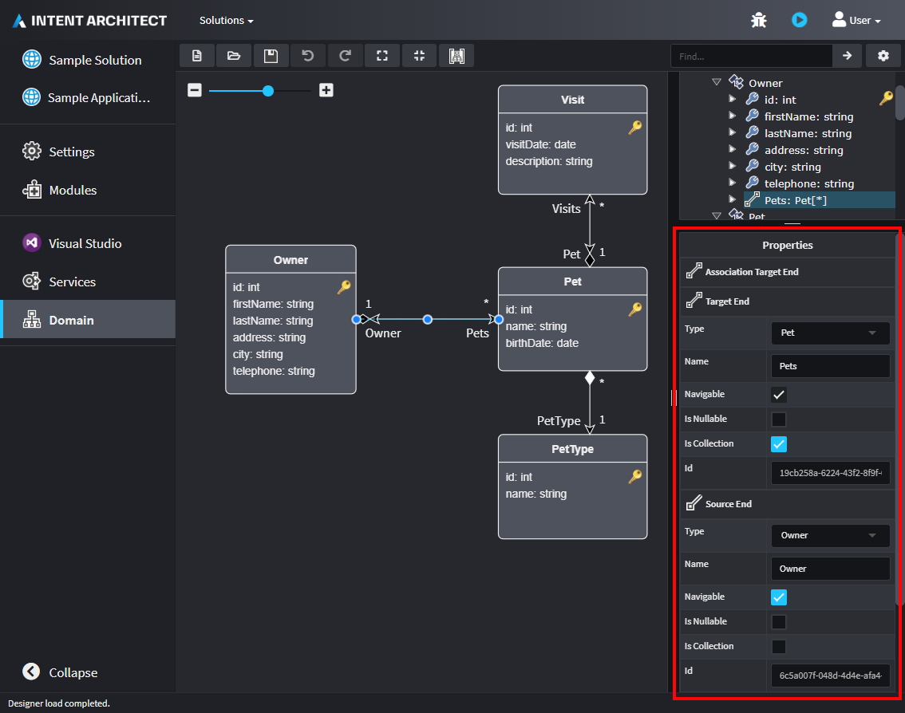
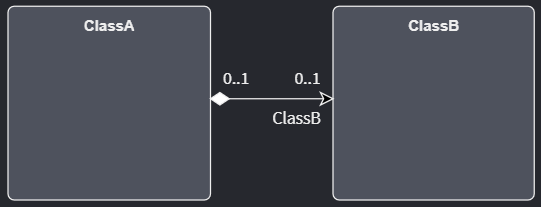
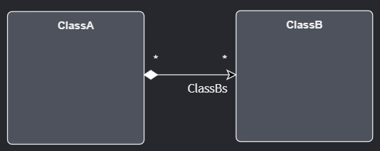
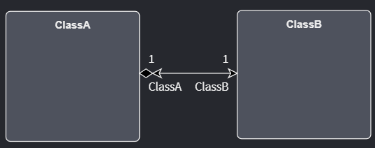

# Domain Designer Associations

Intent Architect's Domain Designer enables modelling of a sub-set of [UML](https://en.wikipedia.org/wiki/Unified_Modeling_Language), in particular, [class diagrams](https://en.wikipedia.org/wiki/Class_diagram). It supports modelling of Classes, their Attributes, Operations (method invocations) and [Associations (relationships)](https://en.wikipedia.org/wiki/Class_diagram#Relationships) between classes.

This article will focus on the different options available within the Domain Designer for modelling Associations and how to do so.

> [!NOTE]
> This article will regularly refer to `Source End` and `Target End`, these are sections in the properties pane in the bottom-right corner of the Domain Designer:
>
> 

## Association types

Association types are used to describe the ownership between Entities.

### Composition Association

> Composition relationship
>
> 1. When attempting to represent real-world whole-part relationships, e.g. an engine is a part of a car.
> 2. When the container is destroyed, the contents are also destroyed, e.g. a university and its departments.
>
> *- [Wikipedia](https://en.wikipedia.org/wiki/Class_diagram#Composition)*

A Composition Association can be achieved by setting the properties of the Association as follows:

|Source End|Target End|
|-|-|
|⬜ Navigable|✅ Navigable|
|⬜ Is Nullable|⬜ Is Nullable|
|⬜ Is Collection|✅ Is Collection|

### Aggregation Association

> Aggregation relationship
>
> 1. When representing a software or database relationship, e.g. car model engine ENG01 is part of a car model CM01, as the engine, ENG01, may be also part of a different car model.[8]
> 2. When the container is destroyed, the contents are usually not destroyed, e.g. a professor has students; when the professor dies the students do not die along with them.
>
> *- [Wikipedia](https://en.wikipedia.org/wiki/Class_diagram#Composition)*

An Aggregation Association be achieved by setting the properties of the Association as follows:

|Source End|Target End|
|-|-|
|⬜ Navigable|✅ Navigable|
|✅ Is Nullable|⬜ Is Nullable|
|⬜ Is Collection|✅ Is Collection|

## Multiplicity types

> Multiplicity is a definition of cardinality - i.e. number of elements - of some collection of elements by providing an inclusive interval of non-negative integers to specify the allowable number of instances of described element.
>
> *- [uml-diagrams.org](https://www.uml-diagrams.org/multiplicity.html)*

Intent Architect's Domain Designer allows modelling of the following Multiplicity types:

|Range|Description|
|-|-|
|1|One-to-one relationship (exactly one instance)|
|0..1|Zero-to-one relationship (no instances or one instance)|
|*|Zero-to-many relationship (zero or more instances)|

### One-to-one relationship

`ClassA` has an association to only one instance of `ClassB` and `ClassB` also has only one instance of association with `ClassA`.

This can be achieved by setting the properties of the Association as follows:

|Source End|Target End|
|-|-|
|⬜ Navigable|✅ Navigable|
|⬜ Is Nullable|⬜ Is Nullable|
|⬜ Is Collection|⬜ Is Collection|

### Zero-or-one to zero-to-one

`ClassA` has an association of zero or one instances of `ClassB` and `ClassB` also has zero or one instance of association with `ClassA`.

This can be achieved by setting the properties of the Association as follows:

|Source End|Target End|
|-|-|
|⬜ Navigable|✅ Navigable|
|✅ Is Nullable|✅ Is Nullable|
|⬜ Is Collection|⬜ Is Collection|

### One-to-many

`ClassA` has many instances of association with `ClassB` but `ClassB` only has one instance of association with `ClassA`.

This can be achieved by setting the properties of the Association as follows:

|Source End|Target End|
|-|-|
|⬜ Navigable|✅ Navigable|
|⬜ Is Nullable|⬜ Is Nullable|
|⬜ Is Collection|✅ Is Collection|

### Many-to-One

`ClassA` has only one instance of association with `ClassB` but `ClassB` has many instances of association with `ClassA`.

This can be achieved by setting the properties of the Association as follows:

|Source End|Target End|
|-|-|
|⬜ Navigable|✅ Navigable|
|⬜ Is Nullable|⬜ Is Nullable|
|✅ Is Collection|⬜ Is Collection|

### Many-to-many

Both `ClassA` and `ClassB` have many instances of association with each other.

This can be achieved by setting the properties of the Association as follows:

|Source End|Target End|
|-|-|
|⬜ Navigable|✅ Navigable|
|⬜ Is Nullable|⬜ Is Nullable|
|✅ Is Collection|✅ Is Collection|

## Navigability

> End property of association is **navigable** from the opposite end(s) of association if instances of the classifier at this end of the link can be accessed efficiently at runtime from instances at the other ends of the link.
>
> *- [uml-diagrams.org](https://www.uml-diagrams.org/association.html#navigability)*

### Uni-directional Association

`ClassA` can access `ClassB` via the `ClassB` association property but `ClassB` cannot access `ClassA` directly.

This can be achieved by setting the properties of the Association as follows:

|Source End|Target End|
|-|-|
|⬜ Navigable|✅ Navigable|
|⬜ Is Nullable|⬜ Is Nullable|
|⬜ Is Collection|⬜ Is Collection|

### Bi-directional Association

`ClassA` can access `ClassB` via the `ClassB` association property and `ClassB` (vice-versa) can access `ClassA` via the `ClassA` association property.

This can be achieved by setting the properties of the Association as follows:

|Source End|Target End|
|-|-|
|✅ Navigable|✅ Navigable|
|⬜ Is Nullable|⬜ Is Nullable|
|⬜ Is Collection|⬜ Is Collection|

### Reflexive Association

The below video demonstrates how to set up an Association where a `Class` can access another instance of type `Class` via the `Class` Association property.

<video style="max-width: 100%" muted="true" loop="true" autoplay="true" src="videos/association-reflexive.mp4"></video>

