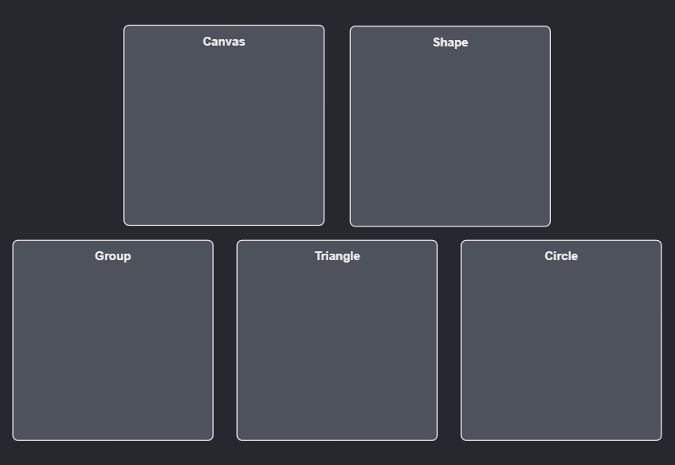
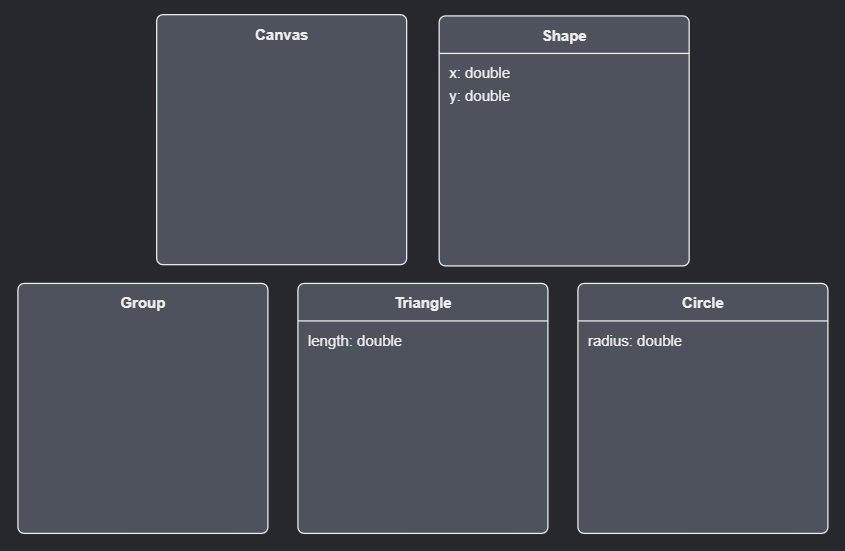
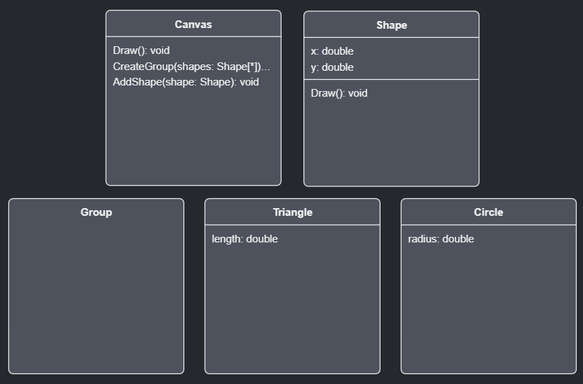
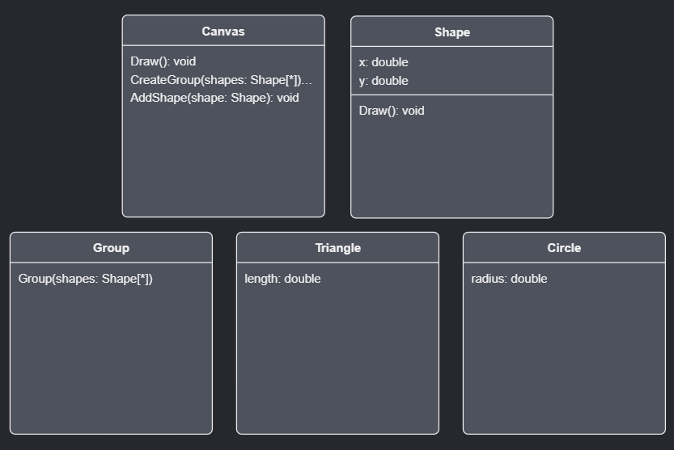
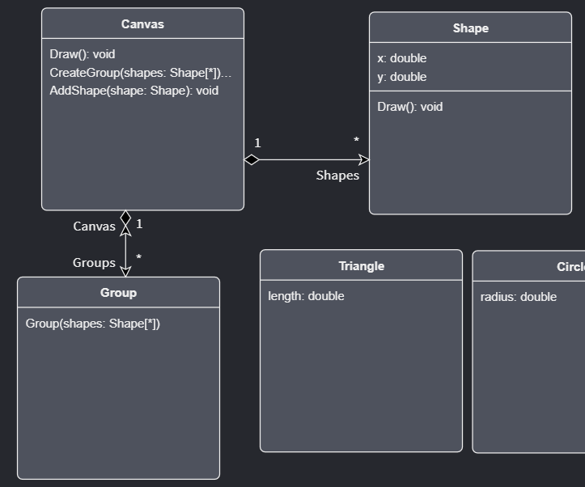
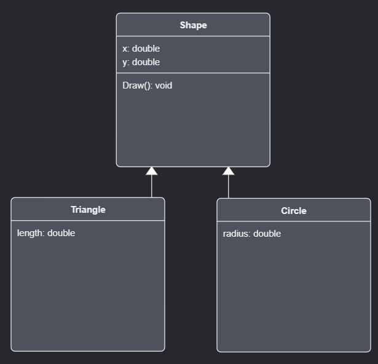

# How to use the Domain Designer

This how-to will help you learn how to use the Domain Designer by working through an example where you will use it to conceptually model how `Shapes` can be drawn on a `Canvas`.

## Pre-requisites

Ensure you have the `Intent.Modelers.Domain` module installed and open up the `Domain` designer by clicking on `Domain` option in left pane of the screen.

## Adding new Classes

- Right-click the background and click the `New Class` option.
- Give it a name of `Shape`.

<video style="max-width: 100%" muted="true" loop="true" autoplay="true" src="videos/create-shape-class.mp4"></video>

Similarly, create the following additional Classes:

- `Canvas`
- `Group`
- `Triangle`
- `Circle`

Your diagram should now appear as follows:

## Adding Attributes to Classes

To add an Attribute to a Class:

- Right-click the Class and click the `Add Attribute` option.
- Give the Attribute a name.
- To change the type, you can use the tab key from the naming to jump to the drop down from where you can select a type. Alternatively you can use the `Type` dropdown in the properties pane on the bottom-right.

For the `Shape` Class add the following Attributes:

- `x` of type `double`.
- `y` of type `double`.

For the `Triangle` Class add the following Attribute:

- `length` of type `double`.

For the `Circle` Class add the following Attribute:

- `radius` of type `double`.

<video style="max-width: 100%" muted="true" loop="true" autoplay="true" src="videos/add-attributes.mp4"></video>

Your diagram should now appear as follows:

## Adding Operations to Classes

To add an Operation to a class:

- Right-click the class and click the `Add Operation` option.
- Give the Operation a name.
- To change the return type, you can use the tab key from the naming to jump to the drop down from where you can select a type. Alternatively you can use the `Type` dropdown in the properties pane on the bottom-right. A blank return type indicates that the function doesn't return a value, or depending on your language, `void`.

To add a Parameter to an Operation:

- Right-click the Operation and click the `Add Parameter` option.
- Give the Parameter a name.
- To set the type of the Parameter you can use the tab key from the naming to jump to the drop down from where you can select a type. Alternatively you can use the `Type` dropdown in the properties pane on the bottom-right.

On the `Shape` Class add the following Operation:

- `Draw` with no return type.

On the `Canvas` Class add the following Operation:

- `Draw` with no return type.

On the `Canvas` Class add the following Operation:

- `Draw` with no return type.
- `CreateGroup` with no return type and the following parameter:
  - `shapes` with a type of `Shape`.
    - In the property pane in the bottom-right ensure that `Is Collection` is checked.
- `AddShape` with no return type and the following parameter:
  - `shape` with a type of `Shape`.

<video style="max-width: 100%" muted="true" loop="true" autoplay="true" src="videos/add-operation-with-parameter.mp4"></video>

Your diagram should now appear as follows:

## Adding Constructors to Classes

To Add a Constructor to a Class:

- Right-click the class and click the `Add Constructor` option.

To add a Parameter to a Constructor:

- Right-click the Constructor and click the `Add Parameter` option.
- Give the Parameter a name.
- To set the type of the Parameter you can use the tab key from the naming to jump to the drop down from where you can select a type. Alternatively you can use the `Type` dropdown in the properties pane on the bottom-right.

Add a Constructor to the `Group` Class with the following parameter:

- `shapes` of type `Shape`.
  - In the property pane in the bottom-right ensure that `Is Collection` is checked.

Your diagram should now appear as follows:

## Adding Associations between Classes

Space out the diagram Classes so that there is some distance vertically between them so that there will be enough room to create and clearly see Associations between them. You're also able to resize the Classes as desired.

- Right-click on the `Canvas` Class and click the `Add Association` option.
- Click on the `Shape` class.
- Click on the newly created arrow.
- In the `Target End` section of the Properties pane tick the `Is Collection` field.
- In the `Source End` section *un*tick the `Is Collection` field.

Similarly create an Association from the `Canvas` to `Group` Class and ensure in the property pane that:

- `Navigable` is checked in the `Source End` section.

<video style="max-width: 100%" muted="true" loop="true" autoplay="true" src="videos/add-composite-association.mp4"></video>

Your diagram should now appear as follows:

Finally, create an Association from the `Group` to the `Shape` Class and ensure in the property pane that:

- In the `Target End` section that:
  - `Is Collection` is checked.
- In the `Source End` section that:
  - `Is Collection` is *un*checked.
  - `Is Nullable` is *un*checked.

<video style="max-width: 100%" muted="true" loop="true" autoplay="true" src="videos/add-aggregate-association.mp4"></video>

> [!TIP]
> The Associations from `Canvas` to `Shape` and `Group` are called "Composite" Associations, while the Association from `Group` to `Shape` is an "Aggregate" association.
>
> You can refer to [this article](xref:designers.about-domain-designer.about-associations) for more information on Association types and modelling them within the Domain Designer.

## Adding new Diagrams

To remove Classes from a current Diagram, right-click them and click the `Hide` option. This does not delete the Classes, (you will see they are still visible in the tree-view pane to the top-right of the window) it has only removed them from the current Diagram.

> [!TIP]
> You can select multiple Classes at once on the Diagram. One way is by clicking and holding down your mouse button and then dragging the mouse cursor to create a selection box around the Classes you want to select. Alternatively you can multi-select Classes by using the `Ctrl` key to select / de-select them.

Hide the following Classes from the current Diagram:

- `Shape`
- `Triangle`
- `Circle`

On the tree-view located in the top-right pane of the window:

- Right-click on the `Domain` package and click `New Diagram` option.
- Give it the name `Shapes Diagram`
- Double-click on it to "enter" into it.

We now want to add Classes to the `Shapes Diagram`, for each class we want to add:

- Click the element in the tree view to select it.
- Click-and-hold your mouse button on the element.
- Drag your mouse cursor to over the Diagram view.
- Release the mouse button to which will "drop" the element on the Diagram, adding it to it.

> [!TIP]
> You can use the `Ctrl` key to select / de-select multiple Classes at once and then drag them all at once onto the Diagram.

Now re-add the classes which were removed from the other Diagram, namely the following:

- `Circle`
- `Triangle`
- `Shape`

Lay them out so that `Shape` is located center-top of the diagram, `Triangle` bottom-left and `Circle` bottom-right.

> [!NOTE]
> Even though you may not be able to visually see the Associations on the Diagram, adding / removing Classes to Diagrams has not actually affected or removed them.
>
> It is always possible to see all Associations on a Class as sub-elements on the Class in the tree-view in the top-right pane, locate `Shape` (for instance), expand it to show its contents and you will notice that there are four Associations:
>
> - `Group`
> - `Canvas`
> - `Circle`
> - `Triangle`
>
> [!TIP]
> When you have a Diagram element selected in the tree-view, in the Properties pane in the bottom-right there is a `New diagram elements` field. When you right-click a Diagram and click the `New Class` option, Intent Architect will create the Class in the package selected in that `New diagram elements` field.

<video style="max-width: 100%" muted="true" loop="true" autoplay="true" src="videos/new-diagram-and-move-over.mp4"></video>

## Specifying inheritance between the Classes

To specify that a Class is derived (or inherited) from another:

- Right-click the Class that should be derived from another Class. An "inheritance relationship" line will appear at your mouse cursor.
- To complete the creation, click on the Class from which that Class should be derived.

Make it so that the following Classes are derived from `Shape`:

- `Triangle`
- `Circle`

Your diagram should now appear as follows:

## See also

- .
