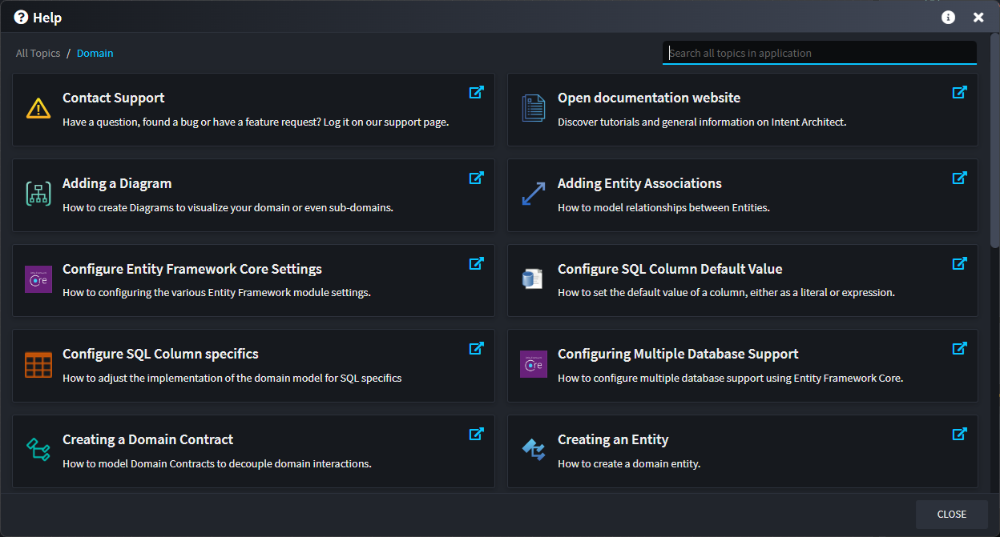
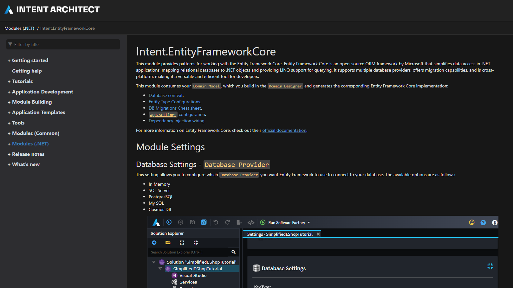
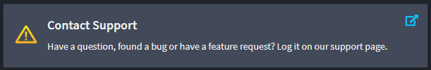

# Getting help

## Built-in help

Intent Architect provides a comprehensive built-in help system to assist you when you need guidance or documentation. Access the help feature by clicking the blue question mark button located in the top-right corner of the application window, or simply press F1.

### Help dialog

This opens a Help dialog that displays relevant help topics provided by your installed modules, along with options to contact support or visit the main Intent Architect documentation website. You can easily find the information you need by scrolling through the available topics or using the search box to filter results based on keywords.

> [!NOTE]
>
> Help Topics are context aware. Depending on the current open designer page you will be presented with different Help Topics.

### Help topic documentation

When you click on any help topic, it will automatically open your web browser and navigate to the corresponding documentation page, providing you with detailed information and guidance.

### Requesting support

Clicking this will open <https://github.com/IntentArchitect/Support> which has further instructions on how best to log an issue.

#### Business customers on packages which include Premium Support

Business customers who are on a packages which include Premium Support are entitled to using alternative pre-arranged communication methods, however, for queries which do not contain privileged proprietary information, we strongly encourage the use of the [above link](https://github.com/IntentArchitect/Support) as it may already contain an answer to the query, or in cases where it doesn't yet, by it being posted there our public answer will be available to all users of Intent Architect as well.

## Release notes for modules

When looking at the details of a module, they may optionally have "release notes":

Pressing "release notes" will show the changes to a module broken down by the version in which those changes were introduced:

