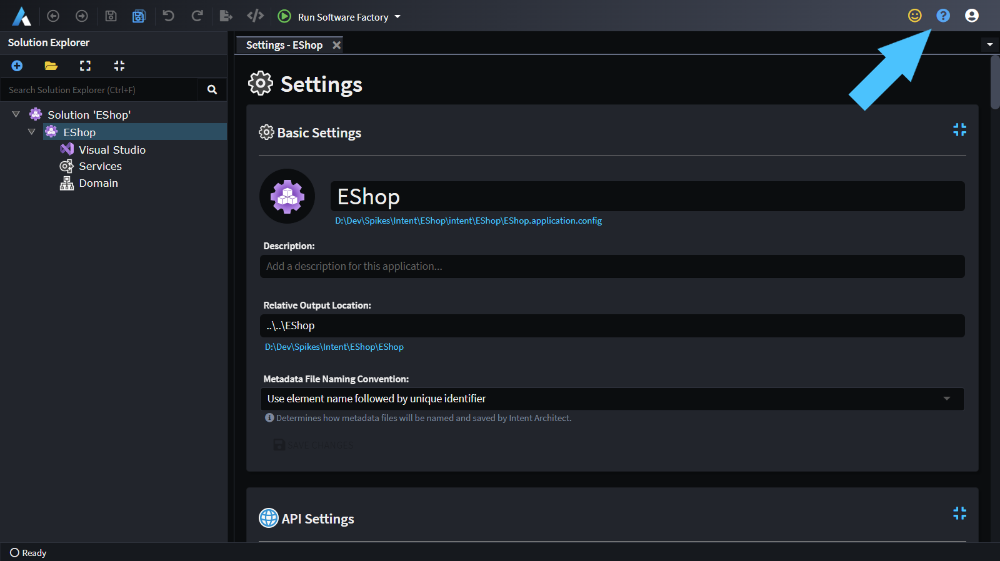

# Getting help

To get help and support for Intent Architect, from within the application you can press the question mark icon near the top-right of the application:

Clicking this will open <https://github.com/IntentArchitect/Support> which has further instructions on how best to log an issue.

## Business customers on packages which include Premium Support

Business customers who are on a packages which include Premium Support are entitled to using alternative pre-arranged communication methods, however, for queries which do not contain privileged proprietary information, we strongly encourage the use of the [above link](https://github.com/IntentArchitect/Support) as it may already contain an answer to the query, or in cases where it doesn't yet, by it being posted there our public answer will be available to all users of Intent Architect as well.
