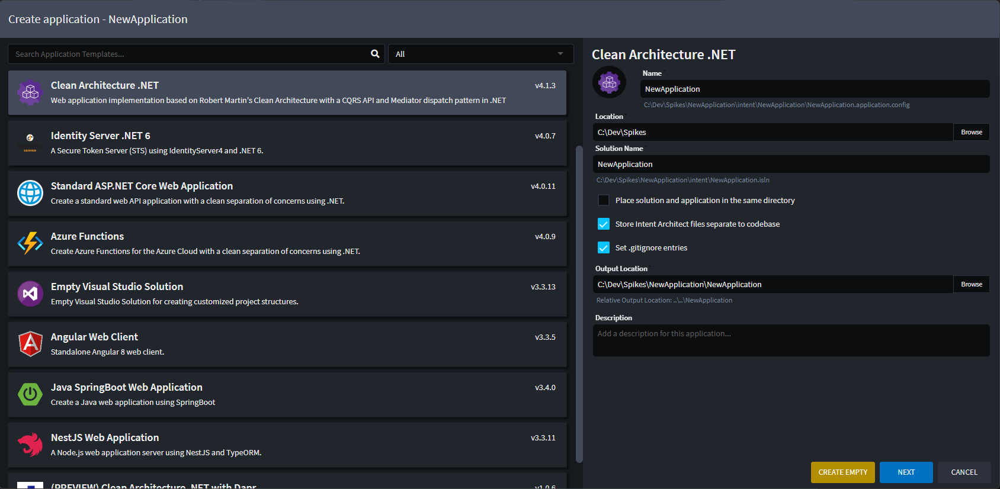
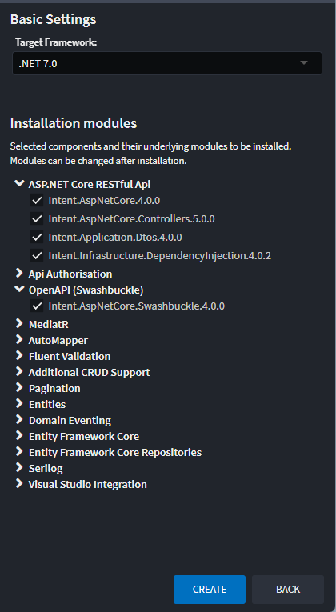
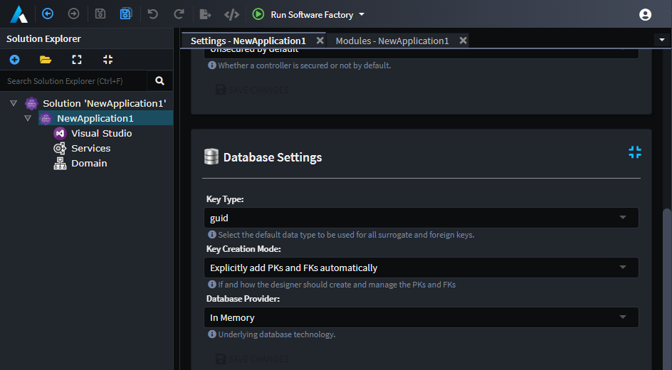
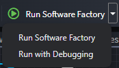

# Take a tour

## Introduction

This tour covers the key concepts in Intent Architect at a high-level. It aims to introduce each concept without going into too much detail. Let's get started.

Once [installed and logged in with your account](xref:getting-started.get-the-application), you will be presented with the home view of Intent Architect. From here you have options to `Create a new application`, `Create a new module`, or `Open an existing solution workspace`.

Previously opened solutions will be listed under the **Open recent** header for quick access later on.

## Applications

Applications in Intent Architect represent a _scope of code files_ that we want to automate. It could be a full-stack monolithic application, a microservice, or even just a single folder in which we wish to generate and manage files.

Applications are fundamentally composed of installed Modules, Designers, and some high-level configuration settings. These concepts will be discussed later in the tour.

Creating a new application in Intent Architect can be done by clicking on the `Create a new application` button in the home view to launch the _Create application_ wizard.

The first page of the wizard lists the available [Application Templates](#application-templates) in the selected repository (by default this will be Intent Architect's website [https://intentarchitect.com/](https://intentarchitect.com/) but could be a local directory or network location. [Learn how to change your default repositories here](xref:application-development.user-interface.how-to-change-user-settings)).

Here you can search and choose which application template you want and directly configure key settings like the Application's name, location, and the [solution](#solutions)'s name.

> [!NOTE]
> It is possible to create an empty application by clicking on the `CREATE EMPTY` button instead of `NEXT`. This would create a new application without any Modules or metadata installed.

### Application Templates

Application Templates allow specifying a pre-defined set of options of which Modules and Metadata (for [Designers](#designers)) to automatically install into the new Application during its creation.

To illustrate this, let's create a sample .NET Core Application using the `Clean Architecture .NET` Application Template. Following the steps we took above, select the template and fill out the Application's name, location, and the Solution name, then click `NEXT`. The wizard then moves to the next page which displays the high-level _Components_ that make up the template.

Each block is a _Component_ and each represents one or more Modules that will be installed into the new Application. Each Component may be included or excluded as required. To see exactly which Modules will be installed (which is based on our selection of Components), we can expand the Component list on the right side of the page.

_This screenshot of the component list on the right of the screen shows exactly which modules would be installed from the selected Components._

To create the Application, we then click on the `CREATE` button.

Intent Architect will download and install the Modules correlating to the selected Components, as well as create any default metadata that is required.

> [!NOTE]
> Although this example is targeting .NET, this process would work in the same way for other Application Templates that are designed for other languages.

## Application Settings

Once Intent Architect has finished creating the application and installing the selected components, it will open the _Settings_ view automatically.

Here you will be able to rename the Application, change its icon, add a description, and change the _Relative Output Location_.

Below the _Relative Output Location_, Intent Architect shows the full path into where code will be created. To open this location in the default file explorer, you can simply click on the full path _link_.

> [!NOTE]
> If the path doesn't exist yet, it won't be able to open.

Settings can be accessed through the applications's context menu.

## Modules

Modules are distributable artifacts which are the _building blocks_ of pattern reuse in Intent Architect.

Typically, the purpose of a Module is to generate and manage a set of code files in a codebase, usually around a particular architectural pattern. This could for example be the entities in our domain, simple bootstrapping files, ORM mappings, controllers in our API, etc.

Modules have similarities with package systems such as NuGet, NPM, and Maven. However, where the primary objective of these systems is to facilitate code-reuse, the primary objective of Modules is to facilitate _pattern-reuse_.

Modules have versions and dependencies and don't directly introduce any runtime dependencies. They can, however, be configured to introduce package dependencies if the designer of the Module so chooses.

To see your applications installed modules right-click on the application and select the `Manage Modules` menu option.

_This example shows the list of Installed Modules in our sample application. The `Intent.Application.MediatR` Module has been selected, with its details displayed in the pane on the right._

> [!NOTE]
> When you select an installed Module, Intent Architect gives a view into the internals of that module (i.e. the Templates, Decorators, and Factory Extensions that it is made up of).

### Module Settings

It is worth noting that some Modules provide additional settings that a developer can configure. These sections can be found on the [Application Settings](#application-settings) page.

_This example shows `Database Settings` which have been introduced by the installed modules, as an example the `Key Type` selector, which allows a developer to choose which Datatype would best represent a Primary Key for that application. In this case, it will be represented as a `guid`._

## Designers

Designers in Intent Architect allow you to describe your application's design as visual models and hierarchical concepts. For example, Designers could be used to describe things such as entities in a domain, services that make up the applications API, events that are published and subscribed, etc.

Designers are added to the Application when a Module that has a designer configuration is installed. You can therefore choose which Designers you would like to use in your Application.

> [!NOTE]
> Designers can be created and configured by using the Intent Module Builder. Existing Designers can also be extended with new concepts, configurations and options.

_An example from our sample application showing a Domain model inside of the Domain Designer._

Designers serve as a **blueprint** of your system. They can be used to describe any aspect of your Application. Typically, they are used to capture the following:

- **Codebase Structure** - Visual Studio Projects in .NET, Folder Structures in other languages, etc.
- **Entities** - Entities and their relationships to one another, Domain Driven Design (DDD) concepts (Aggregate Roots, Entities, and Value Objects), etc.
- **Database Schemas** - Tables, Documents, Foreign keys, Indices, etc.
- **Services** - RESTful web services, SOAP services, security settings, transactional settings, etc.
- **Client Proxies** - Web client proxies, Synchronous Query Proxies, etc.
- **Eventing** - Messages, Topics, Queues, Subscriptions, etc. (often used to support Microservice architectures)
- **Workflows** - Workflow Diagrams, Process Diagrams, etc.
- **Front-End Structure** - Components, Routing, Modules, View Models, Views, etc.

## Software Factory Execution

The Software Factory Execution is the process that executes the installed Modules with the metadata from the Designers within an Application. This results in changes to the codebase which are **staged** before being accepted or rejected.

[!Video-Loop videos/software-factory-execution.mp4]

Intent Architect will not make changes to your codebase without your consent. The changes that are listed can be clicked on which will launch a Diff tool for you to view the changes between the files - like a _pull request_ from your robot developer friend.

_An example diff of changes made to a C# interface that's managed by Intent Architect._

The Software Factory Execution can also be minimized while it's busy processing the changes it needs to apply. This is useful when processing times might be long or for executing additional Software Factory Executions in parallel. You can end a Software Factory Execution prematurely by clicking on the Red button with the cross.

[!Video-Loop videos/software-factory-minimize.mp4]

The Software Factory Execution is initiated from within an Application by clicking on the _Play_ button in the top tool bar labelled `Run Software Factory`. The execution is typically kicked off after completing some design changes or installing/updating Modules.

> [!NOTE]
> When you are developing Modules, it is possible to **Debug** them. Intent Architect supports this by prompting you to attach a debugger when you click the down arrow next to the _Play_ button and then selecting `Run with Debugging`.
> 

## Solutions

Solutions in Intent Architect serve as a _view_ on one or more Applications. They have some basic settings and can configure which Repositories are available for the Applications.

An Application can only be opened in the context on a Solution, which is represented by an `.isln` (Intent Solution) file on the disk drive.

_Solution Explorer with a single Application from this tour._

Additional Applications can be created from the Solution Explorer through the by context menu clicking on the `Create new application ...` menu option or the `+` icon in the toolbar.

## What's Next

### [The "Hello World" tutorial](xref:tutorials.hello-world-tutorial)

Tutorial on how to create a new Application from scratch.
