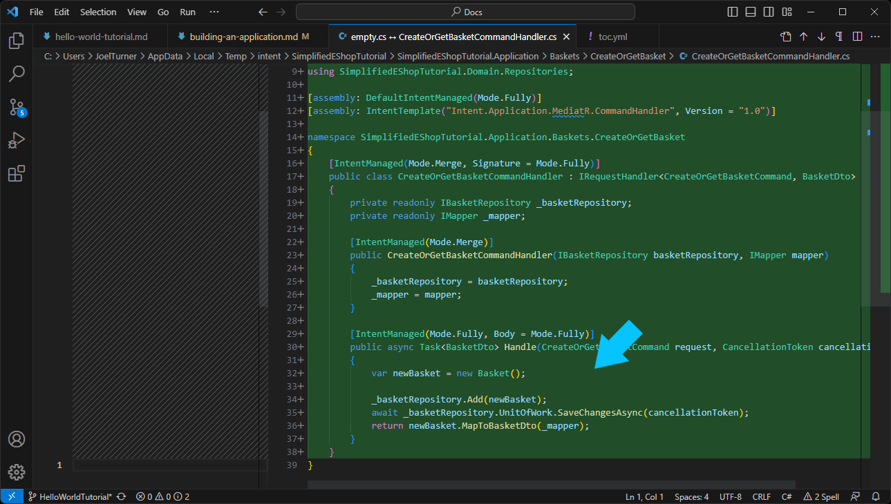
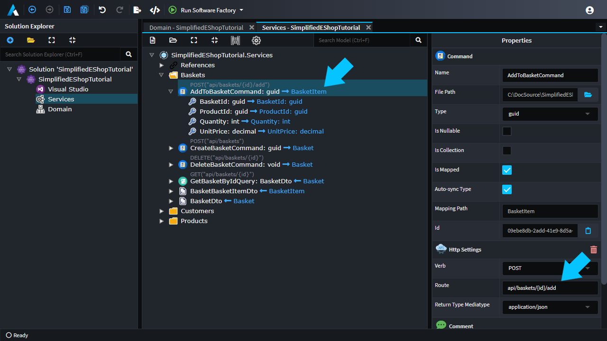

# Tutorial: Building an Application with Intent Architect

In this tutorial you will build a complete stand alone application, based roughly off of the Microsoft `eShopOnContainers`. As this tutorial is focused primary on application building we will simplify the problem space to a single monolith application, as opposed to the Microservice implementation that is `eShopOnContainers`. 

The Tutorial is designed to improve your knowledge around:
* Working with Intent Architect
* Domain Modeling 
* Service Modelling

## Setting up your Intent Architect Solution

* Open Intent Architect. 
* Click `Create a new application`.

On the first screen of the wizard you can select your desired application architecture, go with the `Clean Architecture .NET` option.

* Select the `Clean Architecture .NET` template.
* Change the application name to `SimplifiedEShopTutorial`.
* Check / change the `Location` field. (This is where your Intent Architect application will be created)
* Click `Next`.

This screen allows you to configure your selected Architecture, in the tutorial you are just going to use the default configuration.

* Click `Create`.

You have successfully created an Intent Architect application.
* Intent Architect will now download and install modules based on the application setup wizard you just went through.
* You should see a `Ready` message in the bottom left, when this process is complete.

Before you start domain modeling, let's run the Software Factory, so that later on when you're modelling you can see the impact of the modelling changes to the code base in isolation.

* Run the `Software Factory`, either by pressing `F5` or the button in the tool bar.
* Click `Apply Changes`.

## Domain Modeling

Our business domain is going to reflect the problem domain concepts, here are some of the high-level concepts we are go have to model.
* **Product**, an item for sale on the website.
* **Basket**, the Customer's shopping cart, which they are building as they browse the site.
* **Order**, the customers finalized order, when they checkout their shopping cart.

### Adding Entities

Let's start modelling out the domain.

* Open the `Domain Designer`.
* Right-click on the grid and select `New Class`.
* Type in the name, `Basket`.

>[!Tip]
> You can dramatically speed up your modeling through the use of keyboard shortcuts.  
> `Ctrl` + `Shift` + `c` - Create a new class. (Focus must be on the Diagram)  
> `Ctrl` + `Shift` + `a` - Add a new attribute. (Focus must be on the Class)  
> `Ctrl` + `Enter` - Create a new "whatever I have selected".  
> `Esc` - Shift focus up a level. (Attribute -> Class -> Diagram) 
> `Ctrl` + `.` - Full list of shortcuts currently available (These are context specific) 

Adding more `Entity`s.

* With `Basket` selected press `Ctrl` + `Enter`.
* Type `BasketItem` as your new class's name.
* Press `Ctrl` + `Enter`.
* Type `Product` as your new class's name.
* Click and drag your classes to lay them out.

### Modelling Relationships

Now you will model the relationships between these entities.

* Right-click on the `Basket` class, and select `New Association`.
* Click on `BasketItem` .
* In the `Properties` panel, on the lower right,
    * Check `Is Collection` in the `Target End` section.
    * Uncheck `Is Collection` in the `Source End` section.

You have configured a one to many relationship, i.e. a `Basket` has many `BasketItem`s and a `BasketItem` belongs to one `Basket`.
Next lets map the association between `BasketItem` and `Product`

* Right-click on the `BasketItem` class, and select `New Association`.
* Click on `Product` 

You have configured a many to one relationship, i.e. a `BasketItem` has one `Product` and a `Product` can be associated with many `BasketItem`s.

### Modelling Data

To finish these entities up, you will not model their data.

Model the `Product`
* Right-click on the `Product` entity and select `Add Attribute`.
* Type `Name`, the default type is `string` so you just press enter.
* To add another attribute, press `ctrl` + `enter`.
* Type `Description` of type `string`.
* To add another attribute, press `ctrl` + `enter`.
* Type `Price` of type `decimal`.

>[!Tip]
> You can use the `F2` shortcut to rename things like `Entity`s and `Attribute`s. In the case of `Attribute`s it also allows you to change their type.

Model the `BasketItem`
* Right-click on the `BasketItem` entity and select `Add Attribute`.
* Type `Quantity`, of type `int`.
* To add another attribute, press `ctrl` + `enter`.
* Type `UnitPrice` of type `decimal`.

>[!Tip]
> Some other shortcuts you might find useful while modeling .  
> `Ctrl` + `s` - Save changes in you current designer 
> `Ctrl` + `z` - Undo 
> `Ctrl` + `y` - Redo 

### Model out the rest of the design

You can go ahead and model out the rest of the domain, in the same you just modelled out the first three entities.
Here is what your domain should look like when you are complete.

>[!Note]
> Even in this simple domain, there are many perfectly valid ways to model this domain. For example, `Customer` could be associated with `Basket` or `Basket` with `Order`. This model is trying to keep the model as close to the original design where these tables are in physically separate applications and data stores. 

The last thing to add to the model would be a `Status` to the order so that our customer can see what is happening with their order. 

Add an `OrderStatus` `Enum` to the model.
* In the `TreeView` panel (Top right), right-click on `Domain Package` (Root node of the tree) and click `New Enum`. 
* Type in `OrderStatus` as it's name.
* Right-click on OrderStatus and select `Add Literal`.
* Type `Submitted`, in the `Property` panel below set `Value` to `1`.
* Add 2 more statuses:
    * `Shipped` - `2`.
    * `Cancelled` - `3`.

>[!Tip]
> Starting your `Enum` literal values from `1`, as opposed to `0`, is a good practice to avoid / detect "default initialization bugs" as uninitialized enums will have a value of `0`.

Add status attribute to the `Order`
* On your `Order` entity, add an attribute named `Status` of type `OrderStatus`.

You can now apply your modeling changes to your code base.
* Save your Modeling (`ctrl`+ `s`).
* Run the `Software Factory` (`F5`) this will produce all the code related to your Domain Modeling.
* Feel free to review / explore the changes in the `Software Factory` dialog.
* Click `Apply Changes`.

## Service Modelling

Next up you are going to want to model the services of your application. Look at the domain `Customer`s and `Product`s are really supporting data for `Basket`s and `Order`s. Given that, you can easily use Intent Architect to create these CRUD services for you.

* Open the `Services Designer`.
* In the `TreeView` panel (Center), right-click on `Services Package` (Root node of the tree) and click `Create CQRS CRUD Operations`. 
* In the dialog box select `Customer`.
* Click `Done.`

Looking at what has been created, you can see a logical `Customer` service in a `CQRS` style. Intent has all the basic CRUD operations you'd expect to see.

>[!Note]
> Simplifying it a bit, the CQRS paradigm is about separating server instructions into two groups
>* Commands, these mutate / change the servers state. 
>* Queries, these only read state, never changing it. 
Your next action is to expose these commands and queries as REST end points.

* Click on `CreateCustomerCommand`.
* Hold down `Shift`.
* Click on `GetCustomersQuery`.
* You should have all the `Command`s and `Query`s highlighted
* Right-click on any of the highlighted items and select `Expose as Http Endpoint`

>[!Tip]
> When modelling services in Intent Architect you are modelling application level services, i.e. they are not necessarily available for remote access. In this tutorial you have chosen to expose your services as Http REST endpoints.

Similarly, create a CRUD Service for `Product`s, don't forget to expose them so that we can interact with them through Swagger later on.

* Create your CRUD `Product` service, in the same way you made the `Customer` service.

At this point is might, you can apply these changes to see how your modelling to translating into code.

* Save your Modeling (`ctrl`+ `s`).
* Run the `Software Factory` (`F5`) this will produce all the code to the two services you just modeled.
* Feel free to review / explore the changes in the `Software Factory` dialog.
* Click `Apply Changes`.

>[!Tip]
> Using Intent Architects CRUD modules to create services can be a great productivity boost whether you using them as-is or using them as a starting point to extend.

Now let's look at our `Basket` service. These operations are going to be more bespoke in nature. Online shopping carts usually don't have an explicit creation step, but rather create themselves lazily on demand, so lets model it that way. You are going to create a `Command` called `GetBasketById` which will create or get the customer's basket and return it as a `BasketDto`. It will also use the `Customer`'s Id as the `Basket`'s Id, this means a customer can only ever have 1 basket and it can be persist and easily identified across visits to our site.

Before we create the `Command`, lets design it's return type `BasketDto`.

* In the `TreeView` panel (Center), right-click on `Services Package` (Root node of the tree) and click `Add Folder`. 
* Name the folder `Baskets`.
* Right-click on the `Baskets` folder, and select `New DTO`.
* Name the Dto, `BasketDto`.
* Right-click on the `BasketDto` and select `Map from Domain`.
* A dialog will open, with an expanded dropdown menu, select `Basket`.
* In the tree view check `BasketItem`.
* Click `Done`.
* Right-click on the `BasketItemDto` and select `Map from Domain`.
* You can uncheck `BasketId`.
* Expand the `Product` node and check `Name`.
* Click `Done`.
* Expand the `BasketItemDto`
* Find the `Name` field
    * Select this field.
    * Press `F2`and change it's name to `ProductName`.

Now you can create the `GetBasketById` command.

* Right-click on the `Baskets` folder, and select `New Command`.
* Name the command `GetBasketByIdCommand` and set it's return type to `BasketDto`.
* Right-click on the `GetBasketByIdCommand` command and select `Map to Domain Data`.
* A dialog will open, with an expanded dropdown menu, select `Basket`.
* Check the `Id` field.
* Click `Done`.
* Right-click on the `GetBasketByIdCommand` command, and select `Expose as Http EndPoint.`.
* In the `Properties` panel, in the `Http Settings` section
    * Change the `Verb` to `Post`.
    * Change the `Route` to `api/baskets/{id}`.

>[!Note]
> In the service designer we have used both the `Map from Domain` and `Map to Domain Data`, both mechanisms create design time links between the domain and services allowing modules to use this information. This mappings are visualize by left and right facing arrows respectively. Right facing arrows are typically used for inbound contracts like Command and Queries. Left facing arrows are typically used for outbound contracts, which Dto's typically are. 

Again. lets look at the results of your modelling.

* Save  (`ctrl`+ `s`).
* Run the Software Factory (`F5`).

There should be a change to `GetBasketByIdCommandHandler`, if you double-click and inspect the change, you will notice that this class needs to be implemented and that's what you will tackle next. 

* Click `Apply Changes`.
* Click on the blue hyperlink at the bottom left of the Software Factory dialog, this should open a folder containing all the generated source code.
* Open the `.sln` file.
* Open the `GetBasketByIdCommandHandler.cs` file.

The basic logic of this handler will be to create a new `Basket` if one doesn't exist, other wise work with the existing `Basket`, and then send the `Basket` details back to the caller.

* Update the code as follows:

[!code-csharp]

The next `Command` you will need to one to Add items to the customers `Basket`.

* Right-click on the `Baskets` folder and select `Add Command`.
* Name the command `AddToBasketCommand` and return a `Guid` which will be the `Id` of the newly added line item.
* Right-click on `AddToBasketCommand` and select `Map to Domain Data`
* A dialog will open, with an expanded dropdown menu, select `BasketItem`.
* Check the following :
    * `BasketId`
    * `ProductId`
    * `Quantity`
    * `Unit Price`
* Click `Done`.
* Right-click on `AddToBasketCommand`, and select `Expose as Http EndPoint.`.
* In the `Properties` panel, in the `Http Settings` section
    * Change the `Route` to `api/baskets/{basketId}/add`.

Again. lets look at the results of this modelling.

* Save  (`ctrl`+ `s`).
* Run the Software Factory (`F5`).

There should be a change to `AddToBasketCommandHandler`, if you double-click and inspect the change, you will notice that this class has been fully implemented for us. Here the CRUD module has figured out what you are trying to do and given us an implementation which meets our requirements. 

Lastly, you will want to implement an order service. This service should allow customers to:
1. Check out their `Basket`, creating an `Order`
2. Read their `Order`s

In this example you will bootstrap the service using the CRUD feature and customize according to your needs.

* Open the `Services Designer`.
* In the `TreeView` panel (Center), right-click on `Services Package` (Root node of the tree) and click `Create CQRS CRUD Operations`. 
* In the dialog box select `Order`.
* Click `Done.`
* Open the `Orders` folder

You are now going to remove the `Command`s you don't need.

* Select the `UpdateOrderCommand` and `DeleteOrderCommand` commands.
* Press `Delete`.

Let's enrich the `OrderDto` so that when we query it, the relevant information is there.
* Right-click on the `OrderDto` and select `Map from Domain`.
* In the tree view check `OrderItem`.
* Click `Done`.
* Right-click on the `OrderItemDto` and select `Map from Domain`.
* You can uncheck `OrderId`.
* Expand the `Product` node and check `Name`.
* Click `Done`.
* Expand the `OrderItemDto`
* Find the `Name` field
    * Select this field.
    * Press `F2` and change it's name to `ProductName`.

Next you will modify the `CreateOrderCommand` to how you would like the check out process to work. In this case we will simply pass through our `BasketId` and the  server can create our order based on the current Basket.

* Select the `CreateOrderCommand`.
* Press `F2` and rename the `Command` to `CheckoutCommand`.
* Expand the `CheckoutCommand`, and remove all it's properties.
    * Select the 3 properties (`OrderDate`, `CustomerId`, `Status`)
    * Press `Delete`.
* Right-click on the `CheckoutCommand`, and select `Add Property`
* Name the property `BasketId` of type `Guid`

Expose your services.

* Expose your `Order` commands and queries as Http EndPoints.

Generate the outputs.

* Save  (`ctrl`+ `s`).
* Run the Software Factory (`F5`).

If you double-click the `CheckoutCommandHandler`, you will notice that this class needs to be implemented and that's what you will tackle next. 

* Click `Apply Changes`.
* Click on the blue hyperlink at the bottom left of the Software Factory dialog, this should open a folder containing all the generated source code.
* Open the `.sln` file.
* Open the `CheckoutCommandHandler.cs` file.

Now you need to implement the `CommandHandler`. Basically this service should create a new `Order` based on the `Basket`. The service should also clear out the customers `Basket`, once the order is created. 

* Update the code as follows:

[!code-csharp]

At this point you are done coding and you can see the application in action.

## Running the Application 

* Run the application in you C# IDE.

You should be presented with a Swagger UI as follows:

Take a look at all the end points, you should see all the services you designed in Intent Architect.

First thing we need to do is create a Customer.

Then we can create a product.

Check our shopping cart is empty.

Add to the Cart.

Check out.

Confirm our order is placed.

