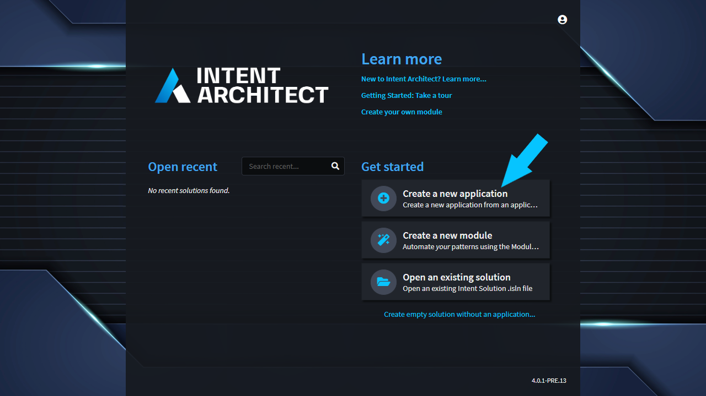
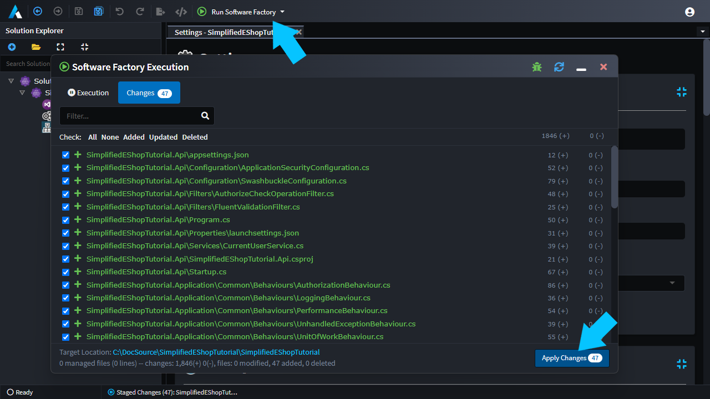
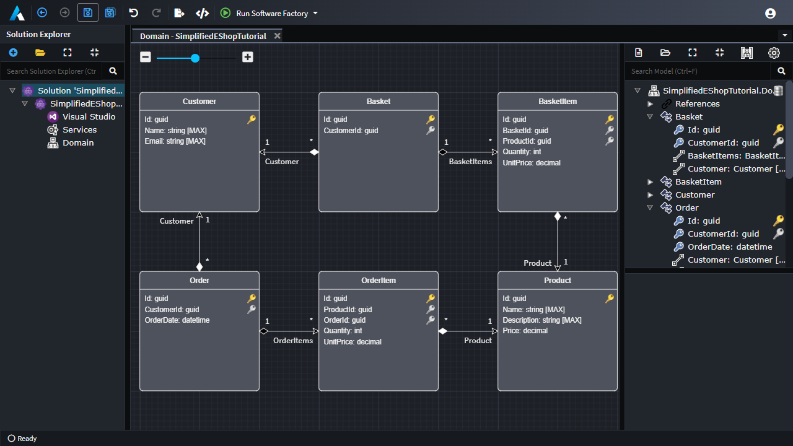
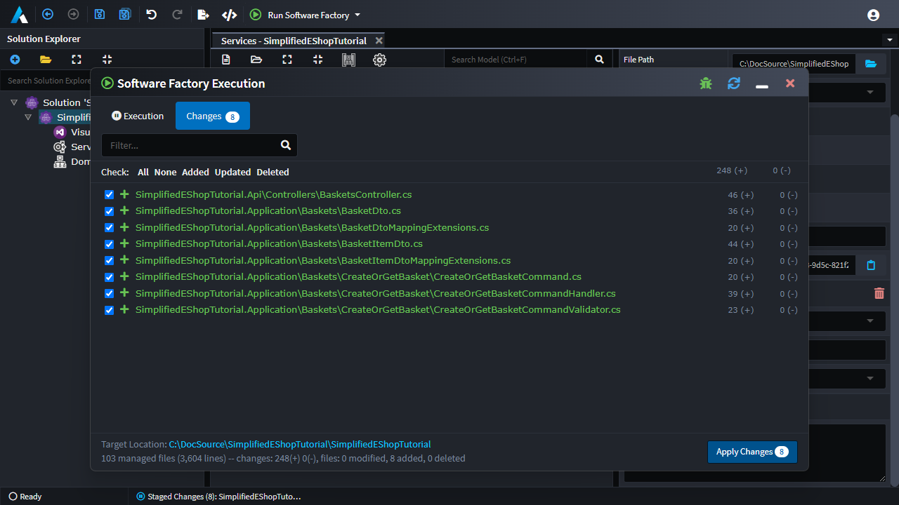
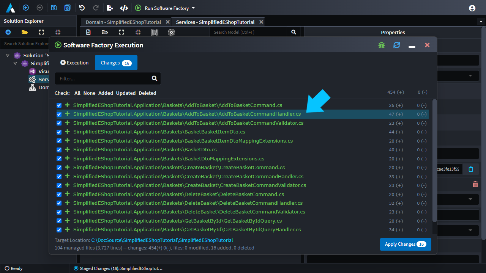
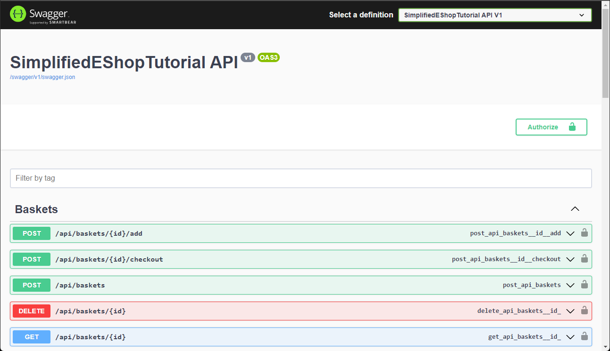
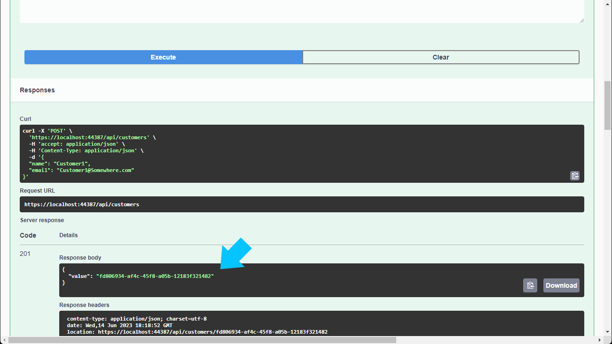
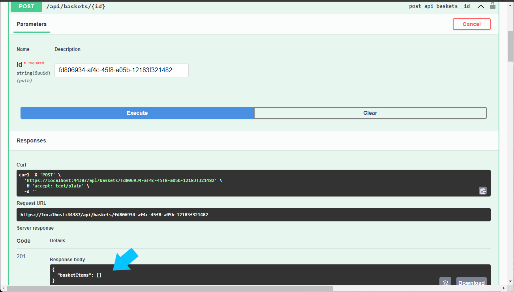
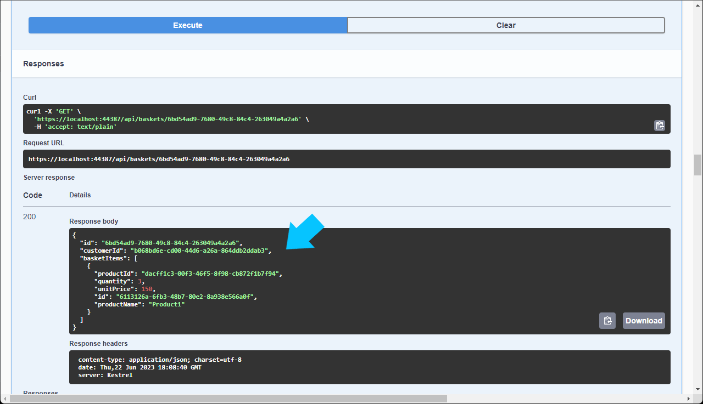

# Tutorial: Building an Application with Intent Architect

In this tutorial you will build a complete stand alone application, based roughly off of the Microsoft `eShopOnContainers`. As this tutorial is focused primarily on application building we will simplify the problem space to a single monolithic application, as opposed to the Microservice implementation that is `eShopOnContainers`.

The Tutorial is designed to improve your knowledge around:

* Working with Intent Architect
* Domain Modeling
* Service Modeling

This tutorial will take around 40 minutes.

## Setting up your Intent Architect Solution

* Open Intent Architect.
* Click `Create a new application`.



On the first screen of the wizard you can select your desired architecture. For this tutorial use the `Clean Architecture .NET` option:

* Select the `Clean Architecture .NET` template.
* Change the application name to `SimplifiedEShopTutorial`.
* Check / change the `Location` field (this is where your Intent Architect application will be created).
* Click `Next`.


The next screen allows you to configure your selected Architecture, for this tutorial we will use the default configuration:

* Click `Create`.


* Intent Architect will now configure your application based on your choices in the setup wizard.
* You will be navigated to the Intent Architect Solution view.
* The Application's icon in the left pane is a spinner while Intent Architect downloads and installs Modules for it.
* When the process is complete the spinner will change to a static icon and the status at the bottom left of the UI will show `Ready`.

You have successfully created an Intent Architect application.


Before you start domain modeling, let's run the Software Factory so that later on when you're modeling you can see the impact of the modeling changes in isolation:

* Run the `Software Factory`, either by pressing `F5` or the button in the tool bar.
* Wait for the `Changes` view to show.
* Click `Apply Changes`.



## Domain Modeling

The Microsoft `eShopOnContainers` is an e-commerce web site where customers can browse products, adding them to a shopping cart, to eventually make a purchase. Our business domain is going to reflect the problem domain concepts, here are some of the high-level ones we are going to have to model:

* **Product**, an item for sale on the website.
* **Basket**, the Customer's shopping cart, to which they are adding items as they browse the site.
* **Order**, the Customer's finalized order, when they checkout their shopping cart.

### Adding Entities

Let's start modeling out the domain:

* Open the `Domain` Designer.
* Right-click on the grid and select `New Class`.
* Type in the name, `Basket`.


> [!TIP]
> You can dramatically speed up your modeling through the use of keyboard shortcuts:
>
> * `Ctrl` + `Shift` + `C` - Create a new class (focus must be on the Diagram).
> * `Ctrl` + `Shift` + `A` - Add a new attribute (focus must be on the Class).
> * `Ctrl` + `Enter` - Create a new "whatever I have selected".
> * `Esc` - Shift focus up a level (Attribute -> Class -> Diagram).
> * `Ctrl` + `.` - Full list of shortcuts currently available (these are context specific).

Adding more `Entity`s:

* With `Basket` selected press `Ctrl` + `Enter`.
* Type `BasketItem` as your new class's name.
* Press `Ctrl` + `Enter`.
* Type `Product` as your new class's name.
* Click and drag your classes to lay them out.


### Modeling Relationships

Now you will model the relationships between these entities:

* Right-click on the `Basket` class, and select `New Association`.
* Click on `BasketItem` .
* In the `Properties` pane, on the lower right,
  * Check `Is Collection` in the `Target End` section.
  * Uncheck `Is Collection` in the `Source End` section.


You have configured a *one-to-many* relationship, i.e. a `Basket` has many `BasketItem`s and a `BasketItem` belongs to one `Basket`.

Next let's map the association between `BasketItem` and `Product`:

* Right-click on the `BasketItem` class, and select `New Association`.
* Click on `Product`.

You have configured a *many-to-one* relationship, i.e. a `BasketItem` has one `Product` and a `Product` can be associated with many `BasketItem`s.


### Modeling Data

To finish these entities up, you will now model their data.

Model the `Product`:

* Right-click on the `Product` entity and select `Add Attribute`.
* Type `Name`, as the default type is `string` you can just press enter.
* To add another attribute, press `Ctrl` + `Enter`.
* Type `Description` of type `string`.
* Again, add another attribute, press `Ctrl` + `Enter`.
* Type `Price`, press `Tab`, start typing `decimal` and when `decimal` is highlighted in the drop down box, press `Enter` to apply it.

> [!TIP]
> You can use the `F2` shortcut to rename things like `Entity`s and `Attribute`s. In the case of `Attribute`s it also allows you to change the `Attribute`'s type.

Model the `BasketItem`:

* Right-click on the `BasketItem` entity and select `Add Attribute`.
* Type `Quantity`, of type `int`.
* Add another attribute, press `Ctrl` + `Enter`.
* Type `UnitPrice`, press `Tab` and select the `decimal` type.


> [!TIP]
> Some other shortcuts you might find useful while modeling:
>
> * `Ctrl` + `S` - Save changes in you current Designer</br>
> * `Ctrl` + `Z` - Undo</br>
> * `Ctrl` + `Y` - Redo</br>

### Model out the rest of the design

You can go ahead and model out the rest of the domain in the same way you just modeled out the first three entities, here is what your domain should look like when you are complete:



> [!NOTE]
> Even in this simple domain, there are many perfectly valid ways to model this domain. For example, `Customer` could be associated with `Basket` or `Basket` with `Order`. Here we are trying to keep the model as close to the original design where these tables are in completely separate applications and data stores.

The last thing to add to the model will be a `Status` on the order, so that our customer can see what is happening with their order.

Add an `OrderStatus` `Enum` to the model:

* In the tree-view (top right pane), right-click on root node of the tree (`SimplifiedEShopTutorial.Domain`) and click `New Enum`.
* Type in `OrderStatus` as its name.
* Right-click on `OrderStatus` and select `Add Literal`.
* Type `Submitted`, in the `Property` pane below set `Value` to `1`.
* Add two more statuses:
  * `Shipped` = `2`.
  * `Cancelled` = `3`.


> [!TIP]
> Starting your `Enum` literal values from `1`, as opposed to `0`, is a good practice to catch "default initialization bugs" as uninitialized enums will have a value of `0`.

Add a `Status` attribute to the `Order`:

* On your `Order` entity, add an attribute named `Status` of type `OrderStatus`.


You can now apply your modeling changes to your codebase:

* Save your Modeling (`Ctrl`+ `S`).
* Run the `Software Factory` (`F5`) this will generate all the code related to your Domain Modeling.
* Feel free to review / explore the changes in the `Software Factory` Changes dialog.
* If you double-click on any of the Changes file entries, the proposed file change will be opened in the configured diff tool (by default *Visual Studio Code* will be used, if not installed then it will try use *Visual Studio*).


Apply the Changes:

* Click `Apply Changes`.

## Service Modeling

Next up you are going to want to model the services of your application. Looking at the domain, `Customer`s and `Product`s are really just supporting data for `Basket`s and `Order`s. Given that, you can easily use Intent Architect to create CRUD services for these:

* Open the `Services` Designer.
* In the tree-view in the center pane, right-click on the root node of the tree (`SimplifiedEShopTutorial.Services`) and click `Create CQRS CRUD Operations`.
* In the dialog box select `Customer`.
* Click `Done`.


Look at what has been created, you can see a logical `Customer` service in a `CQRS` style. Intent has added all the basic CRUD operations you'd expect to see.

> [!NOTE]
> Simplifying it a bit, the CQRS paradigm is about separating server instructions into two groups:
>
> * `Commands`, these mutate / change the server's state.
> * `Query`s, these only read state, never changing it.

Your next action is to expose these commands and queries as REST endpoints:

* Click on `CreateCustomerCommand`.
* Hold down `Shift`.
* Click on `GetCustomersQuery`.
* You should have all the `Command`s and `Query`s highlighted
* Right-click on any of the highlighted items and select `Expose as Http Endpoint`.


> [!TIP]
> When modeling services in Intent Architect you are modeling application level services, i.e. they are not necessarily available for remote access. In this tutorial
you have chosen to expose your services as HTTP REST endpoints.

Similarly, create a CRUD Service for `Product`s, don't forget to expose them so that we can interact with them through Swagger later on:

* Create your CRUD `Product` service, in the same way you made the `Customer` service.

The `Services` Designer should now look as follows:


At this point, you can apply these changes and see how your modeling is translating into code:

* Save your Modeling (`Ctrl`+ `S`).
* Run the `Software Factory` (`F5`) this will produce all the code for the two services you just modeled.
* Feel free to review / explore the changes in the `Software Factory` dialog.
* Click `Apply Changes`.


> [!TIP]
> Using Intent Architect's CRUD modules to create services can be a great productivity boost whether you are using them as-is or as a starting point to extend.

Now let's look at our `Basket` service. These operations are going to be more bespoke in nature. Online shopping carts usually don't have an explicit creation step, but rather create themselves lazily on demand, so let's model it that way. You are going to create a `Command` called `GetBasketById` which will create or get the customer's basket and return it as a `BasketDto`. It will also use the `Customer`'s `Id` as the `Basket`'s `Id`, this means a customer can only ever have one basket and it can be persisted and easily identified across visits to our site.

Before we create the `Command`, let's design its return type `BasketDto`:

* In the tree-view in the center pane, right-click on the root node and click `Add Folder`.
* Name the folder `Baskets`.
* Right-click on the `Baskets` folder, and select `New DTO`.
* Name the DTO, `BasketDto`.
* Right-click on the `BasketDto` and select `Map from Domain`.
* A dialog will open with an expanded dropdown menu, select `Basket`.
* In the tree-view check `BasketItems` node.
* Click `Done`.
* Right-click on the `BasketItemDto` and select `Map from Domain`.
* You can uncheck `BasketId`.
* Expand the `Product` node and check `Name`.
* Click `Done`.
* Expand the `BasketItemDto` node.
* Find the `Name` field
  * Select this field.
  * Press `F2`and change its name to `ProductName`.


Now you can create the `GetBasketById` command:

* Right-click on the `Baskets` folder, and select `New Command`.
* Name the command `GetBasketByIdCommand` and set its return type to `BasketDto`.
* Right-click on the `GetBasketByIdCommand` command and select `Map to Domain Data`.
* A dialog will open with an expanded dropdown menu, select `Basket`.
* Check the `Id` field.
* Click `Done`.
* Right-click on the `GetBasketByIdCommand` command, and select `Expose as Http Endpoint`.
* In the `Properties` pane, scroll to the `Http Settings` section:
  * Change the `Verb` to `POST`.
  * Change the `Route` to `api/baskets/{id}`.


> [!NOTE]
> In the `Services` Designer we have used both `Map from Domain` and `Map to Domain Data`, both mechanisms create design time links between the Domain and Services allowing modules to be aware of these relationships. These mappings are visualized by left and right facing arrows respectively. Right facing arrows are typically used for inbound contracts like Command and Queries. Left facing arrows are typically used for outbound contracts, which DTO's typically are.

Again, let's look at the results of your modeling:

* Save (`Ctrl`+ `S`).
* Run the `Software Factory` (`F5`).



There should be a change to `GetBasketByIdCommandHandler`, if you double-click and inspect the change you will notice that this Class needs to be implemented and that's what you will tackle next.


* Click `Apply Changes`.
* Click on the blue hyperlink at the bottom left of the `Software Factory` dialog, this should open a folder containing all the generated source code.
* Open the `.sln` file.
* Open the `GetBasketByIdCommandHandler.cs` file.

The basic logic of this handler will be to create a new `Basket` if one doesn't exist, otherwise work with the existing `Basket`, and then send the `Basket` details back to the caller:

* Update the code as follows:

[!code-csharp[](code/complete-GetBasketByIdCommandHandler.cs?highlight=7,8,18,19,22,24,25,31-38)]

The next `Command` you will need is one to add items to the customer's `Basket`:

* Right-click on the `Baskets` folder and select `Add Command`.
* Name the command `AddToBasketCommand` and return a `Guid` which will be the `Id` of the newly added `BasketItem`.
* Right-click on `AddToBasketCommand` and select `Map to Domain Data`
* A dialog will open with an expanded dropdown menu, select `BasketItem`.
* Check the following:
  * `BasketId`
  * `ProductId`
  * `Quantity`
  * `UnitPrice`
* Click `Done`.
* Right-click on `AddToBasketCommand`, and select `Expose as Http Endpoint`.
* In the `Properties` pane, in the `Http Settings` section:
  * Change the `Route` to `api/baskets/{basketId}/add`.


Again, let's look at the results of this modeling:

* Save (`Ctrl`+ `S`).
* Run the Software Factory (`F5`).



There should be a change to `AddToBasketCommandHandler`, if you double-click and inspect the change, you will notice that this class has been fully implemented for us. Here the CRUD module has figured out what you are trying to do and given you an implementation which meets your requirements.


> [!TIP]
> If we were not happy with the convention-based crud implementation there are several ways you could opt-out of this. One way to do this would be to adjust he `IntentManged` attribute changing the `Body = Mode.Fully` to `Body = Mode.Ignore`. This will stop the Software Factory from generating the body of this method, allowing you to change the implementation. See [Code Management](xref:application-development.code-weaving-and-generation.about-code-management-csharp) for more details.

Lastly, you will want to implement an order service. This service should allow customers to:

1. Check out their `Basket`, creating an actual `Order`.
2. Read their `Order`.

For this service you will bootstrap the service using the CRUD feature and customize according to your needs:

* Open the `Services` Designer.
* In the tree-view in the center pane, right-click on the root node and click `Create CQRS CRUD Operations`.
* In the dialog box select `Order`.
* Click `Done`.
* Open the `Orders` folder.


You are now going to remove the `Command`s you don't need:

* Select the `UpdateOrderCommand` and `DeleteOrderCommand` commands (you can use the `Ctrl` key to select/de-select multiple nodes ones by one).
* Press `Delete`.


Let's enrich the `OrderDto` so that when you query it, the relevant information is there:

* Right-click on the `OrderDto` and select `Map from Domain`.
* In the tree-view check `OrderItems`.
* Click `Done`.
* Right-click on the `OrderItemDto` and select `Map from Domain`.
* Uncheck `OrderId`.
* Expand the `Product` node and check `Name`.
* Click `Done`.
* Expand the `OrderItemDto`
* Find the `Name` field:
  * Select this field.
  * Press `F2` and change its name to `ProductName`.


Next you will modify the `CreateOrderCommand` to better reflect how the check out process should work. In this case we will simply pass through our `BasketId` and the server can create our `Order` based on the current `Basket`:

* Select the `CreateOrderCommand`.
* Press `F2` and rename the `Command` to `CheckoutCommand`.
* Expand the `CheckoutCommand`, and remove all its properties:
  * Select the three properties (`OrderDate`, `CustomerId`, `Status`)
  * Press `Delete`.
* Right-click on the `CheckoutCommand`, and select `Add Property`
* Name the property `BasketId` of type `Guid`


Expose your services:

* Expose your `Order` commands and queries as HTTP endpoints.
* Select the `CheckoutCommand`
* In the `Properties` pane, in the `Http Settings` section:
  * Change the `Verb` to `POST`.
  * Change the `Route` to `api/orders/checkout`.


Generate the outputs:

* Save (`Ctrl`+ `S`).
* Run the Software Factory (`F5`).


If you double-click the `CheckoutCommandHandler`, you will notice that this class needs to be implemented and that's what you will tackle next:

* Click `Apply Changes`.
* Click on the blue hyperlink at the bottom left of the Software Factory dialog, this should open a folder containing all the generated source code.
* Open the `.sln` file.
* Open the `CheckoutCommandHandler.cs` file.

Now you need to implement the `CommandHandler`. Basically this service should create a new `Order` based on the `Basket`. The service should also clear out the customers `Basket`, once the order is created:

* Update the code as follows:

[!code-csharp[](code/complete-CheckoutCommandHandler.cs?highlight=2,7,8,18,19,22,24,25,31-50,52-61)]

At this point you are done coding and you can see the application in action.

## Running the Application

* Run the application in you C# IDE.

You should be presented with a Swagger UI as follows:



Take a look at all the endpoints, you should see all the services you designed in Intent Architect.

First thing you need to do is create a Customer:

* Click on the `POST /api/customers` row in the Customers section.
* Click the `Try it out` button on the right hand side.
* In the `Request Body` JSON fill in:

```json
{
  "name": "Customer1",
  "email": "Customer1@example.com"
}
```

* Click the big blue `Execute` button.



* Record the `CustomerId` response as you will need it later.

In a similar fashion you can create a `Product` using the `POST /api/products` row in the Products section. Don't forget to record your `ProductId` so you can use it later.

Next let's check the customer's shopping cart:

* Click on the `POST /api/baskets/{id}` row in the Baskets section.
* Click the `Try it out` button on the right hand side.
* Fill in your `CustomerId` in the `Id` field.
* Click the big blue `Execute` button.

You should get back an empty `Basket` as follows.



Let's add an item to the cart:

* Click on the `POST /api/baskets/{id}/add` row in the Baskets section.
* Click the `Try it out` button on the right hand side.
* Fill in your `CustomerId` in the `Id` field.
* In the `Request Body` JSON fill in (replacing the relevant Ids):

```json
{
  "basketId": "{CustomerId}",
  "productId": "{ProductId}",
  "quantity": 1,
  "unitPrice": 200
}
```

* Click the big blue `Execute` button.

Let's check the `Basket` has updated:

* Click on the `POST /api/baskets/{id}` row in the Baskets section.
* Click the `Try it out` button on the right hand side.
* Fill in your `CustomerId` in the `Id` field.
* Click the big blue `Execute` button.

You should get a result similar to this:



Now you can Checkout your `Basket`:

* Click on the `POST /api/orders/checkout` row in the Orders section.
* Click the `Try it out` button on the right hand side.
* In the `Request Body` JSON fill in (replacing the relevant Ids):

```json
{
  "basketId": "{CustomerId}"
}
```

* Click the big blue `Execute` button.
* Record the `OrderId` response as you will need use it now to retrieve the order.

Query the `Order` to confirm it's placed:

* Click on the `GET /api/orders/{id}` row in the Orders section.
* Click the `Try it out` button on the right hand side.
* Fill in your `OrderId` in the `Id` field
* Click the big blue `Execute` button

You should get a result similar to this:


## Next steps

Congratulation's, you have build an application using Intent Architect.

We will have more Tutorials like these out in the future.

We also have a series of [webinars](https://www.youtube.com/@IntentArchitect) covering various many facets of Intent Architect.

## Additional related resources

* [Intent Architect Webinar on Clean Architecture in .NET 7](https://www.youtube.com/watch?v=AFcOyF_TWAg)
* [Intent Architect Webinar on Domain Modeling in .NET](https://www.youtube.com/watch?v=yRfTXxsIKME)
