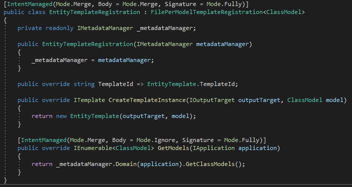
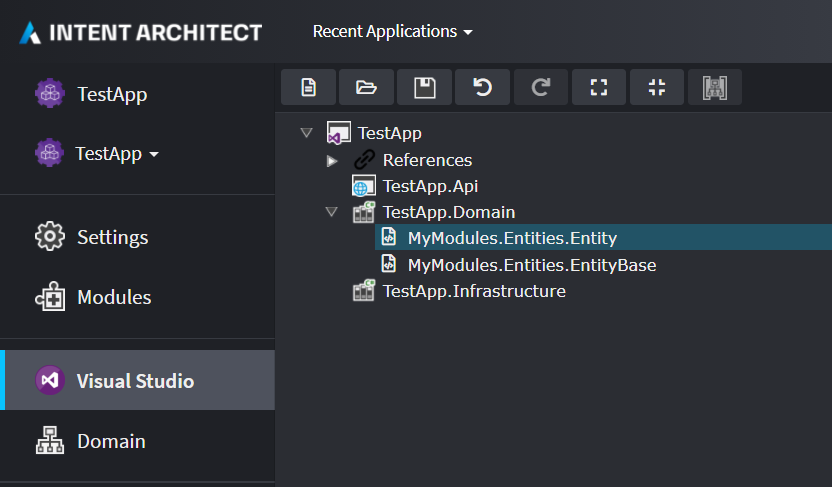

# Create files per Model

In this next part of the tutorial, we will extend our `MyModules.Entities` Module to create and manage domain entities based on the `Domain` Designer. To do this we will create a Template which generates a new file for each entity which has been created in the `Domain` Designer.

## Install the `Domain` Metadata

First, to access the `Domain` types so that we can configure our Template correctly, we must install metadata from the `Intent.Modelers.Domain` Module into our Module Builder.

1. Open the `MyModules` Application.
2. Navigate to the `Modules` tab.
3. Ensure that the `All` option in the repository drop-down is selected.
4. Search for the `Intent.Modelers.Domain` Module.
5. In the Module details pane, expand the `Options` and check the `Install metadata only` checkbox.

    > [!NOTE]
    > By selecting the `Install Metadata only` option, Intent Architect will not install the Designer. This feature is typically used in the Module Builder.
    >
    > [!NOTE]
    > A Software Factory Execution minimized in the background might trigger upon installation (which can be safely ignored for now).
6. Click `Install` to install the Module.

<p><video style="max-width: 100%" muted="true" loop="true" autoplay="true" src="videos/modules-install-domain-metadata-only.mp4"></video></p>

## Create a new Template

Next, we will create a new Template that we can configure to receive the models from the `Domain` Designer and create a new C# class for each entity.

1. Navigate to the `Module Builder` Designer.
2. Create a new Template, call it `Entity`, and set its type to be `File per Model`.
3. In the properties, under `Template Settings`, set its `Designer` to `Domain` and Model Type to `Class`.

    > [!NOTE]
    > These options are available because we installed the `Intent.Modelers.Domain` Module's metadata in the previous step.
4. Save your changes.
5. Click on the status button at the bottom of the screen which detected changes made to the `My Modules` application (this will only happen if you have minimized the Software Factory Execution process, normally you would have to click on the `Run Software Factory` yourself).
6. Click `APPLY CHANGES`.

<p><video style="max-width: 100%" muted="true" loop="true" autoplay="true" src="videos/module-builder-create-entity-template.mp4"></video></p>

> [!WARNING]
> It is always recommended to inspect the changes that Intent Architect wants to make to your codebase _before_ applying them.
>
> [!NOTE]
> You may notice that the `EntityTemplateRegistration.cs` class is wired up to create a new Template _instance_ for each `ClassModel` that is retrieved from the `Domain` Designer by Intent Architect's metadata management system. Later in this article you will see how `ClassModel`s relate to Classes in the `Domain` Designer.
>
> 
>
> [!TIP]
> If you want a template to only generate files for some classes and not others, you can edit the `GetModels(...)` method to [filter the available classes](xref:templates.how-to-filter-templates).

## Implement Template Logic

Next, we will implement the logic of the `Entity` Template, essentially _templatizing_ a pattern ("rules" followed by developers) for creating entities. In this tutorial, we will create `public` properties for each _attribute_ and _association_ that we describe in the `Domain` Designer.

1. Open the `MyModule.Entities` code solution in your IDE (e.g. Visual Studio).
2. Open the `EntityTemplate.tt` file.
3. Implement the following logic to create the properties for the attributes and associations of each `Domain` entity:

    ```csharp
    <#@ template language="C#" inherits="CSharpTemplateBase<Intent.Modelers.Domain.Api.ClassModel>" #>
    <#@ assembly name="System.Core" #>
    <#@ import namespace="System.Collections.Generic" #>
    <#@ import namespace="System.Linq" #>
    <#@ import namespace="Intent.Modules.Common" #>
    <#@ import namespace="Intent.Modules.Common.Templates" #>
    <#@ import namespace="Intent.Modules.Common.CSharp.Templates" #>
    <#@ import namespace="Intent.Templates" #>
    <#@ import namespace="Intent.Metadata.Models" #>
    using System;
    using System.Collections.Generic;

    [assembly: DefaultIntentManaged(Mode.Fully)]

    namespace <#= Namespace #>
    {
        public class <#= ClassName #> : <#= GetBaseType() #>
        {
    <#  foreach(var attribute in Model.Attributes) { #>

            public <#= GetTypeName(attribute) #> <#= attribute.Name.ToPascalCase() #> { get; set; }
    <#  } #>
    <#  foreach(var associationEnd in Model.AssociatedClasses.Where(x => x.IsNavigable)) { #>

            public <#= GetTypeName(associationEnd) #> <#= associationEnd.Name.ToPascalCase() #> { get; set; }
    <#  } #>
        }
    }
    ```

    > [!NOTE]
    > The Module Builder has automatically wired up our Template so that the `Model` property is a `ClassModel` which is a C# class which has all the data of an entity as modelled in the `Domain` Designer including its `Attributes` and `AssociatedClasses` collections.
    >
    > [!NOTE]
    > The [`GetTypeName(...)`](xref:templates.how-to-get-type-names) method returns the referenced type that was specified as a qualified and namespace-normalized C# type. It also tracks dependencies between this template and others, allowing it to dynamically add `using` statements to managed classes (created by Intent Architect) in different namespaces.
    >
    > [!NOTE]
    > We filter the `AssociatedClasses` by those that are _Navigable_:
    >
    > ```text
    > <#  foreach(var associationEnd in Model.AssociatedClasses.Where(x => x.IsNavigable)) { #>
    > ```
    >
    > This prevents every association relationship from being expressed as bidirectional in our code.

4. Open the `EntityTemplatePartial.cs` file. Add the `GetBaseType()` method, that we call in the `EntityTemplate.tt` file, as follows:

    ```csharp
    private string GetBaseType()
    {
        return GetTypeName(EntityBaseTemplate.TemplateId);
    }
    ```

    > [!NOTE]
    > Here the `GetTypeName(...)` method resolves the Template Identifier of our `EntityBaseTemplate`. Since this is a single file and the outputs will be in the same namespace, Intent Architect will resolve it as the class name `EntityBase`. If the classes were in different namespaces, the namespace would be introduced using a [`using` directive](https://docs.microsoft.com/dotnet/csharp/language-reference/keywords/using-directive).
    >
    > [!NOTE]
    > You will need to include the namespace `MyModules.Templates.EntityBase` using the [`using` directive](https://docs.microsoft.com/dotnet/csharp/language-reference/keywords/using-directive).

<p><video style="max-width: 100%" muted="true" loop="true" autoplay="true" src="videos/templatizing-entities-t4.mp4"></video></p>

> [!TIP]
> The Intent Module Builder configures T4 (`.tt`) files to operate in the same way as a `StringBuilder`. The _code-behind_ is regenerated every time the `.tt` file is saved.

## Apply Module changes in Test Application

With the Module changes made, follow the next few steps (keep Visual Studio open):

1. Open the `TestApp` Application in Intent Architect.
2. In Visual Studio, rebuild the module by recompiling the project.
3. Notice that Intent Architect has automatically detected that the Module's `.imod` file was updated, installed, and executed by the Software Factory process again. There should be no output changes so click on `APPLY` and minimize it.
4. Navigate to the `Visual Studio` Designer and assign the `MyModules.Entities.Entity` Template Output to the `TestApp.Domain` project. The configuration should look as follows:
    

> [!NOTE]
> Notice that the `Domain` Designer has now been installed. When we configured our `Entity` Templates to use the `Domain` Designer, the Module Builder automatically added a dependency to the `Intent.Modelers.Domain` Module in the `.imodspec` file.
>
> [!TIP]
> Instead of having to manually assign Template Outputs, it can be done automatically by Intent Architect during Module installation through [use of roles](xref:templates.how-to-auto-assign-template-outputs).

<p><video style="max-width: 100%" muted="true" loop="true" autoplay="true" src="videos/after-module-changes-steps.mp4"></video></p>

## Visually model a test domain

Next, we will use the `Domain` Designer to model out a basic test domain. We will use this to test our _entity's pattern_.

1. Navigate to the `Domain` Designer tab.
2. Create a new `Domain Package`.
3. Create classes on the diagram by right-clicking, and selecting `Create a Class`. For this example, let's create the following classes:
    - `User`
    - `Privilege`
    - `AssignedPrivilege`
4. We can now add attributes to each of the classes as follows:
    - `User`
        - `firstName: string`
        - `lastName: string`
        - `emailAddress: string`
        - `isActive: bool`
    - `Privilege`
        - `name: string`
    - `AssignedPrivilege`
        - `canUpdate: bool`
5. Next, let's create relationships between each class as follows:
    - `User` 1 --> * `AssignedPrivilege` (one-to-many)
    - `AssignedPrivilege` * --> 1 `Privilege` (many-to-one)

    > [!TIP]
    > Associations in the `Domain` Designer have a Source End and Target End. To set the multiplicity of relationships we change the `Is Collection` and `Is Nullable` settings of each end. For example, a _one-to-many_ relationship will be set up that the Target End `Is Collection` is `true` and the Source End `Is Collection` is `false`.
6. Save your changes.
7. Notice again that on saving, the Software Factory Execution automatically kicked itself off. A new C# entity class should be created for each of our entities with their properties for each Attribute and Association.
8. Click `APPLY CHANGES`.

<p><video style="max-width: 100%" muted="true" loop="true" autoplay="true" src="videos/domain-visually-modelling.mp4"></video></p>

## Summary

This tutorial introduced using the Module Builder to create a Module (composed of a _single file_ Template as well as a _file per model_ Template), and then using it in a different Intent Architect application. We then covered how to templatize an entity pattern inside of the T4 `.tt` files, and how to set up methods in the Template's partial class that are called  from the T4. We finally covered how to install and reinstall Modules, some basic domain modelling using the `Domain` Designer, as well as how to assign Template Outputs to projects in the `Visual Studio` Designer.

## What's Next

### [Use Stereotypes](xref:stereotypes.how-to-use-stereotypes)

Stereotypes provide powerful metadata extensions, allowing you to add extra custom information to your Designers. This information can be used to make all kinds of decisions in your Modules.

### [Decorate a Template](xref:templates.how-to-decorate-a-template)

Sometimes you may want to optionally extend a Template from another Module. Decorators allow you to achieve this and can help keep your Modules cohesive with a good separation of concerns.

### [Get type names](xref:templates.how-to-get-type-names)

When you need to get the name of a type generated by a template while also:

- Automatically applying a collection format as needed.
- Adding any required `using` directives.
- Adding any required project references.
