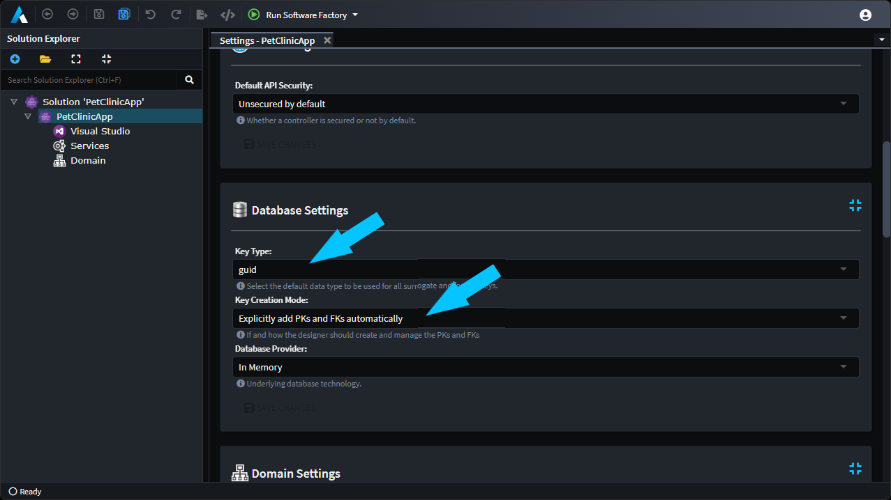
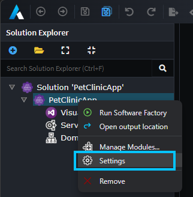
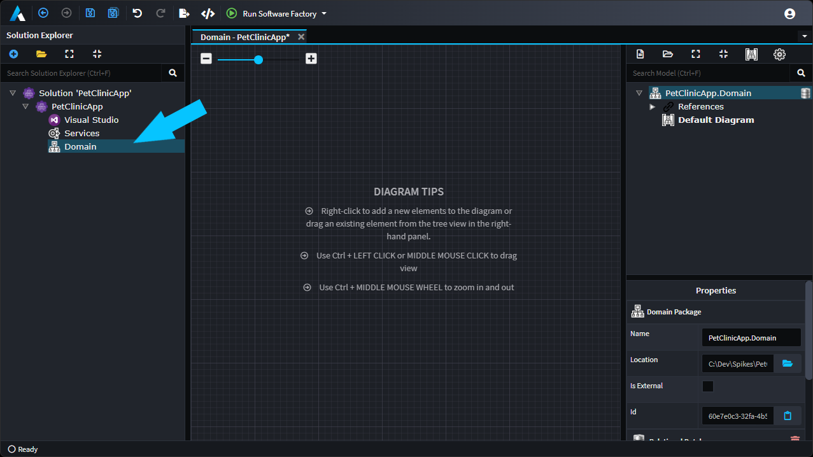
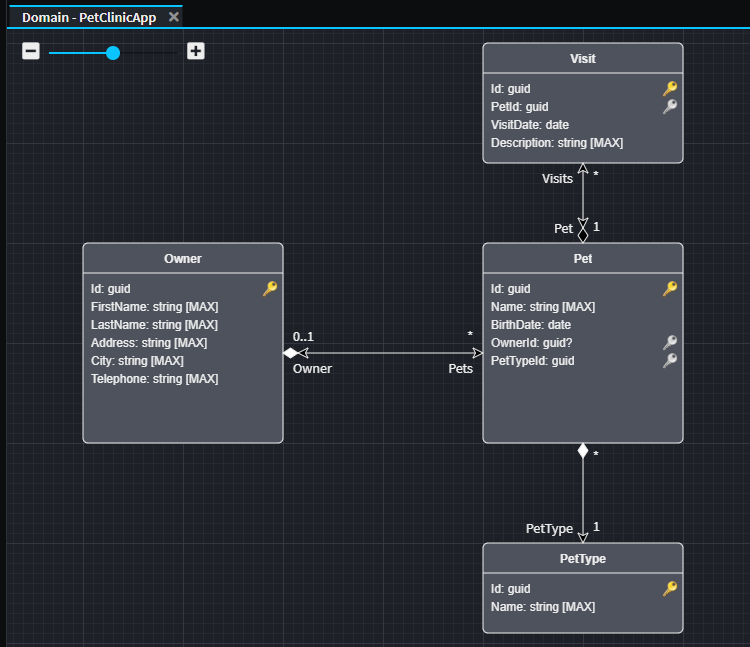
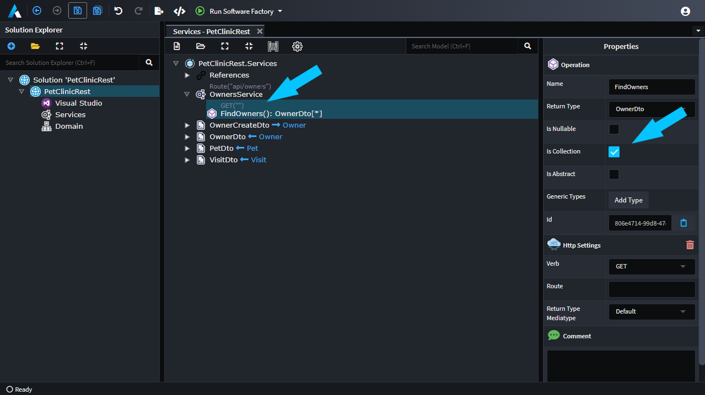
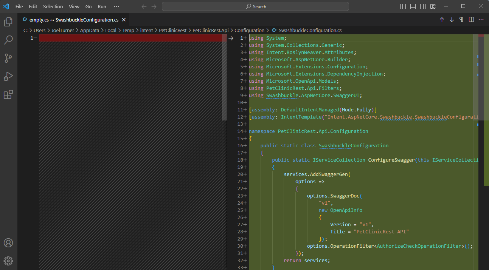
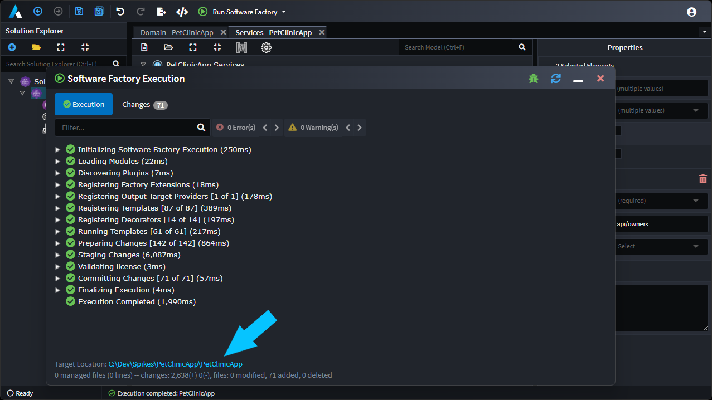
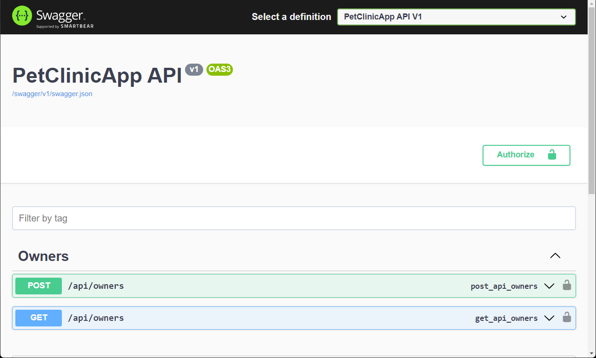
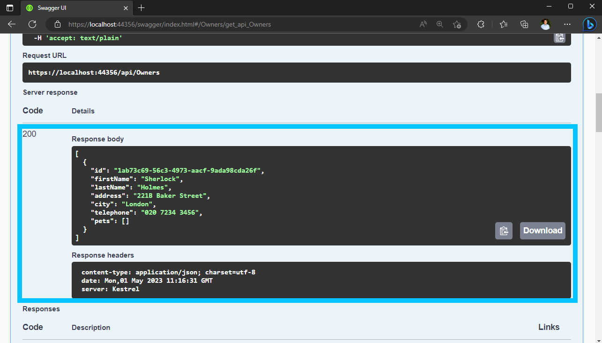

# Create Pet Clinic for the .NET C# Technology Stack

## Prerequisites

- Ensure Intent Architect has been [installed](xref:getting-started.get-the-application).
- The latest [Microsoft Visual Studio for Windows/Mac](https://visualstudio.microsoft.com/), [JetBrains Rider](https://www.jetbrains.com/rider/download/), or any other IDE capable of working with .NET projects.

## Create a new Application

On the home screen, click `Create a new application`.

Select the `Standard ASP.NET Core Web Application` Application Template.

Fill in a `Name` (such as `PetClinicRest`), review/change the `Location` as desired and click `NEXT`.

Leave the selected application components as is and click `CREATE`.

The `Task Output` dialogue will pop up showing the progress of downloading and installing Modules and Metadata for the Application and once it's finished, will hide itself automatically:

[!Video-Loop videos/create-new-app.mp4]

> [!NOTE]
>
> The `Task Output` dialog can be re-opened at any time by clicking on the text at the bottom-left corner of the window which shows the name of any currently executing task or otherwise says "Ready".

## Configure Explicit Key Creation

The application `Settings` tab should be open, locate the `Database Settings` section. Select `Explicitly add PKs and FKs automatically` from the `Key Creation Mode` dropdown. It will become apparent in the next section.

> [!NOTE]
> In the Database Settings section, make note that Key Type is `guid` as this is the type we will be using later for our Primary Keys.



> [!NOTE]
> You can get back to your Application settings through it's context menu.
> 


## Create the Domain Entities

Click on `Domain` on the left of the window to enter the [designer](xref:application-development.modelling.domain-designer.how-to-use-the-domain-designer).

Out the box, the designer will add, and open, a `Default Diagram` to start visual modelling on.



This is where the "business domain" will be modelled using a [UML class](https://en.wikipedia.org/wiki/Class_diagram) relationship diagram which Intent Architect will use to generate C# classes and ultimately a database schema.

This PetClinic application's business domain requires the following [entities](https://en.wikipedia.org/wiki/Domain-driven_design#Building_blocks) (concepts) to be modelled:

- `Pet`
- `Owner` (to which a `Pet` "belongs to")
- `Visit` (to represent each visit by a `Pet` to the PetClinic)

Entities can be added to the domain designer by right-clicking on the background and selecting the `New Class` option. Alternatively, they can also be added in the tree view by right-clicking on a folder and similarly selecting the `New Class` option.

Create a `Pet` entity and then right-click it (on either the visual diagram's block or the tree view element) and then select the `Add Attribute` option to add the following attributes:

- `Name` of type `string`
- `BirthDate` of type `date`

[!Video-Loop videos/create-entity-pet.mp4]

> [!NOTE]
> An `Id` Primary Key attribute has been automatically added to our `Pet` entity because we've configured the Database settings to use `Explicitly add PKs and FKs automatically` and its type was set to `guid` due as per the `Key Type` setting.

Create an `Owner` entity with the following attributes:

- `FirstName` of type `string`
- `LastName` of type `string`
- `Address` of type `string`
- `City` of type `string`
- `Telephone` of type `string`

> [!TIP]
> Follow this [shortcut demonstration](xref:application-development.user-interface.keyboard-shortcuts#create-new-element-of-selected-type) to add multiple attributes without using the mouse.

The `Owner` entity should appear as follows:


## Specify the relationships between entities

Specifying [relationships](https://en.wikipedia.org/wiki/Class_diagram#Instance-level_relationships) between entities in the Intent Architect designers can be initiated by right-clicking on an entity in the visual diagram, then selecting the `New Association` option and the creation is completed by clicking on the other class which you want to be the target of the relationship.

> [!NOTE]
> Refer to [this article](xref:application-development.modelling.domain-designer.about-associations) if you wish to learn more about Associations.

Create an association between `Owner` and `Pet`:

- Right-click on the `Owner` entity.
- Click on the `New Association` option.
- Click on the `Pet` entity which completes the creation of the association.
- In the property pane (in the bottom-right corner of the window) within the `Target End` section ensure that `Is Collection` is checked.
- In the property pane within the `Source End` section ensure that `Is Collection` is *un*checked, `Is Nullable` is checked and that `Navigable` is checked.

[!Video-Loop videos/add-owner-pet-association.mp4]

Set up a `Visit` entity to be as follows:

- Add an association from `Pet` to `Visit`:
  - In the property pane (in the bottom-right corner of the window) within the `Target End` section ensure that `Is Collection` is checked.
  - In the property pane within the `Source End` section ensure that `Is Collection` is *un*checked and that `Navigable` is checked.
- Add the following attributes:
  - `visitDate` of type `date`.
  - `description` of type `string`.

Also set up a `PetType` entity in a similar way:

- Add an association from `Pet` to `PetType`:
  - In the property pane (in the bottom-right corner of the window) within the `Target End` section, ensure that `Is Collection` is *un*checked.
  - In the property pane within the `Source End` section, ensure that `Is Collection` is checked.
- Add the following attributes:
  - `name` of type `string`.



## Create Services

Click on the `Services` designer located in the left panel. This is where API Services can be modelled to interact with the entities modelled in the domain designer.

Create the `OwnerController` service in the `Services` package by right-clicking on the `Services` package and clicking the `New Service` option.


Create the `OwnerDto`:

- Right-click on the `Services` package and select the `New DTO` option.
- Give it the name `OwnerDto`.

Also, create the following additional DTOs:

- `PetDto`
- `OwnerCreateDto`

Right-click the `OwnerCreateDto` element and click the `Add Field` option to add the following fields:

- `FirstName` with type of `string`.
- `LastName` with type of `string`.
- `Address` with type of `string`.
- `City` with type of `string`.
- `Telephone` with type of `string`.


## Map the DTO fields from Domain Entities

- Right-click the `PetDto` element and click on the `Map from Domain...` option.
- Select the `Pet` Entity from the bottom drop-down.
- Ensure that the following attributes are checked:
  - `Id`
  - `Name`
  - `BirthDate`
  - `Visits`
- Expand the `PetType` association and ensure the following attributes under it are checked:
  - `Name`
- Expand the `Owner` association and ensure the following attributes under it are checked:
  - `FirstName`
  - `LastName`

Click `DONE`.

You will see that the `Visits` field has automatically been mapped to a `VisitsDto`, which has been added for you:

You will see that the `PetDto` element has multiple fields sharing the same name. Notice that the arrow to the right of the field name shows the "source path" for each field's mapping in the format `<AssociationName>.<AttributeName>`. To make the field names on the DTO unique it is generally suggested to make the name the same as the path:

- `Name` from `PetType.name` becomes `PetTypeName`.
- `FirstName` from `Owner.firstName` becomes `OwnerFirstName`.
- `LastName` from `Owner.lastName` becomes `OwnerLastName`.

[!Video-Loop videos/service-mapping-pet.mp4]

Lastly, for `OwnerDto`:

- Right-click the `OwnerDto` element and click on the `Map from Domain...` option.
- Select the `Owner` Entity from the bottom drop-down.
- Ensure that the following attributes are checked:
  - `Id`
  - `FirstName`
  - `LastName`
  - `Address`
  - `City`
  - `Telephone`
  - `Pets`
- Click `DONE`
- Select the `Pets` element.

## Add Operations to the Service

- Right-click on the `OwnerController` element and click the `Add Operation` option.
- Name it `GetOwners` and set the return type to `OwnerDto`.
- In the properties pane on the right:
  - Ensure `Is Collection` is checked.
- Right-Click on the `GetOwners` operation and click `Expose as Http Endpoint`.
- Click on the `OwnerController`, in the `Properties` window change the Route to `api/Owner`



- Right-click on the `OwnerController` element and click the `Add Operation` option.
- Name it `addOwner` and leave the return type blank.
- Right-click the `addOwner` element and click the `Add parameter` option.
- Give the parameter a name of `dto` and set its type to `OwnerCreateDTO`.

[!Video-Loop videos/services-add-add-owner.mp4]

## Generate the Code

Click the `Run Software Factory` button located near the top right of the window.

[!Video-Loop videos/software-factory-run.mp4]

Once the staged `Changes` comes into view, you can review the proposed code changes.

> [!TIP]
> The `Filter` box near the top-right of the `Software Factory Execution` modal can be used to help quickly locate particular files.
>
> [!TIP]
> You can double-click on entries to have Intent Architect start up an external "diff" tool which you can use to review the proposed changes to a particular file. By default Intent Architect will use Visual Studio Code if it can find it; otherwise, you can manually configure any other "diff" tool in Settings.
>
> 

Click `APPLY CHANGES` and then minimize the Software Factory Execution by using the "_" icon near the top-right.

> [!NOTE]
>
> When the Software Factory Execution is minimized, it is now watching for any saved changes to the Intent Architect Application or its Modules and will re-run itself should any be detected.

## Test the generated application's back-end

We now want to open the generated application's `.sln` file. The easiest way to locate the `.sln` file is to click on `Settings` in the left bar of Intent Architect. Beneath the `Relative Output Location:` text box is a clickable link which will open the Output Location in your operating system's file browser:



Open the `.sln` file using your preferred .NET capable IDE and then ensure that the startup project is set to the `.WebApi` one, then compile, and run the solution.

If you're running Visual Studio, it should automatically open the website in your browser. Append `/swagger` to the URL and press your return key to navigate to it.



Click on the `POST` version of the `/api/Owner` panel and then click on the `Try it out` button.

Paste the following in the request body text box:

```json
{
  "firstName": "Sherlock",
  "lastName": "Holmes",
  "address": "221B Baker Street",
  "city": "London",
  "telephone": "020 7234 3456"
}
```

Click on the blue `Execute` button.

It should show a success result which means that the application should have added an entry with the above details to its database.


To see the database record inserted above, in Swagger now click on the `GET` version of the `/api/Owner` panel and click on the `Try it out` button followed by clicking on the blue `Execute` button.

It should also have a success result as well as an array of JSON results including the entry you created above.



## What's Next

### Finish the Implementation

- [Create additional CRUD services](xref:tutorials.create-a-sample-app.create-crud-services).
- If you wish to continue exploring the concepts covered by this tutorial you can make new services, operations, and DTOs to cover additional use cases towards a complete implementation of the PetClinic.

### Get the completed solution

Alternatively, you can view the fully-fledged solution for multiple programming languages on [Github](https://github.com/IntentSoftware/Samples-PetClinic).
