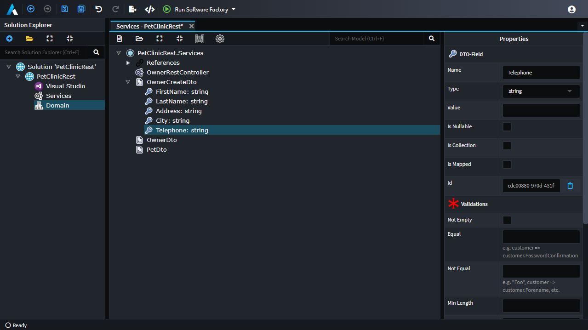
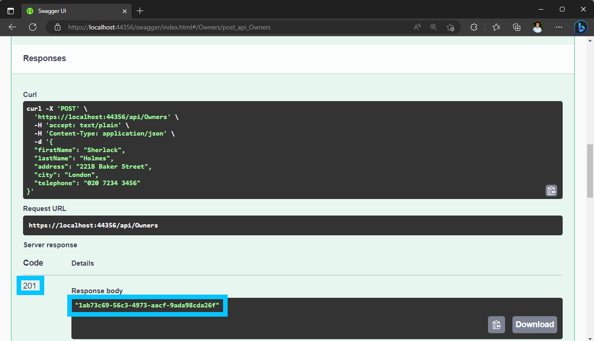

# Create Pet Clinic for the .NET C# Technology Stack

## Prerequisites

- Ensure Intent Architect has been [installed](xref:getting-started.get-the-application).
- The latest [Microsoft Visual Studio for Windows/Mac](https://visualstudio.microsoft.com/), [JetBrains Rider](https://www.jetbrains.com/rider/download/), or any other IDE capable of working with .NET Core projects.

## Create a new Application

On the home screen, click `Create a new application`.

Select the `Web Application ASP.NET Core 5.0` Application Template.

Fill in a `Name` (such as `PetClinicRest`), review/change the `Location` as desired and click `NEXT`.

Ensure that the following Modules are selected:

- `ASP.NET Core RESTful API`
- `OpenAPI (Swashbuckle)`
- `Basic Service Implementation`
- `Entities`
- `Entity Framework Core`
- `Visual Studio Integration`

An `Application Installation` dialogue will pop up showing the progress of downloading and installing Modules and Metadata for the Application and once it's finished, will hide automatically:

[!Video-Loop videos/create-new-app.mp4]

## Create a package for the Domain designer

Click on `Domain` on the left of the screen to enter the designer.

Click `CREATE NEW PACKAGE`.

Leave the name with its default value of `Domain` and click `DONE`.

This is where the "business domain" will be modelled using a [UML](https://en.wikipedia.org/wiki/Unified_Modeling_Language) class relationship diagram which Intent Architect will use to generate C# classes and ultimately a database schema.

<p><video style="max-width: 100%" muted="true" loop="true" autoplay="true" src="videos/create-domain-package.mp4"></video></p>

### Create the Domain Entities

This PetClinic application's business domain requires the following [entities](https://en.wikipedia.org/wiki/Domain-driven_design#Building_blocks) (concepts) to be modelled:

- `Pet`
- `Owner` (to which a `Pet` "belongs to")
- `Visit` (to represent each visit by a `Pet` to the PetClinic)

Entities can be added to the domain modeler by right-clicking on the background and selecting the `New Class` option. Alternatively, they can also be added in the tree view by right-clicking on a folder and similarly selecting the `New Class` option.

Create a `Pet` entity and then right-click it (on either the visual diagram's block or the tree view element) and then select the `Add Attribute` option to add the following attributes:

- `name` of type `string`
- `birthDate` of type `date`

<p><video style="max-width: 100%" muted="true" loop="true" autoplay="true" src="videos/create-entity-pet.mp4"></video></p>

Create an `Owner` entity with the following attributes:

- `firstName` of type `string`
- `lastName` of type `string`
- `address` of type `string`
- `city` of type `string`
- `telephone` of type `string`


> [!NOTE]
> You may have noticed that no `id` field has been specified. This is because the code that will be generated will automatically generate one for us.

## Specify the relationships between entities

Specifying [relationships](https://en.wikipedia.org/wiki/Class_diagram#Instance-level_relationships) between entities in the Intent Architect designers can be initiated by right-clicking on an entity in the visual diagram, then selecting the `New Association` option which is then completed by clicking on the other class which you want to be the target of the relationship.

> [!NOTE]
> Refer to [this article](xref:designers.about-domain-designer.about-associations) if you wish to learn more about Associations.

Create an association between `Owner` and `Pet`:

- Right-click on the `Owner` entity.
- Click on the `New Association` option.
- Click on the `Pet` entity which completes the creation of the association.
- In the property pane (in the bottom-right corner of the screen) within the `Target End` section ensure that `Is Collection` is checked.
- In the property pane within the `Source End` section ensure that `Is Collection` is *un*checked and that `Navigable` is checked.

<p><video style="max-width: 100%" muted="true" loop="true" autoplay="true" src="videos/add-owner-pet-association.mp4"></video></p>

Setup a `Visit` entity to be as follows:

- Add an association from `Pet` to `Visit`:
  - In the property pane (in the bottom-right corner of the screen) within the `Target End` section ensure that `Is Collection` is checked.
  - In the property pane within the `Source End` section ensure that `Is Collection` is *un*checked and that `Navigable` is checked.
- Add the following attributes:
  - `visitDate` of type `date`.
  - `description` of type `string`.

Also, set up a `PetType` entity in a similar way:

- Add an association from `Pet` to `PetType`:
  - In the property pane (in the bottom-right corner of the screen) within the `Target End` section, ensure that `Is Collection` is *un*checked.
  - In the property pane within the `Source End` section, ensure that `Is Collection` is checked.
- Add the following attributes:
  - `name` of type `string`.


## Create a package for the Services designer

Click on the `Services` designer located in the left panel. This is where API Services can be modelled to interact with the entities modelled in the domain designer.

Click `CREATE NEW PACKAGE`.

Leave the name with its default value of `Services` and click `DONE`.

<p><video style="max-width: 100%" muted="true" loop="true" autoplay="true" src="videos/create-services-package.mp4"></video></p>

Create the `OwnerRestController` service in the `Services` package by right-clicking on the `Services` package and clicking the `New Service` option.


Create a new Package in which [DTO](https://en.wikipedia.org/wiki/Data_transfer_object)s will be modelled:

- Right-click the background of the modeller and click the `Create new package` option.
- Give it the name `DTOs`.
- Click on the `Save` button.
- Right-click on the `References` element located in the `Services` Package and click on the `Add Package Reference ...` option.
- On the modal which pops up check the `DTOs` entry.
- Click on `Save` again.

<p><video style="max-width: 100%" muted="true" loop="true" autoplay="true" src="videos/create-services-dtos-package.mp4"></video></p>

Create the `OwnerDTO`:

- Right-click on the `DTOs` package and select the `New DTO` option.
- Give it the name `OwnerDTO`.

Also, create the following additional DTOs:

- `PetDTO`
- `PetVisitDTO`
- `OwnerCreateDTO`

Right-click the `OwnerCreateDTO` element and click the `Add Field` option to add the following fields:

- `firstName` with type of `string`
- `lastName` with type of `string`
- `address` with type of `string`
- `city` with type of `string`
- `telephone` with type of `string`



## Map the DTO fields from Domain Entities

- Right-click the `PetVisitDTO` element and click on the `Mapping...` option.
- Pull down the `Select an element to map from` the dropdown and observe that it has a list of the modelled domain entities.
- Choose the `Visit` Entity.
- Ensure that the following attributes are checked:
  - `visitDate`
  - `description`

Click `DONE`.

<p><video style="max-width: 100%" muted="true" loop="true" autoplay="true" src="videos/service-mapping-pet-visit.mp4"></video></p>

Similarly for `PetDTO`:

- Right-click the `PetDTO` element and click on the `Mapping...` option.
- Select the `Pet` Entity from the bottom drop-down.
- Ensure that the following attributes are checked:
  - `name`
  - `birthDate`
  - `Visits`
- Expand the `PetType` association and ensure the following attributes under it are checked:
  - `name`
- Expand the `Owner` association and ensure the following attributes under it are checked:
  - `firstName`
  - `lastName`

Click `DONE`.

You will likely have noticed that the `Visits` field has been highlighted in red, this is because you will need to let Intent Architect know which type should be used for this field:

- Select the `Visits` element.
- In the properties pane on the right, change the `Type` to `PetVisitDTO`.

You will see that the `PetDTO` element has multiple fields sharing the same name. Notice that the arrow to the right of the field name shows the "source path" for each field's mapping in the format `<AssociationName>.<AttributeName>`. To make the field names on the DTO unique, it is generally suggested to make the name the same as the path, but without the periods, while also adopting the [camel casing](https://en.wikipedia.org/wiki/Camel_case) convention:

- `name` from `PetType.name` becomes `petTypeName`.
- `firstName` from `Owner.firstName` becomes `ownerFirstName`.
- `lastName` from `Owner.lastName` becomes `ownerLastName`.

<p><video style="max-width: 100%" muted="true" loop="true" autoplay="true" src="videos/service-mapping-pet.mp4"></video></p>

Lastly, for `OwnerDTO`:

- Right-click the `OwnerDTO` element and click on the `Mapping...` option.
- Select the `Owner` Entity from the bottom drop-down.
- Ensure that the following attributes are checked:
  - `firstName`
  - `lastName`
  - `address`
  - `city`
  - `telephone`
  - `Pets`
- Click `DONE`
- Select the `Pets` element.
- In the properties pane on the right, change the `Type` to `PetDTO`.

## Add Operations to the Service

- Right-click on the `OwnerRestController` element and click the `Add Operation` option.
- Name it `getOwners` and set the return type to `OwnerDTO`.
- In the properties pane on the right:
  - Ensure `Is Collection` is checked.
  - Change the `HTTP Verb` to `GET`.

> [!WARNING]
> If you find that the list of DTOs from the `DTOs` package does not show in the list of available types, save your work, navigate to another designer/screen (such as the Domain), then navigate back to the Services designer.

<p><video style="max-width: 100%" muted="true" loop="true" autoplay="true" src="videos/services-add-get-owners.mp4"></video></p>

- Right-click on the `OwnerRestController` element and click the `Add Operation` option.
- Name it `addOwner` and leave the return type blank.
- Right-click the `addOwner` element and click the `Add parameter` option.
- Give the parameter a name of `dto` and set its type to `OwnerCreateDTO`.
- In the properties pane on the right:
  - Change the `HTTP Verb` to `POST`.

<p><video style="max-width: 100%" muted="true" loop="true" autoplay="true" src="videos/services-add-add-owner.mp4"></video></p>

## Generate the Code

Run the `Software Factory Execution` by clicking on the Play button located on the top right part of the screen.

<p><video style="max-width: 100%" muted="true" loop="true" autoplay="true" src="videos/software-factory-run.mp4"></video></p>

Once the staged `Changes` comes into view, you can review the proposed code changes, for example, the `OwnerService.cs`.

> [!TIP]
> The `Filter` box near the top-right of the `Software Factory Execution` modal can be used to help quickly locate particular files.

Click on the file located in the `Implementation` folder.


On double-clicking the file, Intent Architect will start up an external "diff" tool which you can use to review the changes. By default Intent Architect will use Visual Studio Code if it can find it; otherwise, you can manually configure any other "diff" tool in Settings.


Don't apply the changes for the moment and instead minimize the Software Factory Execution by clicking on the minimize button.

Click the `Modules` option located in the left pane of the window and install the following modules:

- `Intent.EntityFrameworkCore.Repositories`
- `Intent.Application.ServiceImplementations.Conventions.CRUD`

Once you've installed those modules, you will notice a blinking button at the bottom of the screen. Click on it to view the Software Factory Execution again. When it detected the module installation, it automatically performed another Software Factory Execution.

Once it is done, double-click the file `OwnerService` in the changes and observe how its output has changed from the previous run.

<p><video style="max-width: 100%" muted="true" loop="true" autoplay="true" src="videos/view-software-factory-after-module-installation.mp4"></video></p>


> [!NOTE]
> Notice that the operations are now populated with code that will facilitate [CRUD](https://en.wikipedia.org/wiki/Create,_read,_update_and_delete) operations.
>
> The `Intent.Application.ServiceImplementations.Conventions.CRUD` module automatically checked for operations that followed simple conventions and generated basic implementations where detected.
>
> Anything not meeting those conventions were ignored and no implementations were generated.
>
> [!WARNING]
>
> It is recommended to always review all of the files in the `Changes` tab of the Software Factory Execution to ensure that all of the changes that will be applied are as expected.

This time we will commit the changes, so click `APPLY CHANGES`. Minimize the Software Factory Execution once again.

## Add missing Id fields to DTOs

Up to this point, we are not presenting any `Id`s to the consumer of our API Services.

Navigate back to the `Services` designer and perform the following:

- Right-click on `OwnerDTO` and add a new field called `id` with the type `guid`.
- In the properties panel, click on `Is Mapped`.
- A `Mapping Path` field appears. Enter `Id`.

<p><video style="max-width: 100%" muted="true" loop="true" autoplay="true" src="videos/service-mapping-pet-visit-with-ids.mp4"></video></p>

Click on save and again note a blinking button at the bottom of the screen due to the Software Factory Execution automatically happening again. It detected your having pressed save and automatically initiated a Software Factory Execution.

<p><video style="max-width: 100%" muted="true" loop="true" autoplay="true" src="videos/software-factory-execution-after-id-added.mp4"></video></p>

`APPLY` the change and do the same for the following types:

- `PetDTO`
- `PetVisitDTO`

## Test the generated application's back-end

We now want to open the generated application's `.sln` file. The easiest way to locate the `.sln` file is to click on `Settings` in the left bar of Intent Architect. Beneath the `Relative Output Location:` text box is a clickable link which will open the Output Location in your operating system's file browser:


Open the `.sln` file using your preferred .NET capable IDE and then ensure that the startup project is set to the `.WebApi` one, then compile, and run the solution.

If you're running Visual Studio, it should automatically open the website in your browser. Append `/swagger` to the URL and press your return key to navigate to it.


Click on the `POST` version of the `/api/OwnerRest` panel and then click on the `Try it out` button.

Paste the following in the request body text box:

```json
{
  "firstName": "Sherlock",
  "lastName": "Holmes",
  "address": "221B Baker Street",
  "city": "London",
  "telephone": "020 7234 3456"
}
```

Click on the blue `Execute` button.

It should show a success result which means that the application should have added an entry with the above details to its database.



To see the database record inserted above, in Swagger now click on the `GET` version of the `/api/OwnerRest` panel and click on the `Try it out` button followed by clicking on the blue `Execute` button.

It should also have a success result as well as an array of JSON results including the entry you created above.


## What's Next

### Finish the Implementation

If you wish to continue exploring the concepts covered by this tutorial you can make new services, operations, and DTOs to cover additional use cases towards a complete implementation of the PetClinic.

### Get the completed solution

Alternatively, you can view the fully-fledged solution for multiple programming languages on [Github](https://github.com/IntentSoftware/Samples-PetClinic).

### [Tutorial: Create a Module (.NET)](xref:tutorials.create-a-module.introduction)

A tutorial on how to create a Module and install it into an Application.
