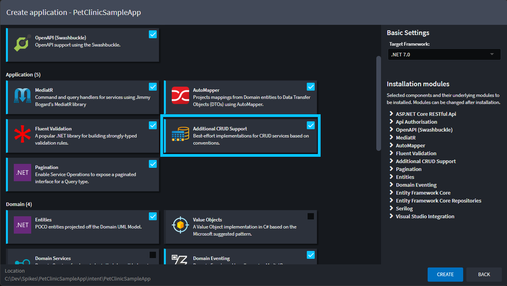
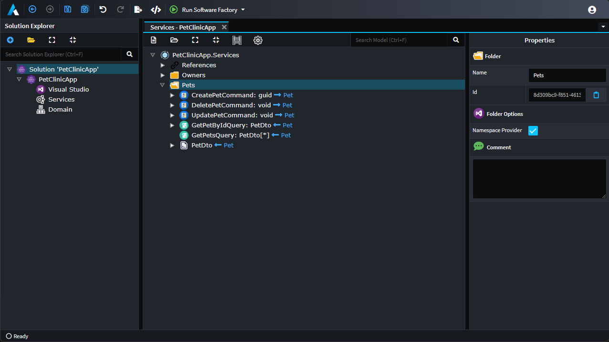

# Create CRUD services

## Overview

This article continues from [](xref:tutorials.create-a-sample-app.create-a-petclinic-csharp) and shows how to create additional [CRUD](https://en.wikipedia.org/wiki/Create,_read,_update_and_delete) services and operations using the `Create CQRS CRUD Operations` context menu option.

Intent Architect was built for automating the most complex conceivable use cases, so for Intent Architect Modules to add automation for simple patterns like CRUD is very easy. The Clean Architecture application template by default includes the `Additional CRUD Support` component which does exactly this.



## Create the additional services

- Right-click the `Services` tree node.
- Select the `Create CQRS CRUD Operations` context menu option.

You will be presented with a `Lookup Type` dialogue.

- Select the `Pet` option.
- Press `DONE`.

The `Create CQRS CRUD Operation` script option you selected will now automatically create a CQRS Style `PetsService`, with all the relevant `Command`s, `Query`s and `DTO`s:



It has automated the same process you could have alternatively done manually in the designer by creating all these elements.

The final thing we need to do is to configure how our service will be distributed.
* Select all the `Pet` `Command`s and `Query`s
* Right-click and select `Expose as Http Endpoint`
* Click the `Save` icon.

## Run the Software Factory

Run the [Software Factory](xref:tutorials.create-a-sample-app.create-a-petclinic-csharp#generate-the-code), once complete, double-click `CreatePetCommandHandler.cs` file:


Contents like, or very similar to, the following has been generated:

```csharp
using System;
using System.Linq;
using System.Threading;
using System.Threading.Tasks;
using Intent.RoslynWeaver.Attributes;
using MediatR;
using PetClinicApp.Domain.Entities;
using PetClinicApp.Domain.Repositories;

[assembly: DefaultIntentManaged(Mode.Fully)]
[assembly: IntentTemplate("Intent.Application.MediatR.CommandHandler", Version = "1.0")]

namespace PetClinicApp.Application.Pets.CreatePet
{
    [IntentManaged(Mode.Merge, Signature = Mode.Fully)]
    public class CreatePetCommandHandler : IRequestHandler<CreatePetCommand, Guid>
    {
        private readonly IPetRepository _petRepository;

        [IntentManaged(Mode.Merge)]
        public CreatePetCommandHandler(IPetRepository petRepository)
        {
            _petRepository = petRepository;
        }

        [IntentManaged(Mode.Fully, Body = Mode.Fully)]
        public async Task<Guid> Handle(CreatePetCommand request, CancellationToken cancellationToken)
        {
            var newPet = new Pet
            {
                Name = request.Name,
                BirthDate = request.BirthDate,
                OwnerId = request.OwnerId,
                PetTypeId = request.PetTypeId,
            };

            _petRepository.Add(newPet);
            await _petRepository.UnitOfWork.SaveChangesAsync(cancellationToken);
            return newPet.Id;
        }
    }
}
```

Observe how the `CommandHandler`  has been implemented for you. These implementations were generated by decorators in the `Intent.Application.ServiceImplementations.Conventions.CRUD` module which was by default installed by the application template. The decorators recognized the conventional operation names, with conventional DTOs, with conventional fields on them and then automatically generated these implementations.

You can press `APPLY` and then test these in Visual Studio and Swagger as per part 2 of this tutorial.

## Summary

You have used the `Create CQRS CRUD Operations` script available on the services designer to model and generate operations for basic CRUD operations on entities. This process can be done in a matter of _seconds_.
