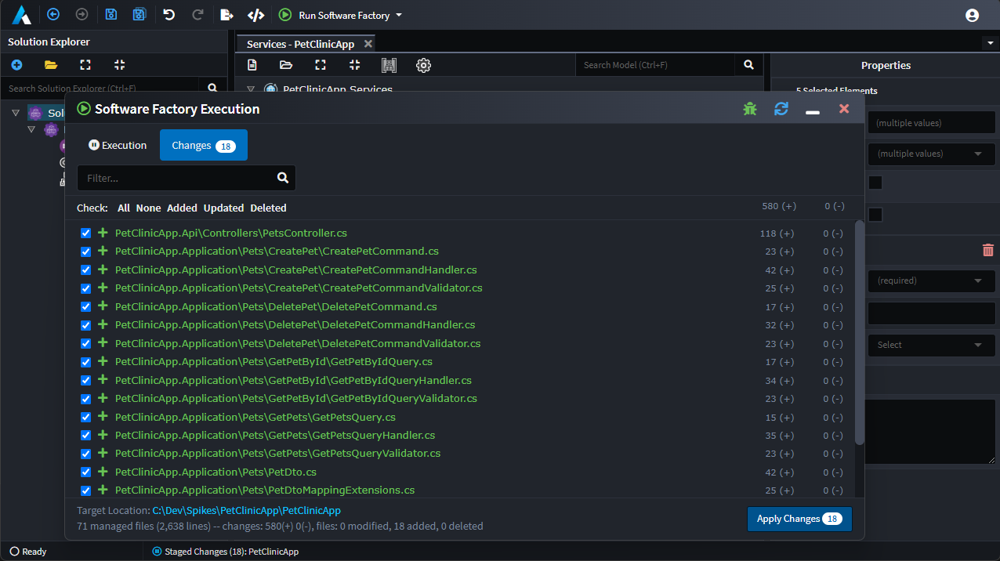

# Create CRUD services

## Overview

This article continues from [](xref:tutorials.create-a-sample-app.create-a-petclinic-csharp) and shows how to create additional [CRUD](https://en.wikipedia.org/wiki/Create,_read,_update_and_delete) services and operations using the `Create CRUD Operations` context menu option.

Intent Architect was built for automating the most complex conceivable use cases, so for Intent Architect Modules to add automation for simple patterns like CRUD is very easy. The Clean Architecture application template by default includes the `Additional CRUD Support` component which does exactly this.


## Preparation for additional services

To disambiguate the DTOs that already exist from the new ones being created, we're going to move them into their own folder.

- Ensure you are in the `Services` designer.
- Create a Folder called `Owners`.
- Select all the DTOs using the shift-click method.
- Drag all the selected DTOs into the `Owners` folder.

It should look like this:


## Create the additional services

- Right-click the `Services` tree node.
- Select the `Create CRUD Operations` context menu option.

You will be presented with a `Lookup Type` dialogue.

- Select the `Pet` option.
- Press `DONE`.

The `Create CRUD Operation` script option you selected will now automatically create a `PetsService`, CRUD operations and a corresponding `Pets` folder containing the DTOs for the operations:


It has automated the same process you could have alternatively done manually in the designer by creating all these elements.

## Run the Software Factory

Run the [Software Factory](xref:tutorials.create-a-sample-app.create-a-petclinic-csharp#generate-the-code), once complete, double-click `PetsService.cs` file:



Contents like, or very similar to, the following has been generated:

```csharp
using System;
using System.Collections.Generic;
using System.Linq;
using System.Threading.Tasks;
using AutoMapper;
using Intent.RoslynWeaver.Attributes;
using PetClinicRest.Application.Interfaces;
using PetClinicRest.Application.Pets;
using PetClinicRest.Domain.Entities;
using PetClinicRest.Domain.Repositories;

[assembly: DefaultIntentManaged(Mode.Fully)]
[assembly: IntentTemplate("Intent.Application.ServiceImplementations.ServiceImplementation", Version = "1.0")]

namespace PetClinicRest.Application.Implementation
{
    [IntentManaged(Mode.Merge)]
    public class PetsService : IPetsService
    {
        private readonly IPetRepository _petRepository;
        private readonly IMapper _mapper;

        [IntentManaged(Mode.Fully, Body = Mode.Ignore)]
        public PetsService(IPetRepository petRepository, IMapper mapper)
        {
            _petRepository = petRepository;
            _mapper = mapper;
        }

        [IntentManaged(Mode.Fully, Body = Mode.Fully)]
        public async Task<Guid> CreatePet(PetCreateDto dto)
        {
            var newPet = new Pet
            {
                Name = dto.Name,
                BirthDate = dto.BirthDate,
                OwnerId = dto.OwnerId,
                PetTypeId = dto.PetTypeId,
            };
            _petRepository.Add(newPet);
            await _petRepository.UnitOfWork.SaveChangesAsync();
            return newPet.Id;
        }

        [IntentManaged(Mode.Fully, Body = Mode.Fully)]
        public async Task<PetDto> FindPetById(Guid id)
        {
            var element = await _petRepository.FindByIdAsync(id);
            return element.MapToPetDto(_mapper);
        }

        [IntentManaged(Mode.Fully, Body = Mode.Fully)]
        public async Task<List<PetDto>> FindPets()
        {
            var elements = await _petRepository.FindAllAsync();
            return elements.MapToPetDtoList(_mapper);
        }

        [IntentManaged(Mode.Fully, Body = Mode.Fully)]
        public async Task UpdatePet(Guid id, PetUpdateDto dto)
        {
            var existingPet = await _petRepository.FindByIdAsync(id);
            existingPet.Name = dto.Name;
            existingPet.BirthDate = dto.BirthDate;
            existingPet.OwnerId = dto.OwnerId;
            existingPet.PetTypeId = dto.PetTypeId;
        }

        [IntentManaged(Mode.Fully, Body = Mode.Fully)]
        public async Task DeletePet(Guid id)
        {
            var existingPet = await _petRepository.FindByIdAsync(id);
            _petRepository.Remove(existingPet);
        }

        public void Dispose()
        {
        }
    }
}
```

Observe how all the CRUD methods had implementations generated for them. These implementations were generated by decorators in the `Intent.Application.ServiceImplementations.Conventions.CRUD` module which was by default installed by the application template. The decorators recognized the conventional operation names, with conventional DTOs, with conventional fields on them and then automatically generated these implementations.

You can press `APPLY` and then test these in Visual Studio and Swagger as per part 2 of this tutorial.

## Summary

You have used the `Create CRUD Operations` script available on the services designer to model and generate operations for basic CRUD operations on entities. This process can be done in a matter of _seconds_.
