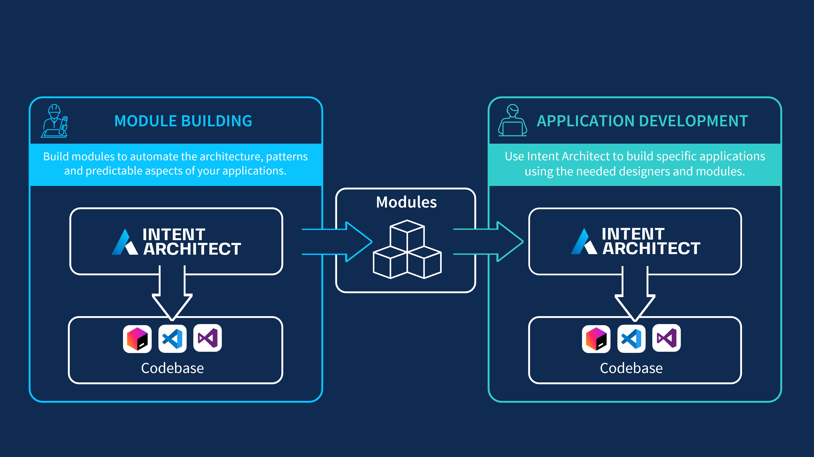

# The Two Development Roles

In the same way that traditional software development teams have members who fulfil different roles (such as developing infrastructure, architecture, backends, front-end applications, API integration and consumer services, etc.) Intent Architect is no different in that developers who design and implement Applications may be different to the developers who supply the [Modules](xref:modules.about-modules) that support the ability for the Application developers to function (more efficiently) and deliver value.

> [!NOTE]
> Not all software development teams may have the need to develop and maintain their own Modules, since Intent Architect offers a suite of Modules out of the box to development teams. However, Intent Architect offers power and flexibility for those who do.

## Module Building

This can be likened in general to developers who create their own library packages for Nuget, NPM, Yarn, PIP, etc. It allows for an installable package to supply code that can plug in to the existing code-base to provide additional functionality to help achieve the goal of delivering business value.

Developers who build Modules in Intent Architect are providing different value in that their focus is on finding ways to automate architecture, patterns and any other predictable aspects of software development and provide installable Module packages to the development teams who need them.

This can form part of the same software development development-cycle of the team who is developing applications using Intent Architect, or it can even be an entirely different team operating on a separate development-cycle.

## Application Development

These are the consumers of the said Module packages who install and benefit from the automation features that it provides. This can include new forms of code being generated which saves a lot of time and effort for development teams or it can be that new and/or enhanced designers are provided which offer richer designing experiences and can potentially offer opportunities for other parts of the code-base to be automated that previously had to be maintained by hand.
