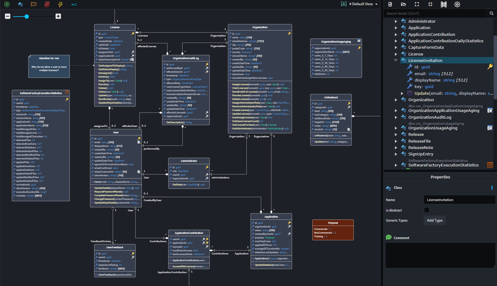
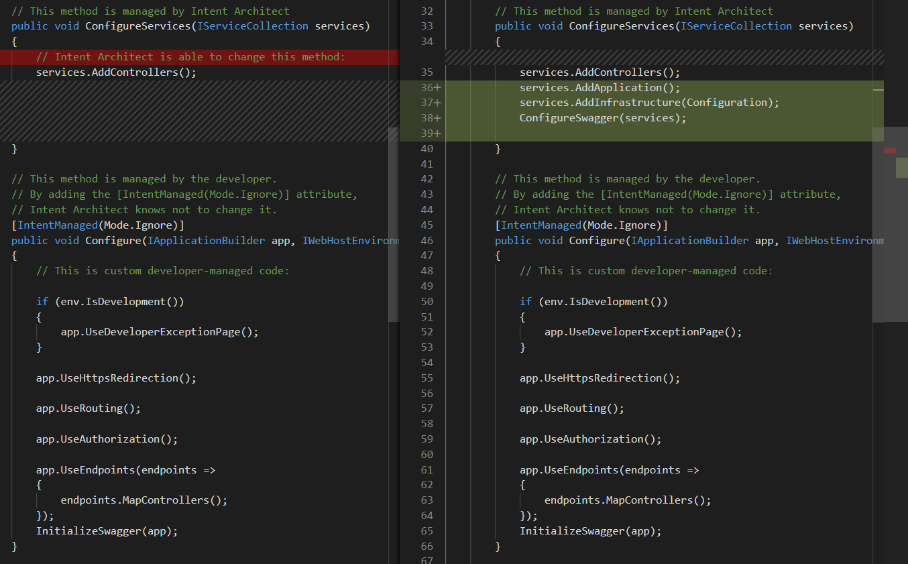
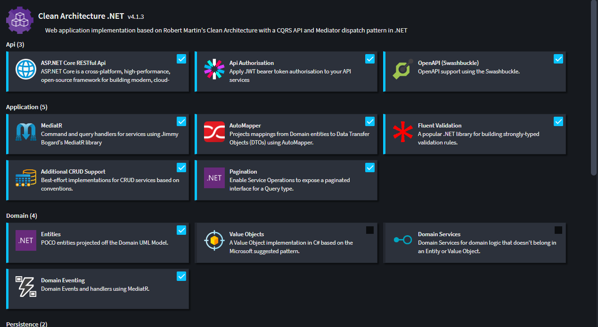

# Welcome

## Overview

Intent Architect is a practical and non-prescriptive, design and code-automation platform for developers.

It helps development teams dramatically accelerate their delivery, standardize their architecture, design their application's blueprint, and keep their technologies up to date.

Intent Architect can be thought of as a _robot developer_ whose sole purpose is to await instructions and do the bidding of the human developer.

The platform is designed to be completely under the control of the developers and to never get in their way - bringing all the advantages of code-automation, without any of the drawbacks that have historically invalidated the approach.

## How it's achieved

By combining visual modelling, code-management, and pattern reuse into a powerful and intuitive platform, Intent Architect offers the first truly practical approach to code-automation. These mechanisms are explained briefly below.

### Visual Models

Intent Architect allows developers to use visual models to describe their application's design. By compressing information into visual formats (e.g. entity relationship diagrams), the human mind can quickly interpret and digest it. When instructed, Intent Architect synchronizes the visual models with the codebase according to the patterns (Modules) that the developer has installed. In this way, it ensures that the visual models are a true representation of the codebase, thereby providing teams with blueprints of their systems.

_Example of an entity relationship diagram being used to design a domain and its persistence characteristics._

### Code Management

Code-automation as used in the software industry has two flavours: once-off (scaffolding) and continuous. Both have their place, but come with trade-offs and compromises in customizability and control.

Code-management is a unique approach to code-automation that completely avoids the typical compromises. It utilizes abstract syntax tree parsing and intelligent algorithms to merge user-written code with automatically generated code. Code-management allows developers to control the automation systems of Intent Architect from a high-level all the way to the granular level of the members within each managed code file (e.g. classes, fields, functions, methods, etc.). 

As an example, a developer may configure a C# or Java file such that they are managing the implementation of one method within a class, while Intent Architect will manage the remaining methods. They may then choose to change this configuration, perhaps deciding to take over management of the entire class or just one of the other methods. The configuration of each file is completely controlled by the developer, preventing the automation system from ever getting in the way.

_An example of how Intent Architect would change a C# `Startup.cs` file that is partially managed by the developer and partially by Intent Architect. Changes are staged before being accepted by the developer, allowing them to diff the changes before accepting or rejecting them._

### Pattern Reuse

Software systems are made up of patterns – each instance is different, but the patterns are the same. These patterns glue the technologies to the business logic and can easily account for over 80% of a codebase. Pattern reuse is the ability to turn these patterns into artifacts that can be reused within projects and across organizations. Intent Architect's _Modules_ serve as a collection of one or more of these artifacts and provide the mechanism to turn visual models and metadata into code.

With Intent Architect, teams can choose to build and maintain their own Modules or simply reuse modules made by other developers.

_An example of an application template for a .NET Core web application that uses Robert Martin's clean architectural principles. Each component represents Modules that automate a specific aspect of the architecture._

## Supported technologies

Intent Architect **does not introduce any hard runtime dependencies** and is capable of generating and managing files for _any_ programming language or technology.

Therefore, since Intent Architect is language oriented (it manages code files), it completely supports any framework or technology (including custom, in-house built frameworks) that is managed by the language.

For the advanced [code-management](#code-management) capabilities described above, Intent Architect currently has support for the following languages:
 - C#
 - Java
 - TypeScript / JavaScript
 - HTML
 - SQL

This list will continue to grow to include other popular programming languages such as Python and Go in the near future.

## Non-prescriptive

Intent Architect is non-prescriptive, making it unopinionated on choice of architecture, language, technologies, or even how the application's design is prescribed.

While other code generation solutions tend to generate code that works and looks in a particular way, Intent Architect is instead just a platform, and the code that is managed is determined by the particular _Modules_ that the team has installed into any particular application.

Since _Modules_ are typically created and managed by the architect(s) within an organization, there is no constraint on forced opt-in, and the development team is completely in control of what code is managed under automation, and what code they will manage by hand.

Similarly, Intent Architect does not dictate how developers design their system. Where most modelling products constrain developers to use strict UML diagrams (Class Diagrams, State Diagrams, Sequence Diagrams, etc.), Intent Architect's modelling systems are completely customizable, configurable and extensible. Teams choose how _they_ want to design their application. They also choose _which_ parts of the system they want to model visually.

## Use cases

Intent Architect is ideal for automating architectural, infrastructural, and boilerplate code. Depending on the project, this type of code can make up over 80% of the codebase. Typically, the tool is used by developers to achieve the following:
- **Bootstrapping** - microservices, monolithic applications, application modules, identity, etc.
- **Persistence Infrastructure** - ORM Mappings, Repositories, etc.
- **Service Infrastructure** - RESTful Web Services, Data Transfer Objects, Dispatch Patterns (e.g. Mediator, Interface Dispatch), etc.
- **Eventing Infrastructure** - Events, Message Broker configuration, Message dispatch infrastructure, etc.
- **Business Logic Placeholders** - Domain Entities, Service Call Handlers, Command / Query Handlers, etc.
- **Front-End Infrastructure** - Components, Service Proxies, Models, etc.
- **Workflow Design** - Workflow Infrastructure, Flow Control Systems, etc.

The use cases for Intent Architect really are endless. A general rule of thumb is **if it can be described, it can be automated**. In other words, if a developer can define a way to adequately model their _design intent_, they would be able to create a _Module_ to automate that particular pattern.

## No lock-in

Intent Architect is not a framework or runtime platform. It does not inherently introduce any hard runtime dependencies. Because it generates and manages code (and the code is written in the same style as a developer - a key principle when creating Modules), there is no dependency on it, and therefore no lock-in. Teams may choose to continue building their project without Intent Architect and all the code that was managed by Intent Architect will be no worse off than if it were originally written by hand.

## What's Next

#### [Get the application](xref:getting-started.get-the-application)

How to download and install Intent Architect, and how to create an account.

#### [Take a tour](xref:getting-started.take-a-tour)

Discover the key concepts and features in Intent Architect.