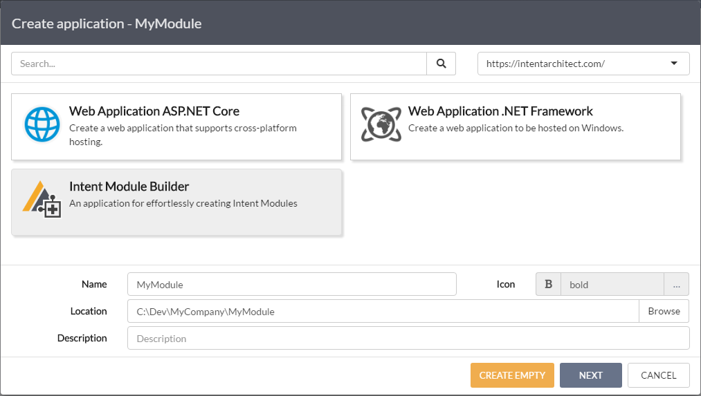
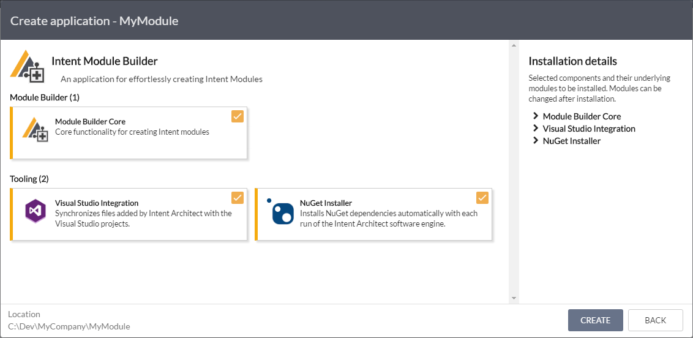

# Create your own Module

Modules are the building blocks and extension points of Intent Architect. They typically encapsulate _how_ your metadata should be realized as code in your application. 

By creating modules to automate the repetitive coding tasks that you as a developer do, you effectively save yourself (and your team!) all that time and effort. In addition, you no longer have to manage the each instance of the automated pattern, but rather can upgrade the Module and update all instances at once.

_**"Automation is to your time, what compounding interest is to your money"** ~ Rory Vaden_

This guide will take you through the process of creating an Intent Architect Module using the _Intent Module Builder_ application template.

The aim is to create a Module to automate the setup of ASP.NET Core web services. In th

>[!TIP]
>A basic knowledge of Intent Architect is required for this guide. If you are new to Intent Architect, it is recommended that you do the [Create an ASP.NET Core web app](create_an_aspnetcore_web_app.md) tutorial before attempting this one.

## Prerequisites

This guide has the following prerequisites:
 - Visual Studio 2015 or later
 - Intent Architect is installed. [See here for installation instructions](create_an_aspnetcore_web_app.md#1-installing-and-running-intent-architect).
 - A workspace has been created. [See this for how to create a workspace](create_an_aspnetcore_web_app.md#2-create-a-workspace).

## 1. Creating an Intent Module Builder application

To create an Intent Module Builder application, **click the New Application tile from within the workspace.**

A `Create application` wizard will be displayed, presenting a set of `application templates`.

- Select the `Intent Module Builder` application template.
- Capture the Name, Location, Icon and Description (option) of your module builder.

*Select the Intent Module Builder application template*

**Click `NEXT`.**

The `Intent Module Builder` application template provides a set of components which are required for the module builder to work out the box.

**Leave all components selected and click `CREATE`.**

*Select the Intent Module Builder application template*

Intent Architect will download the necessary Modules, and once complete the application will open automatically. You can **close the Installation Manager** once this process is complete.

## 2. Defining Templates

For a basic ASP.NET web application, we need at our module to create the following classes when executed:
 - `Program.cs` - the standard ASP.NET Core Program class
 - `Startup.cs` - the standard ASP.NET Core Startup class
 - `{Service.Name}Controller.cs` - a controller for every service that we define within the Intent Architect `Services` modeler.

To do this we must navigate to the `Module Builder` modeler and create a `C# Template` for each of the above. The `gif` below illustrates how to do this:

*Create C# Templates in the Module Builder*
