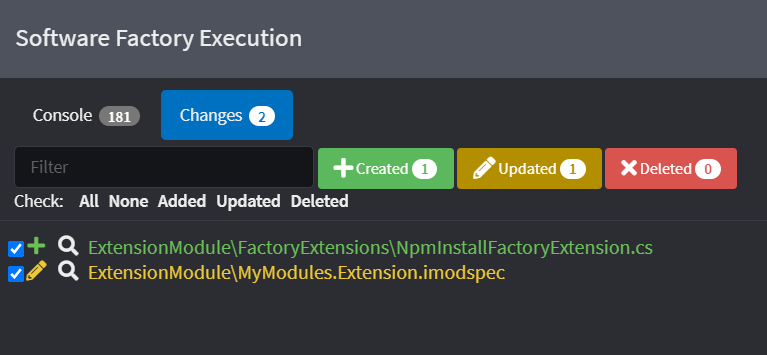
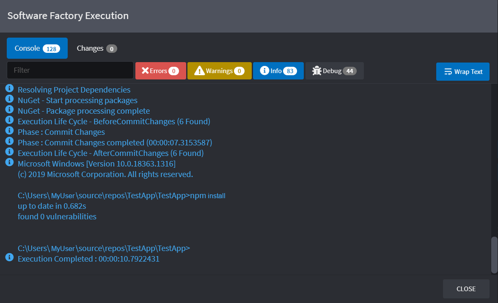

# Create a Factory Extension

Generating source code is not the only thing that Intent Architect can do when runs the Software Factory. The processing pipeline can also be extended by running middleware called `Factory Extensions`.
This guide will explain how to create a `Factory Extension` and using it to invoke a command-line command:

```
npm install
```

This guide assumes that you have a Module Project already setup to work from. If you would like to know how to set one up please visit the [Create Module](xref:tutorials.create-a-module.introduction) tutorial.

## Creating a Factory Extension

Inside your Module Builder designer, right click on the package and select `New Factory Extension`.
Give it the name of `NpmInstallFactoryExtension`.

<p><video style="max-width: 100%" muted="true" loop="true" autoplay="true" src="videos/create-factory-extension.mp4"></video></p>

>[!NOTE]
>Make sure to Run the Software Factory as this will generate the Factory Extension code.
>
>

## Implementing the Factory Extension

Open your `MyModules.Entities` Visual Studio project and locate the `NpmInstallFactoryExtension.cs` file and open it.

Make changes to the class so that it looks like this:

```csharp
using Intent.Engine;
using Intent.Modules.Common.Plugins;
using Intent.Plugins.FactoryExtensions;
using Intent.RoslynWeaver.Attributes;
using Intent.Utils;
using System;
using System.Diagnostics;
using System.IO;

[assembly: DefaultIntentManaged(Mode.Fully)]
[assembly: IntentTemplate("Intent.ModuleBuilder.Templates.FactoryExtension", Version = "1.0")]

namespace ExtensionModule.FactoryExtensions
{
    [IntentManaged(Mode.Merge)]
    public class NpmInstallFactoryExtension : FactoryExtensionBase, IExecutionLifeCycle
    {
        public override string Id => "MyModules.Extension.NpmInstallFactoryExtension";
        public override int Order => 0;

        [IntentManaged(Mode.Ignore)]
        public void OnStep(IApplication application, string step)
        {
            if (step == ExecutionLifeCycleSteps.AfterCommitChanges)
            {
                try
                {
                    var cmd = new Process
                    {
                        StartInfo =
                        {
                            FileName = "cmd.exe",
                            RedirectStandardInput = true,
                            RedirectStandardOutput = true,
                            CreateNoWindow = false,
                            UseShellExecute = false,
                            WorkingDirectory = Path.GetFullPath(application.RootLocation)
                        }
                    };
                    cmd.Start();

                    cmd.StandardInput.WriteLine("npm install");

                    cmd.StandardInput.Flush();
                    cmd.StandardInput.Close();

                    var output = cmd.StandardOutput.ReadToEnd();
                    Logging.Log.Info(output);
                }
                catch (Exception e)
                {
                    Logging.Log.Failure($@"Failed to execute: ""npm install"", Reason: {e.Message}");
                }
            }
        }
    }
}
```

>[!IMPORTANT]
>Make sure to compile your module project before continuing.

## Running the Factory Extension

Install your Module to your Test Application in Intent Architect. Follow these [steps](xref:tutorials.create-a-module.install-and-run-the-module#install-the-module) if you are not sure how.

Once that is done, run the Software Factory and click on the Apply button. Then you will observe the following at the end of the process in the console output:

