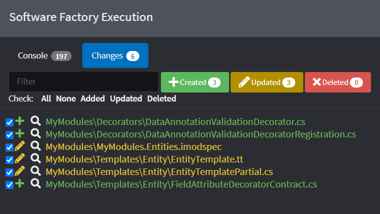

# Decorate a Template

Even though Templates are simple for a developer to change, Intent Architect does offer another mechanism for extending the content that gets generated by a Template without actually modifying the template itself. This mechanism is referred to as a Decorator.

If you have followed through the [Create Module](xref:tutorials.creating-modules-net.create-templates-per-model) tutorial, it will be useful to note that we will be extending the Template in order to allow Decorators to be applied to the Entity template at runtime and to have a Decorator that adds validation logic to our Entity class.

## Creating a Decorator Contract

In Intent Architect, open the `MyModule` solution (as was created in the tutorial) and select the `MyModule.Entities` Project that represents the Module that will generate the code for a C# Entity.

Right click on the Entity Template and select `Add Decorator Contract`. Give this contract a name of `FieldAttributeDecoratorContract`.

<video style="max-width: 100%" muted="true" loop="true" autoplay="true" src="videos/template-decorator-contract.mp4"></video>

## Creating a Decorator

Right click on the package and select `New Template Decorator`.
Give it the name of `DataAnnotationValidationDecorator` and select (as the type) `FieldAttributeDecoratorContract`.

<video style="max-width: 100%" muted="true" loop="true" autoplay="true" src="videos/create-decorator.mp4"></video>

>[!NOTE]
>Make sure to Run the Software Factory as this will generate the Decorator as well as the Contract for the Template.
>
>

