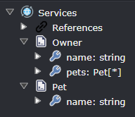

# Get type names for types generated by templates

A common requirement when authoring templates is getting the name of a type which is generated in the same or a different template.

Intent Architect not only makes it easy to do this, but one of its differentiating features is that it can also automatically add any required `using` / `import` statements as well as project references. For example, when generating a C# file it handles all of the following:

- Resolve the type name from the same or a different template, meaning that if you change the convention of your naming in a template, all references to that type in other templates are automatically updated too.
- Automatically make it the desired collection type as required.
- Allows you to specify which template's generated type name to use when there is more than one template for a generated type, for example if you're generating both an `interface` and a `class` for a referenced type.
- Ensure the appropriate `using` statement is present if the referenced type is in a different namespace.
- Ensure the required `<ProjectReference />` element is present in the `.csproj` file if the referenced type is in a different assembly.
- Recursively handle generic type parameters again addressing all the above mentioned concerns.

> [!NOTE]
>
> We strongly recommend _against_ using strategies like conventions to work out type names of classes which are generated by templates. There are many edge cases you will have to solve for yourself including handling collections or ensuring that appropriate `using` statements are also generated. Managing such complexities yourself invariably leads to more complicated templates which might not be able to handle all scenarios correctly.

## Scenario: the same template for the type

You want to create a template which generates [POCO](https://en.wikipedia.org/wiki/Plain_old_CLR_object)s for DTOs defined in the Services Designer and where the DTOs may have fields whose type is another DTO, for example:



We want our template to output the following for the `Owner` DTO:

```csharp
public class OwnerDto
{
    public string Name { get; set; }
    public IEnumerable<PetDto> Pets { get; set; }
}
```

Notice that we intend to have the template automatically suffix the type names with `Dto`.

### The template

The `.cs` partial file for the template would be:

```csharp
partial class DtoTemplate : CSharpTemplateBase<DTOModel>
{
    public const string TemplateId = "MyModule.Dto";

    public DtoTemplate(IOutputTarget outputTarget, DTOModel model) :
        base(TemplateId, outputTarget, model)
    {
    }

    protected override CSharpFileConfig DefineFileConfig()
    {
        return new CSharpFileConfig(
            className: $"{Model.Name}Dto",
            @namespace: $"{this.GetNamespace()}",
            relativeLocation: $"{this.GetFolderPath()}");
    }
}
```

And the `.tt` file would be:

```text
[assembly: DefaultIntentManaged(Mode.Fully)]

namespace <#= Namespace #>
{
    public class <#= ClassName #>
    {
<# foreach(var field in Model.Fields) { #>
        public <#= GetTypeName(field) #> <#= field.Name.ToPascalCase() #> { get; set; }
<# } #>
    }
}
```

Note the `<#= GetTypeName(field) #>` part, this will instruct the template to automatically "get" the correct name of the type by finding a template instance using the passed in `field`, reading the `ClassName` property from it and it will also wrap it in `IEnumerable<>` if the `Is Collection` property has been selected for the Field in the Services Designer.

## Scenario: customizing the collection type to generate

This scenario is identical to the [above scenario](#scenario-the-same-template-for-the-type) except that we want the collection type to be a `List<>` rather than an `IEnumerable<>` which would change our template output to:

```csharp
public class OwnerDto
{
    public string Name { get; set; }
    public List<PetDto> Pets { get; set; }
}
```

The typical way to achieve this is to add the following to the constructor of the template's partial class:

```csharp
SetDefaultTypeCollectionFormat("List<{0}>");
```

This makes it so that any time `GetTypeName(...)` is used within that template it will by default use the entered format.

> [!TIP]
>
> The `{0}` within the [composite string](https://docs.microsoft.com/dotnet/standard/base-types/composite-formatting) will be replaced by the resolved type.

If you only want to change the collection format for a single `GetTypeName(...)` call, then you can do so using the overload which takes in `string collectionFormat`. In the `.tt` file change `<#= GetTypeName(field) #>` to instead be `<#= GetTypeName(field, "List<{0}>") #>` which will override the default collection format for just this call.

## Scenario: different template for the type

You want to create two templates, one which which generates an interface for each service and another which generates an implementation of that interface.

For the interface template, we want it to output the following:

```csharp
public interface IOwnerService
{
    // ...
}
```

For the implementation template, we want it to output the following:

```csharp
public class OwnerService : IOwnerService
{
    // ...
}
```

### The templates

The partial file for the interface template would be:

```csharp
partial class ServiceInterfaceTemplate : CSharpTemplateBase<ServiceModel>
{
    public const string TemplateId = "MyModule.ServiceInterface";

    public ServiceInterfaceTemplate(IOutputTarget outputTarget, ServiceModel model) :
        base(TemplateId, outputTarget, model)
    {
    }

    protected override CSharpFileConfig DefineFileConfig()
    {
        return new CSharpFileConfig(
            className: $"I{Model.Name}Service",
            @namespace: $"{this.GetNamespace()}",
            relativeLocation: $"{this.GetFolderPath()}");
    }
}
```

The partial file for the implementation template would be:

```csharp
partial class ServiceTemplate : CSharpTemplateBase<ServiceModel>
{
    public const string TemplateId = "MyModule.Service";

    public ServiceTemplate(IOutputTarget outputTarget, ServiceModel model) :
        base(TemplateId, outputTarget, model)
    {
    }

    protected override CSharpFileConfig DefineFileConfig()
    {
        return new CSharpFileConfig(
            className: $"{Model.Name}Service",
            @namespace: $"{this.GetNamespace()}",
            relativeLocation: $"{this.GetFolderPath()}");
    }
}
```

The `.tt` file for the interface template would be:

```text
[assembly: DefaultIntentManaged(Mode.Fully)]

namespace <#= Namespace #>
{
    public interface <#= ClassName #>
    {
        // ...
    }
}
```

The `.tt` file for the implementation template would be:

```text
[assembly: DefaultIntentManaged(Mode.Fully)]

namespace <#= Namespace #>
{
    public class <#= ClassName #> : <#= this.GetServiceInterfaceName() #>
    {
        // ...
    }
}
```

In this case the `<#= this.GetServiceInterfaceName() #>` part is a call to the following extension method which the module builder automatically generated:

```csharp
public static string GetServiceInterfaceName<T>(this IntentTemplateBase<T> template)
    where T : ServiceModel
{
    return template.GetTypeName(ServiceInterfaceTemplate.TemplateId, template.Model);
}
```

By using the extension method and not putting the logic directly in the template, it makes the template simpler. As with the [same template for the type scenario](#scenario-the-same-template-for-the-type), `GetTypeName(...)` is ultimately getting called, but in this case we're using an overload which takes in a template ID and from this Intent Architect knows to get the `ClassName` value from the template with that ID.
