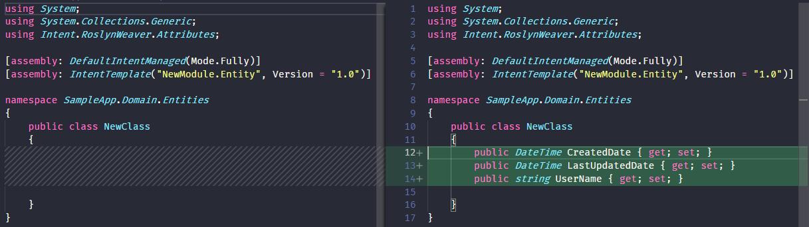

# Use Stereotypes

This how-to will explain how to define and use [Stereotypes](xref:references.stereotypes) in [Modules](xref:references.modules).

The Stereotype defined in the Module will are useable in two ways:

- By the Module author in the code of the module through the easy to use Api which is generated by the Module Builder when the software factory is run for it.
- By users of the Module in Intent Architect who can apply it to elements.

This how-to requires knowing how to [create a Module](xref:tutorials.create-a-module.introduction).

## Create a Stereotype Definition

[Stereotype Definitions](xref:references.stereotypes.stereotype-definitions) are used to creates "types" of Stereotypes which can then be applied to Element(s) (such as a Class).

> [!NOTE]
> This how-to requires that the Domain Module's metadata is [installed](xref:tutorials.creating-modules-net.create-templates-per-model#install-the-domain-metadata).
> Although this how-to uses the Domain Designer, the same principles can be applied to the use of any Designer.

Create or open a Module application in Intent Architect, open the Module Builder Designer, right-click on the package in the designer and select New Stereotype-Definition.

In the Properties pane on the right of the screen, ensure that:

- `Name` has a value (eg: `Entity`).
- `Target Mode` is set to `Elements of Type`.
- `Targets` has `Class`.
- `Apply Mode` is set to `Manually`.
- `Icon` is specified to be a Boxed Character "E" on a Black background `E|#0`.
- `Display Icon` is checked.

<p><video style="max-width: 100%" muted="true" loop="true" autoplay="true" src="videos/create-basic-stereotype.mp4"></video></p>

> [!NOTE]
> Running the Software Factory Execution will generate a `ClassModelExtensions.cs` which contains an "API" for being able to more easily use the Stereotype in Template files. Use of this will be discussed in more detail [further below](#querying-stereotypes-from-templates) in this how-to.

## Configure Module packaging to include Stereotype Definitions

Open the Module application in Intent Architect where your Stereotype Definition is located, then open the `Module Builder` Designer and click on the package.

In the Properties pane on the right of the screen:

- Check `Include in Module`.
- Select `Domain` (for example) in `Reference in Designer`.

<p><video style="max-width: 100%" muted="true" loop="true" autoplay="true" src="videos/package-stereotype.mp4"></video></p>

## Add properties to a Stereotype

Properties on Stereotype are are additional "fields" of metadata which can be configured on an applied Stereotype.

Open the Module application in Intent Architect containing the Stereotype Definition you created above and then open the `Module Builder` Designer.

Right-click on the `Entity` Stereotype Definition.

- Select `Add Property`.
- Give the Name `Change Detection`.
- Select the Type `Checkbox`.

<p><video style="max-width: 100%" muted="true" loop="true" autoplay="true" src="videos/stereotype-add-property.mp4"></video></p>

## Query Stereotypes from Templates

Open the Module application in Intent Architect where your [Stereotype Definition](#add-extra-metadata-to-a-stereotype) is located, then open the `Module Builder` Designer.

Ensure there is a Template called `EntityClass` that has the following `.tt` content:

```cs
<#@ template language="C#" inherits="CSharpTemplateBase<Intent.Modelers.Domain.Api.ClassModel>" #>
<#@ assembly name="System.Core" #>
<#@ import namespace="System.Collections.Generic" #>
<#@ import namespace="System.Linq" #>
<#@ import namespace="Intent.Modules.Common" #>
<#@ import namespace="Intent.Modules.Common.Templates" #>
<#@ import namespace="Intent.Modules.Common.CSharp.Templates" #>
<#@ import namespace="Intent.Templates" #>
<#@ import namespace="Intent.Metadata.Models" #>

using System;
using System.Collections.Generic;

[assembly: DefaultIntentManaged(Mode.Fully)]

namespace <#= Namespace #>
{
    public class <#= ClassName #>
    {
<#  foreach(var attribute in Model.Attributes) { #>

        public <#= GetTypeName(attribute) #> <#= attribute.Name.ToPascalCase() #> { get; set; }
<#  } #>
<#  foreach(var associationEnd in Model.AssociatedClasses.Where(x => x.IsNavigable)) { #>

        public <#= GetTypeName(associationEnd) #> <#= associationEnd.Name.ToPascalCase() #> { get; set; }
<#  } #>
    }
}
```

> [!NOTE]
> Your Code Solution (the Project generated by the Software Factory from the Module application) should contain an `API` folder with a file called `ClassModelExtensions.cs`.
>
> It contains a Class with Extension Methods for performing queries against a Class Element with regards to the `Entity` Stereotype. The Module Builder generates these extension methods for each of thee entries specified in the `Targets` property of the Stereotype Definition.

A Class Element can be queried for the presence of the `Entity` Stereotype. This can be invoked within your Template code:

```cs
bool hasEntityStereotype = Model.HasEntity();
```

The Property of the `Entity` Stereotype "Change Detection" can also be queried by invoking it within your Template code:

```cs
bool hasChangeDetection = Model.GetEntity().ChangeDetection();
```

The example below uses these extension methods in the `EntityClass` Template to determine whether or not it should generate additional properties:

```cs
<#  if (Model.HasEntity() && Model.GetEntity().ChangeDetection()) 
    { #>
        public DateTime CreatedDate { get; set; }
        public DateTime LastUpdatedDate { get; set; }
        public string UserName { get; set; }
<#  } #>
```

> [!IMPORTANT]
> Don't forget to add the `import` directive to the Template file that references the namespace of the `ClassModelExtensions` class.
>
> In this example it would be `<#@ import namespace="NewModule.Api" #>`

After applying the example above, the complete Template should be as follows:

```cs
<#@ template language="C#" inherits="CSharpTemplateBase<Intent.Modelers.Domain.Api.ClassModel>" #>
<#@ assembly name="System.Core" #>
<#@ import namespace="System.Collections.Generic" #>
<#@ import namespace="System.Linq" #>
<#@ import namespace="Intent.Modules.Common" #>
<#@ import namespace="Intent.Modules.Common.Templates" #>
<#@ import namespace="Intent.Modules.Common.CSharp.Templates" #>
<#@ import namespace="Intent.Templates" #>
<#@ import namespace="Intent.Metadata.Models" #>
<#@ import namespace="NewModule.Api" #>

using System;
using System.Collections.Generic;

[assembly: DefaultIntentManaged(Mode.Fully)]

namespace <#= Namespace #>
{
    public class <#= ClassName #>
    {
<#  if (Model.HasEntity() && Model.GetEntity().ChangeDetection()) 
    { #>
        public DateTime CreatedDate { get; set; }
        public DateTime LastUpdatedDate { get; set; }
        public string UserName { get; set; }
<#  } #>

<#  foreach(var attribute in Model.Attributes) { #>

        public <#= GetTypeName(attribute) #> <#= attribute.Name.ToPascalCase() #> { get; set; }
<#  } #>
<#  foreach(var associationEnd in Model.AssociatedClasses.Where(x => x.IsNavigable)) { #>

        public <#= GetTypeName(associationEnd) #> <#= associationEnd.Name.ToPascalCase() #> { get; set; }
<#  } #>
    }
}
```

## Apply a Stereotype (manually)

Create or open an ASP.NET Core application in Intent Architect.

[Install the module](xref:tutorials.create-a-module.install-and-run-the-module#install-the-module) that contains the [newly created Stereotype Definition](#create-a-basic-stereotype).

Open the Domain Designer and create or select a Class Element.

Right-click on the Element and select Add Stereotype. A popup dialog appears with a list of Stereotypes Definitions whose `Targets` property contains this `Element` type.
Select your `Entity` Stereotype. Locate the Stereotype in the Properties pane on the right and check the checkbox next to "Change Detection".

<p><video style="max-width: 100%" muted="true" loop="true" autoplay="true" src="videos/apply-stereotype-manually.mp4"></video></p>

The net result will be determined by the state of that check-box. For a given Entity class, if in the Designer the checkbox is checked, then it will generate that C# class with those properties. If not, it will omit the generation of those properties.


