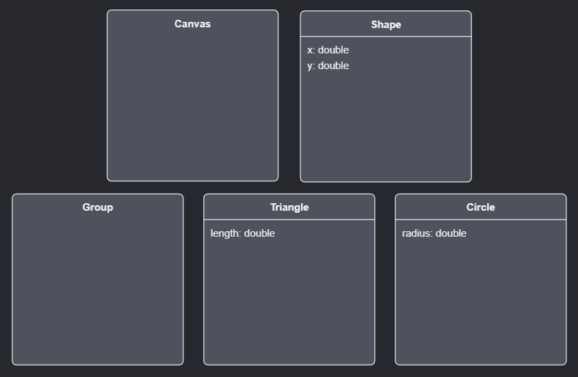
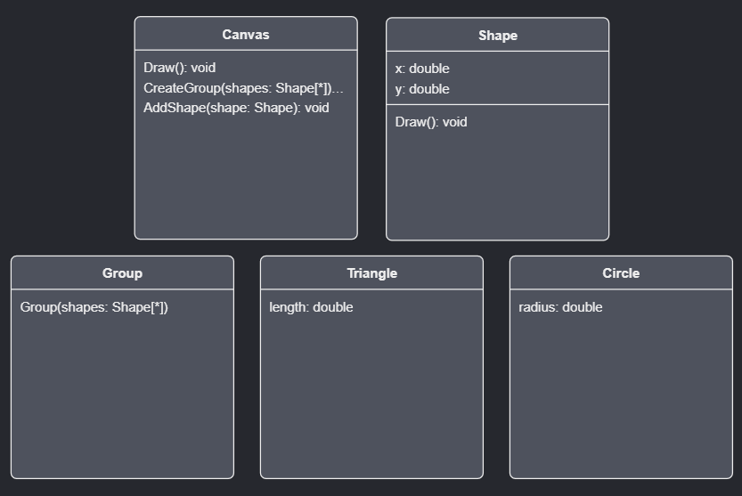
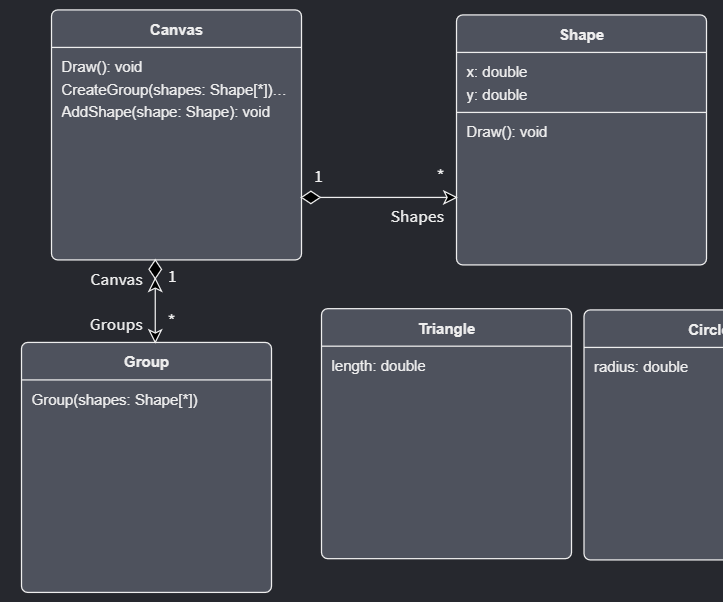

# Use the Domain Designer

This how-to will walk you through using the Domain Designer by working through an example where you will model conceptually how `Shapes` can be drawn on a `Canvas`.
Assuming you have the `Intent.Modelers.Domain` module installed, open up the `Domain` designer by clicking on `Domain` located left of the screen.

## Add new Classes

Right click on the background and select `New Class`.
In this example, give it the name `Shape`.

<video style="max-width: 100%" muted="true" loop="true" autoplay="true" src="videos/create-shape-class.mp4"></video>

Create a few more Classes:

- `Canvas`
- `Group`
- `Triangle`
- `Circle`

## Add Attributes to Classes

Right click on `Shape` and select `Add Attribute`.
Give it the name `x` of type `double`, add another attribute and name it `y` also of type `double`.

Right click on `Triangle` and select `Add Attribute`.
Give it the name `length` of type `double`.

Right click on `Circle` and select `Add Attribute`.
Give it the name `radius` of type `double`.

<video style="max-width: 100%" muted="true" loop="true" autoplay="true" src="videos/add-attributes.mp4"></video>

## Add Operations to Classes

Right click on `Shape` and select `Add Operation`.
Give it the name of `Draw` (with no return type).

Right click on `Canvas` and select `Add Operation` and give it the name `Draw` (with no return type).
Add another Operation and call it `CreateGroup` and additionally right click on `CreateGroup` and select `Add Parameter`.
Give it the name of `shapes` with a type of `Shape` and ensure `Is Collection` is checked in the Properties panel.
Add another Operation on `Shapes` called `AddShape` (with no return type), add a parameter `shape` of type `Shape`.

<video style="max-width: 100%" muted="true" loop="true" autoplay="true" src="videos/add-operation-with-parameter.mp4"></video>

## Add a Constructor to a Class

Right click on `Group` and select `Add Constructor`. Right click on this constructor and select `Add Parameter`.
Give it the name of `shapes` and specify the type `Shape` and ensure that `Is Collection` is checked in the Properties panel.

## Add a Composite association between Classes

Space out the diagram elements so that there is some distance between them vertically in order to show an arrow clearly. Feel free to resize the elements too.

Right click on `Canvas` and select `Add Association`. Click thereafter on `Shape`. Click on the newly created arrow.
In the `Target End` section of the Properties panel (located right of the screen) tick the `Is Collection` field. Then in the `Source End` un-tick the `Is Collection` field.

Now create the same association between `Canvas` and `Group` in the same way except that when you click on that new arrow to set the field properties, ensure that `Navigable` is checked in the `Source End` section.

<video style="max-width: 100%" muted="true" loop="true" autoplay="true" src="videos/add-composite-association.mp4"></video>

## Add an Aggregate association between Classes

Right click on `Group` and select `Add Association`. Click thereafter on `Shape`. Click on the newly created arrow.
In the `Target End` tick the `Is Collection` field and in the `Source End` un-tick the `Is Collection` and tick the `Is Nullable` field.

<video style="max-width: 100%" muted="true" loop="true" autoplay="true" src="videos/add-aggregate-association.mp4"></video>

## Add a new Diagram

On the tree-view located right of the screen, right click on the `Domain` package. Select `New Diagram`. Give it the name `Shapes Diagram`.
Draw a selection box around the `Shape`, `Triangle` and `Circle` Classes and ensure that they highlight once you release the mouse cursor.
Right click on any of the selected items and select `Hide`.

Now double-click on `Shapes Diagram` located in the tree-view on the right side of the screen to open that diagram.
Perform a drag-and-drop from the tree-view and onto the diagram by selecting (or multi-selecting by clicking on each item while holding in the `CTRL` key) these three items: `Circle`, `Triangle` and `Shape`.

Spread them out so that `Shape` is located center-top of the diagram, `Triangle` bottom left and `Circle` bottom right.

>[!NOTE]
>Once you've moved those Classes over to another diagram, they are still associated with the other Classes you've assigned them to before.
>You can inspect this by going over to the tree-view on the right, locate `Shape` (for instance), expand it to show its contents and you will notice that there are four associations: `Group`, `Canvas`, `Circle` and `Triangle`.

>[!TIP]
>Inspect the properties panel when you click on a diagram in the tree-view and notice the field `New diagram elements`.
>This will allow you to select which package to place newly created elements in when you add them from the diagram view itself.

<video style="max-width: 100%" muted="true" loop="true" autoplay="true" src="videos/new-diagram-and-move-over.mp4"></video>

## Add inheritance to Classes

Right click on the `Triangle` and select `Add Inheritance`. Thereafter click on `Shape`. Do the same with `Circle`.

