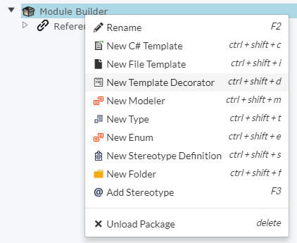
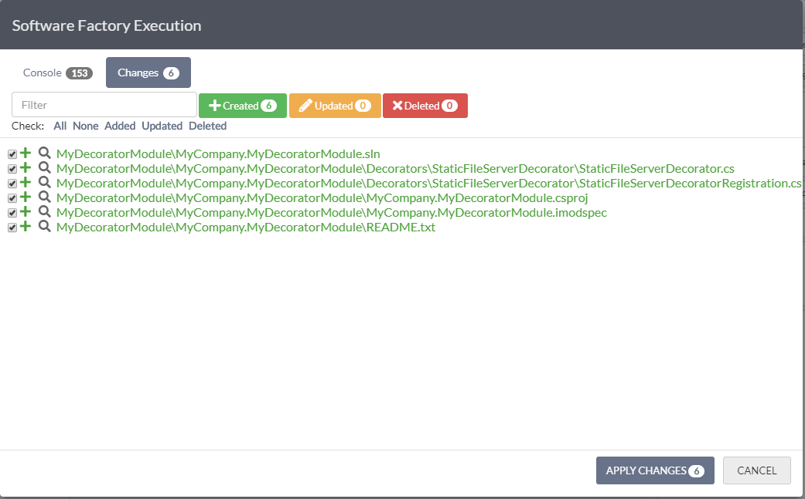
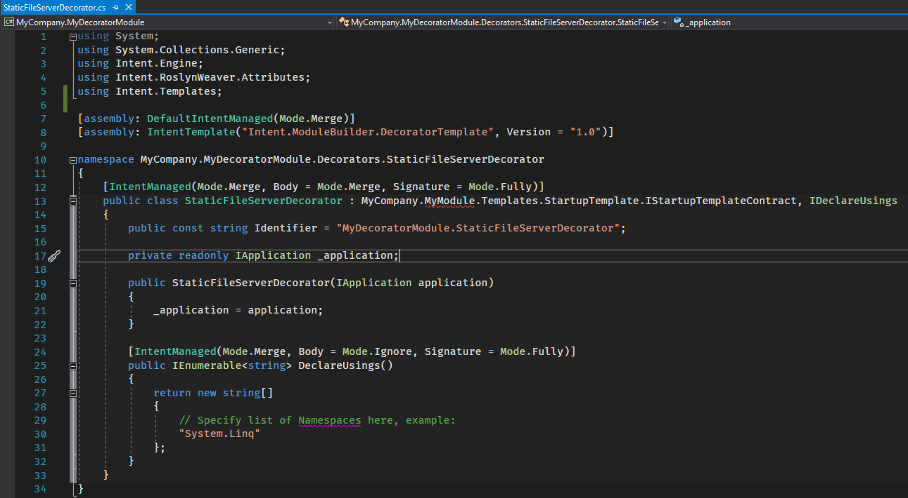

# How can I create a new Decorator?

Click [here](xref:Decorator) to find out more about Decorators.

This how-to will serve as an example of how to create a new Decorator that will inject code at runtime for a Template that has been setup for it.

This how-to will build up from the [previous](xref:MakeTemplateDecoratorReady) how-to, which showed how to make a Template ready for Decorators. Please interpolate on your end what is written here to make the necessary adjustments on what you're trying to achieve.

## Create a new Decorator

Typically you would create a new Decorator in a new Intent Architect Application which will reference a Template from another Module or Intent Architect Application. As such we will be doing that.


Go ahead and create your Application in Intent Architect that will be used to create the Module that will contain the new Decorator for the `StartupTemplate`.

Once the generation is done, create a new Decorator called `StaticFileServerDecorator`.



We need to specify the Contract name for that Decorator so that it will know for which Template it is meant to Decorate.

To recap, the Template we're trying to Decorate is the `StartupTemplate` and it requires a Decorator that adheres to this interface:

```csharp
public interface IStartupTemplateContract : ITemplateDecorator
{
    string ConfigureCode();
}
```

It has a Full Namespace of: `MyCompany.MyModule.Templates.StartupTemplate.IStartupTemplateContract`

So that is the value that we need to specify in the `Full TypeName` field for that Decorator.


Run the code generation.



Open Visual Studio and navigate to where the code has been generated and open up the `MyCompany.MyDecoratorModule` solution.

You will notice that it has generated a Decorator as well as a Registration for the Decorator.


Although, you will notice that the IDE reports a problem with our namespace we gave it.



## Ensure the "blueprint" (or contract) assembly is referenced

To fix this issue, we need to make sure that we reference the assembly that contains `IStartupTemplateContract`.

In our case this is simple. We add a project reference to that solution.


Let's add that module as an existing project into our current solution.


Now we add that project as a reference to our new module project.

This should resolve our initial problem which is that the interface was not found but now we need to implement that interface, so we're not out of the woods yet.


Once we instructed Visual Studio to implement this interface, you will notice that it added two things:

```csharp
public int Priority => throw new NotImplementedException();

public string ConfigureCode()
{
    throw new NotImplementedException();
}
```

The Priority helps to clarify in which order the Decorator gets applied. You will notice in the [Aggregate method](xref:MakeTemplateDecoratorReady#aggregate-all-the-decorators-output) of that Template that it does an order by `Priority`.

So in our case, we want to put this at an arbitrary order and supply the value `1`.

As for the Code that we want to generate, we will write the following lines inside the `ConfigureCode` method:

```csharp
public string ConfigureCode()
{
    return @"app.UseStaticFiles(new StaticFileOptions
    {
        FileProvider = new PhysicalFileProvider(
            Path.Combine(Directory.GetCurrentDirectory(), ""MyStaticFiles"")),
        RequestPath = ""/StaticFiles""
    });";
}
```

Now I can compile the solution.