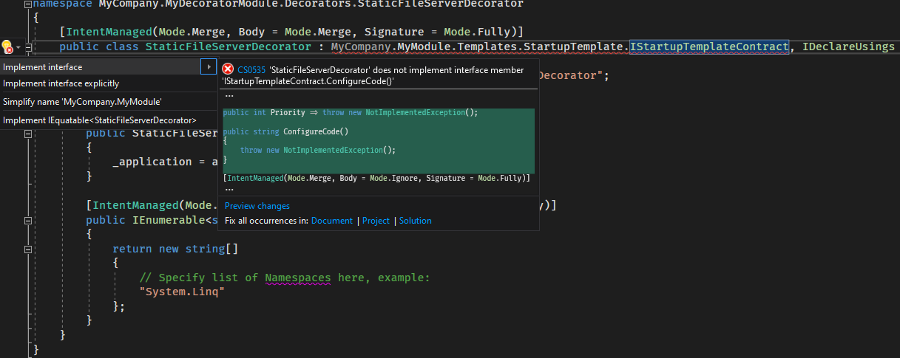
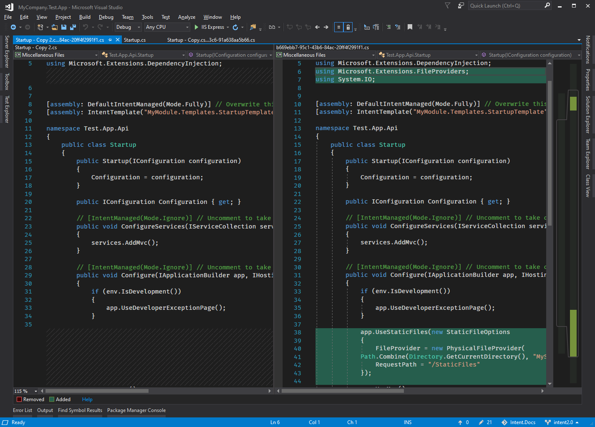
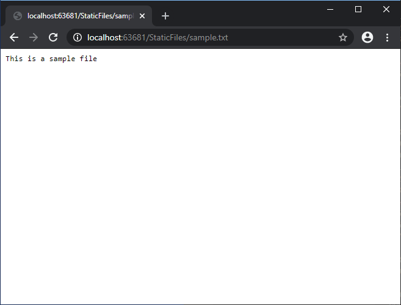

# How can I create a new Decorator?

Click [here](xref:Decorator) to find out more about Decorators.

This how-to will serve as an example of how to create a new Decorator that will inject code at runtime for a Template that has been setup for it.

This how-to will build up from the [previous](xref:MakeTemplateDecoratorReady) how-to, which showed how to make a Template ready for Decorators. Please interpolate on your end what is written here to make the necessary adjustments on what you're trying to achieve.

## Create a new Decorator

Typically you would create a new Decorator in a new Intent Architect Application which will reference a Template from another Module or Intent Architect Application. As such we will be doing that.


Go ahead and create your Application in Intent Architect that will be used to create the Module that will contain the new Decorator for the `StartupTemplate`.

Once the generation is done, create a new Decorator called `StaticFileServerDecorator`.


We need to specify the Contract name for that Decorator so that it will know for which Template it is meant to Decorate.

To recap, the Template we're trying to Decorate is the `StartupTemplate` and it requires a Decorator that adheres to this interface:

```csharp
public interface IStartupTemplateContract : ITemplateDecorator
{
    string ConfigureCode();
}
```

It has a Full Namespace of: `MyCompany.MyModule.Templates.StartupTemplate.IStartupTemplateContract`

So that is the value that we need to specify in the `Full TypeName` field for that Decorator.

Also, click on the `Declare Usings` flag in the `Decorator Settings` panel.


Run the code generation.


Open Visual Studio and navigate to where the code has been generated and open up the `MyCompany.MyDecoratorModule` solution.

You will notice that it has generated a Decorator as well as a Registration for the Decorator.


Although, you will notice that the IDE reports a problem with our namespace we gave it.


## Ensure the "blueprint" (or contract) assembly is referenced

To fix this issue, we need to make sure that we reference the assembly that contains `IStartupTemplateContract`.

In our case this is simple. We add a project reference to that solution.


Let's add that module as an existing project into our current solution.


Now we add that project as a reference to our new module project.

## Implement the Decorator

This should resolve our initial problem which is that the interface was not found but now we need to implement that interface, so we're not out of the woods yet.



Once we instructed Visual Studio to implement this interface, you will notice that it added two things:

```csharp
public int Priority => throw new NotImplementedException();

public string ConfigureCode()
{
    throw new NotImplementedException();
}
```

The Priority helps to clarify in which order the Decorator gets applied. You will notice in the [Aggregate method](xref:MakeTemplateDecoratorReady#aggregate-all-the-decorators-output) of that Template that it does an order by `Priority`.

So in our case, we want to put this at an arbitrary order and supply the value `1`.

As for the Code that we want to generate, we will write the following lines inside the `ConfigureCode` method:

```csharp
public string ConfigureCode()
{
    return @"app.UseStaticFiles(new StaticFileOptions
    {
        FileProvider = new PhysicalFileProvider(
            Path.Combine(Directory.GetCurrentDirectory(), ""MyStaticFiles"")),
        RequestPath = ""/StaticFiles""
    });";
}
```

Also, with the Declare Usings section, we need to specify some namespaces that our Decorator will need to successfully apply code that will compile.

Override the `DeclareUsings` method to look like this:

```csharp
[IntentManaged(Mode.Merge, Body = Mode.Ignore, Signature = Mode.Fully)]
public IEnumerable<string> DeclareUsings()
{
    return new string[]
    {
        "System.IO",
        "Microsoft.Extensions.FileProviders"
    };
}
```

We now need to add a dependency on the original Template.

Open up the `MyCompany.MyDecoratorModule.imodspec` file in Visual Studio.

You will see something resembling this:

```xml
<?xml version="1.0" encoding="utf-8"?>
<package>
  <id>MyCompany.MyDecoratorModule</id>
  <version>1.0.0</version>
  <summary>A custom module for MyCompany.</summary>
  <description>A custom module for MyCompany.</description>
  <authors>MyCompany</authors>
  <templates></templates>
  <dependencies>
    <dependency id="Intent.Common" version="2.0.0" />
    <dependency id="Intent.Common.Types" version="2.0.0" />
  </dependencies>
  <files>
    <file src="$outDir$/$id$.dll" />
    <file src="$outDir$/$id$.pdb" />
  </files>
  <decorators>
    <decorator id="MyDecoratorModule.StaticFileServerDecorator" />
  </decorators>
</package>
```

In the `dependencies` section we need to add a dependency to our original Template Module.

```xml
<dependencies>
    <dependency id="Intent.Common" version="2.0.0" />
    <dependency id="Intent.Common.Types" version="2.0.0" />
    <dependency id="MyCompany.MyModule" version="1.0.0" />
</dependencies>
```

Where did we get this info?
Open up the `MyCompany.MyModule.imodspec` file in the project we imported.

At the top of that XML file you will see this:

```xml
<?xml version="1.0" encoding="utf-8"?>
<package>
  <id>MyCompany.MyModule</id>
  <version>1.0.0</version>
```

We only need the `id` and `version` fields and that gets used to specify module dependencies.

Now I can compile the solution.

## Install the Decorator Module in your application

Open up the `Test.App` in Intent Architect, click on the `Modules` on the side panel.

Click on the "gear" icon located to the right. Add the location to the new Module.


**Name**: MyDecoratorModule
**Address**: ./MyDecoratorModule/Intent.Modules

Now, select the `MyDecoratorModule` in the dropdown.


Locate the `MyCompany.MyDecoratorModule` and click on the `Install` button (located to the right).

When you run the Software Factory, you should see the expected change in the `Startup.cs` file.


When you inspect that file you should notice this diff view:



You can now apply the changes and inspect the file yourself.

## Follow through

Even though this is not technically part of the how-to, we do want to give developers the closure that this will work.

Go to the Test.App Visual Studio solution and create a folder named `MyStaticFiles`. Create a text file `sample.txt` inside it with the content:

>This is a sample file


Once you run the solution and navigate to this URL:

>http://localhost:63681/StaticFiles/sample.txt
(port number may vary)

You should get this outcome:

