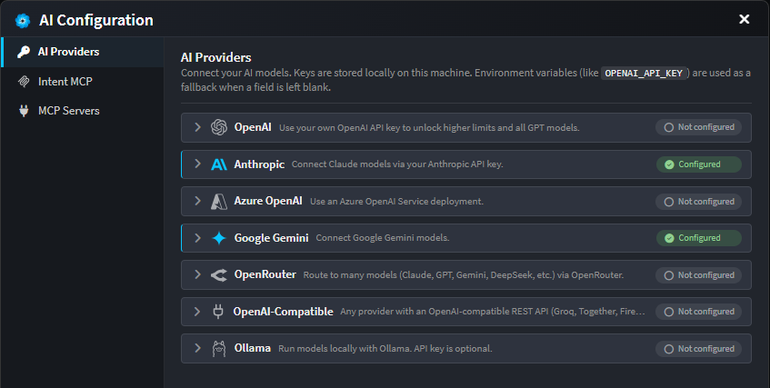
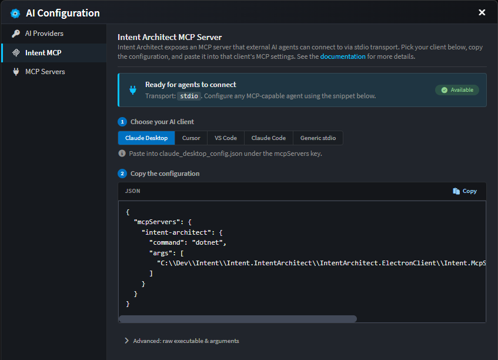
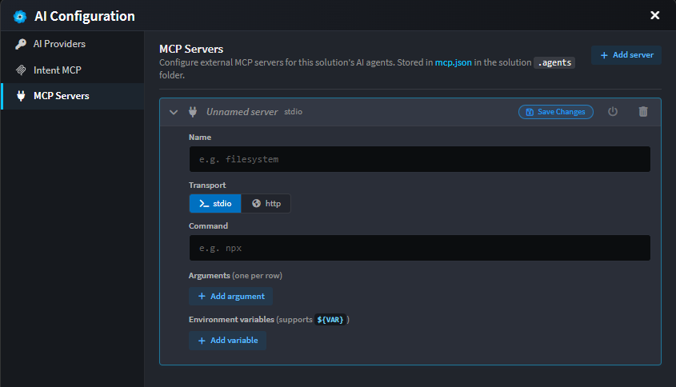

# AI Configuration

Open via the **AI Configuration** dialog in the AI chat window. There are three tabs.

---

## 1. AI Providers

Connect Intent's agents to one or more LLM services. API keys are stored **locally**. If a key field is left blank, Intent falls back to the matching environment variable (e.g. `OPENAI_API_KEY`). Without any key, usage is capped by the free daily budget.

| Provider              | What you need                                                                                                              |
| --------------------- | -------------------------------------------------------------------------------------------------------------------------- |
| **OpenAI**            | API key (`sk-...`)                                                                                                         |
| **Anthropic**         | API key (`sk-ant-...`); optional **Max Output Tokens** (blank = model default)                                              |
| **Azure OpenAI**      | API key, **Endpoint URL** (`https://<your-resource>.openai.azure.com/`), and **Deployment Name** of your Azure OpenAI model |
| **Google Gemini**     | API key                                                                                                                    |
| **OpenRouter**        | API key                                                                                                                    |
| **OpenAI Compatible** | API key, **Base URL** of the API, and **Model** name (use this for any provider with an OpenAI-compatible endpoint)         |
| **Ollama**            | **Host URL** (e.g. `http://localhost:11434`) and **Model** name; API key only if your host is behind an auth proxy          |

Each provider shows a status pill: **Not configured** → **Save Changes** (after edits) → **Configured**.

---

## 2. Intent MCP

Intent Architect exposes its own MCP server, so external AI agents (Claude Desktop, Cursor, VS Code Copilot, etc.) can drive Intent. Transport is **stdio**.

To set up:

1. Pick your AI client from the segmented selector.
2. Copy the generated snippet and paste it into that client's MCP configuration.

The **Advanced** toggle reveals the raw executable path and arguments if you need to assemble a config by hand.

For more details on what the Intent MCP server does and how external agents use it, see .

---

## 3. MCP Servers

Connect **external** MCP servers as additional tools for this solution's coding agents. Configuration is stored per-solution in `.agents/mcp.json` under the solution folder.

> MCP server tools are only made available to `coding` context agents.

For each server you can configure:

| Field          | Notes                                                                                  |
| -------------- | -------------------------------------------------------------------------------------- |
| **Name**       | Free-form label (e.g. `filesystem`)                                                    |
| **Transport**  | `stdio` (launch a local command) or `http` (call a remote endpoint)                    |
| **Command**    | *(stdio)* Executable to launch - e.g. `npx`                                             |
| **Arguments**  | *(stdio)* One per row                                                                  |
| **Env vars**   | *(stdio)* Key/value pairs; supports `${VAR}` substitution from your environment         |
| **URL**        | *(http)* Endpoint URL                                                                  |
| **Headers**    | *(http)* Key/value pairs; supports `${VAR}` substitution                                |

Each server has a status pill (**Not tested**, **Testing…**, **Connected**, **Error**, **Disabled**) and a power toggle to enable/disable it without deleting the entry. Disabled servers stay in the file but aren't loaded by agents.

Edits are local until you click **Save Changes** on the entry.
