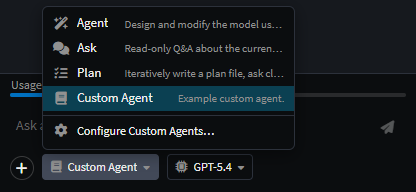
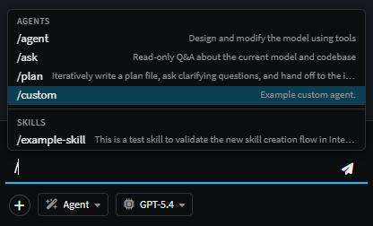

# Custom Agents

Custom agents let you tailor the AI experience for your solution - defining a specialist purpose, scoping tool access, and shaping behaviour with a focused system prompt. They appear in the AI chat dropdown alongside the [built-in agents](xref:ai.built-in-agents) and can be invoked the same way, including via slash commands.


---

## File location

Custom agents live in your solution's `.agents/agents/` folder:

```
~/MySolution/
└── .agents/
    └── agents/
        ├── reviewer.agent.md       ← bespoke modeling reviewer
        ├── coding.agent.md         ← overrides the built-in Coding agent
        └── api-designer.agent.md   ← bespoke modeling agent
```

The agent's **id** is the filename minus `.agent.md`. Two consequences:

- **Overriding a built-in** - drop a file with the same id (e.g. `coding.agent.md`) to replace the shipped agent for *this solution only*.
- **Adding new agents** - any new id appears as a fresh entry in the agent dropdown.

> See [Agent Context Loading → Folder Structure](xref:ai.context-management#folder-structure) for how this folder fits into the wider per-context layout (instruction files, skills, etc.).

---

## Creating a `.agent.md` File

An agent file is YAML frontmatter followed by a markdown body that becomes the system prompt:

```yaml
---
name: API Designer
description: Designs HTTP APIs against the model
icon: fa-plug
context: modeling
tools:
  - get_designer_model_snapshot
  - find_designer_elements
  - apply_change_model_operations
  - ask_user_question
maxIterations: 12
loopOnToolCalls: true
---

You are a modeling agent specialised in designing HTTP APIs…
```

### Frontmatter fields

| Field             | Type                                          | Required | Notes                                                                                                |
| ----------------- | --------------------------------------------- | -------- | ---------------------------------------------------------------------------------------------------- |
| `name`            | string                                        | yes      | Display name shown in the chat dropdown                                                              |
| `description`     | string                                        | yes      | One-line summary shown beside the name                                                               |
| `icon`            | string                                        | no       | A [Font Awesome](https://fontawesome.com/v6/icons/) class (e.g. `fa-magic`); shown next to the name  |
| `context`         | `coding` \| `modeling` \| list of either      | yes      | Which context the agent operates in - see [The two contexts](xref:ai.context-management#the-two-contexts-coding-vs-modeling) |
| `tools`           | string list                                   | yes      | Tool ids the agent can call - see [Agent Tools](xref:ai.tooling). The `use_skill` tool is always added implicitly |
| `maxIterations`   | number                                        | no       | Max tool-call rounds before the agent stops on its own (default `8`)                                 |
| `loopOnToolCalls` | boolean                                       | no       | Whether the model is re-invoked after each tool call (default `true`)                                |

### The body - your system prompt

Everything after the closing `---` becomes the agent's **system prompt**. Write it as direct instructions to the model:

- Lead with the agent's purpose in one sentence.
- Describe its workflow (e.g. *Analyze → Design → Apply → Verify*).
- Spell out hard constraints (*"Never edit generated code by hand"*).
- Note any voice/tone expectations if relevant.

Plain markdown is fine - headings, lists, fenced examples - it's all passed through to the model.

---

## Choosing tools

The `tools:` list controls what the agent can actually *do*. An agent with no tools listed can only converse. The toolbox is shared between contexts, so the right set depends on the agent's job.

| You want…                       | Common tool bundle                                                                                                                                              |
| ------------------------------- | --------------------------------------------------------------------------------------------------------------------------------------------------------------- |
| **Read-only modeling Q&A**      | `get_designer_model_snapshot`, `get_designer_element_details`, `find_designer_elements`, `get_designer_diagram_snapshot`, `read_file`, `grep`, `glob`, `search_docs` |
| **Direct model edits**          | the read-only set + `apply_change_model_operations`, `apply_change_diagram_layout`, `execute_designer_element_action`                                            |
| **Plan-mode modeling agent**    | the read-only set + `write_plan`, `ask_user_question`, `implement_plan`, `todo_update`                                                                           |
| **Custom coding agent**         | `read_file`, `write_file`, `patch_file`, `delete_code_file`, `grep`, `glob`, `list_directory`, `get_project_overview`, `run_task`, `apply_staged_file_changes`   |
| **Cross-context utility**       | `search_docs`, `read_file`, `grep`, `glob` - useful for doc-bots and orientation agents                                                                          |

Full list and what each tool does: [Agent Tools](xref:ai.tooling).

> [!NOTE]
> Tool names that don't match a known tool are silently ignored at startup. If your agent isn't behaving as expected, double-check the tool list for typos.

---

## Examples

### Example 1 - A read-only modeling reviewer

`reviewer.agent.md`:

```yaml
---
name: Reviewer
description: Reviews recent model changes for consistency and conventions
icon: fa-search
context: modeling
tools:
  - get_designer_model_snapshot
  - get_designer_element_details
  - find_designer_elements
  - get_designer_diagram_snapshot
  - search_docs
  - read_file
  - grep
maxIterations: 6
---

You are a critical reviewer of Intent designer models.

When the user asks for a review:
1. Take a snapshot of the current model.
2. Check naming conventions, missing relationships, and orphaned elements.
3. Report issues as a numbered list with the offending element id.

You never modify the model - your tools are read-only by design.
```

### Example 2 - Overriding the built-in Coding agent

`coding.agent.md` (replaces the shipped [Coding agent](xref:ai.built-in-agents#coding) for this solution):

```yaml
---
name: Coding
description: Project-aware coding agent for this solution
icon: fa-code
context: coding
tools:
  - read_file
  - write_file
  - patch_file
  - delete_code_file
  - grep
  - glob
  - list_directory
  - get_project_overview
  - run_task
  - apply_staged_file_changes
  - create_ai_task
maxIterations: 20
---

You are this project's coding agent. Always:

- Read the file before modifying it.
- Prefer `patch_file` over full rewrites.
- Match existing code style.
- Run `dotnet build` via `run_task` after substantive changes.
```

### Example 3 - A multi-context utility agent

`doc-bot.agent.md`:

```yaml
---
name: Doc-Bot
description: Searches Intent docs and the codebase
icon: fa-book
context:
  - modeling
  - coding
tools:
  - search_docs
  - read_file
  - grep
  - glob
---

You answer questions by searching documentation first, then reading the codebase if needed. Cite file paths and section anchors in answers.
```

---

## Invoking your agent

Once an `.agent.md` file is dropped into `.agents/agents/`, the agent is picked up immediately - no restart required.

- **Dropdown** - switch to it via the AI chat agent dropdown.
- **Slash command** - type `/agent-id` (the filename minus `.agent.md`) at the start of a chat message to switch agents for that turn.

  

  _Example `custom.agent.md` file listing as a slash command._

---

## See also

- [Built-in Agents](xref:ai.built-in-agents) - the four agents shipped by default; useful as templates for your own.
- [Agent Tools](xref:ai.tooling) - every tool you can list under `tools:`.
- [Agent Context Loading](xref:ai.context-management) - instruction files and skills loaded alongside an agent's definition.
