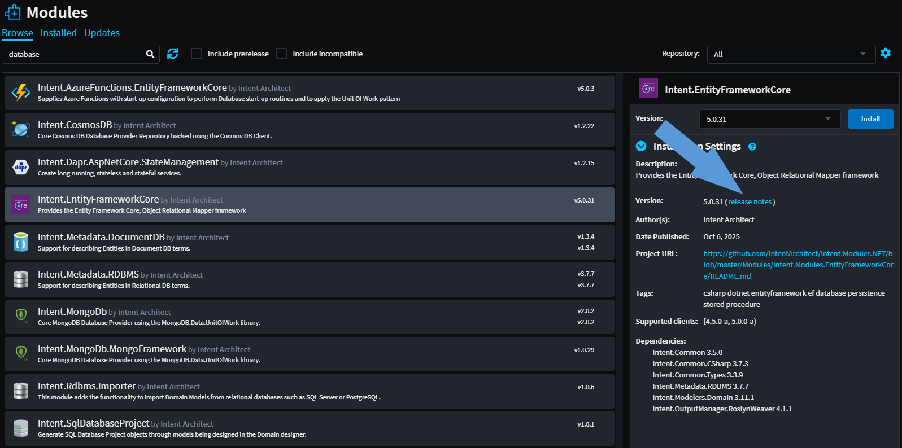

# Getting help: Reference & resources

Have a question, issue, or suggestion? Here’s how to find help and get the support you need.

---

##  **In-app help**

Browse contextual tips and how-tos right inside the app  
*Find in-context answers inside the app*  

[Learn more about in-app help topics→](#in-app-help)

──────

##  **Website documentation**

Guides, tutorials, and best practices  
*Explore how-to guides and tutorials to deepen your knowledge*  

[Go to the docs website →](xref:tutorials.fundamentals-landing-page)

──────

##  **Contact support**

Can’t find it? Reach our team for personalized help  
*Reach our team with your question or feedback*  

[Learn how to contact our support team →](#contact-support)

──────

##  **Release notes**

See what’s new, fixed, or changed by version  
*Check what's new in the latest module versions*  

[Learn more about release notes →](#release-notes)

---

## In-app help

Intent Architect includes a built-in help system to provide quick access to guidance and documentation.
You can open it by clicking the **blue question mark button in the top-right corner** of the window, or simply by pressing `F1`.

### Help dialog

Clicking the help button opens the **Help dialog**, which displays relevant help topics based on your currently installed modules. This includes context-specific documentation tailored to the currently selected element and open designer. You'll also find quick links to contact support or open the main Intent Architect documentation website.

You can browse through the suggested topics or use the **search box** to look up keywords. When searching, **all available documentation** is included — even topics from modules that aren’t currently installed. This makes it easy to discover additional features and functionality you might want to add to your application.

> [!NOTE]
> The Help dialog is **context-aware** by default, showing topics related to the currently active designer and selected elements.  
> Use the search box to explore beyond your current context or to discover features from other modules.

---

## Contact support

Need help, request a feature or share feedback? Here are a few ways to get in touch with us:

###  **Email us**

Have a question or issue?  
[Reach out to us via email →](mailto:support@intentarchitect.com)

──────

###  **GitHub issues**

Log a ticket on our public GitHub support repository or browse existing issues for answers.

[Log an issue on GitHub →](https://github.com/IntentArchitect/Support)

> [!TIP]
> You can also find this link inside the [in-app help documentation](#in-app-help)

──────

###  **In-App feedback**

Send feedback or rate the application directly within the app using the *yellow face feedback icon* in the top bar:

──────

###  **Teams / Slack**

You can also contact us through your company’s dedicated **Teams** or **Slack** support channel.

---

## Release notes

On the `Modules` screen, each module includes a link to its release notes.

Clicking **Release Notes** displays a versioned list of *enhancements, bug fixes, and new features* for the module.

---

## Helpful Links

- **[Official site](https://intentarchitect.com)**  
- **[Get Intent Architect](xref:getting-started.get-the-application)**
- **[Quick start](xref:introducing.quickstart)**
- **[Intent Architect fundamentals](xref:tutorials.fundamentals-landing-page)**
