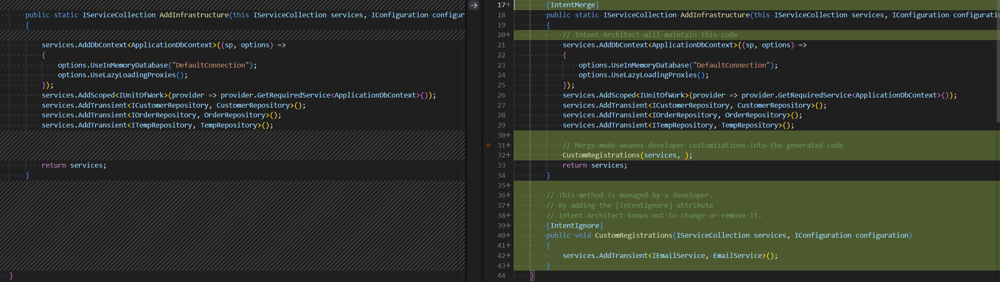

# Codebase integration

Intent Architect integrates directly with your existing development workflow and IDE, augmenting your current development experience with automation.  

Unlike typical code generation tools that simply scaffold or are inflexible to customization, Intent Architect’s integration model is built around **transparency, precision, and developer choice**.  You decide which parts of your code are automated, which are hand-crafted, and how the two coexist, all with full review and traceability.

At its core, this is powered by three systems: **Code Management**, **Customization Tracking**, and **Developer-in-the-Loop Integration** through the **Software Factory**.

---

## Key benefits

- **🎚️ Architecture Opt-out model**
  In traditional development, architecture is opt-in, it only holds if every developer rigorously follows it. Intent Architect flips that model: architecture is enforced by default through code automation, and developers explicitly opt-out when needed, with transparency.
  This ensures high-fidelity, consistent architecture across the entire system without restricting flexibility.

- **🧩 Code Management**  
  Customizable code automation, easily adjust which parts of your code are managed by Intent Architect and which remain developer-controlled.  
  Fine-grained configuration, from entire files down to individual statements, ensures automation never interferes with your code.

- **🧭 Customization tracking**  
  Track and visualize every architectural deviation. See what’s been customized, by whom, and why bringing clarity to design evolution.

- **💻 IDE integration**  
  Work side-by-side with your favourite IDE. Transition seamlessly from visual design to the implementation code.

---

## Architecture Opt-Out model, standards by default

Traditional architecture is opt-in: teams rely on every developer to follow patterns perfectly.
Intent Architect makes architecture opt-out: standards and structure are applied automatically, and developers consciously opt out only when necessary.
This yields consistent, high-fidelity architecture across your system, without restricting flexibility or innovation.

### Automatic governance

Here Intent Architect is highlighting architectural deviations it would like to correct, for developer review.

✅ Architectural adherence by default, spend less time policing your codebase.

## Code Management, customizable code generation

Code-automation, as used in the software industry, has two flavours: once-off (scaffolding) and continuous. Both have their place but come with trade-offs and compromises in the form of customizability and control.

Code-management is a unique approach to code-automation that completely avoids the typical compromises. It utilizes abstract syntax tree parsing and intelligent algorithms to merge user-written code with automatically generated code. Code-management allows developers to control the automation systems of Intent Architect from a high-level down to the granular level of the members within each managed code file (e.g. classes, fields, functions, methods, etc.).

As an example, a developer may configure a C# or Java file such that they are managing the implementation of one method within a class, while Intent Architect will manage the remaining methods. They may then choose to change this configuration, perhaps deciding to take over management of the entire class or just one of the other methods. The configuration of each file is completely controlled by the developer, preventing the automation system from ever getting in the way.

For more information, read .

⚙️ Code Management unlocks all the advantages of code generation, without the traditional limitations.

## Customization tracking, transparency and auditability

When developers intentionally deviate from generated patterns, Customization Tracking records and highlights those changes.

Each customization shows:

- What was changed
- Who changed it
- When and why
- How it diverges from the reference pattern

This creates a living audit trail of architectural decisions, enabling developers to see where the system differs from standards and why.

Easily visualize customizations in generated code.

For more information, read .

🕵️‍♂️ Auditable transparency on architectural customizations, with reasoning

## Developer-in-the-loop workflow

Every change proposed by Intent Architect passes through the Software Factory, a staging system that previews how your design will affect the codebase.
Developers review these proposed modifications as diffs before applying them. Nothing touches your codebase without explicit consent.

💡 This “staging gate” makes automation transparent and reversible.

## Learn more

- **[Visual modeling](xref:how-it-works.visual-modeling)**
- **[Pattern-based code generation](xref:how-it-works.deterministic-codegen)**
- **[AI-assisted code generation](xref:how-it-works.non-deterministic-codegen)**
