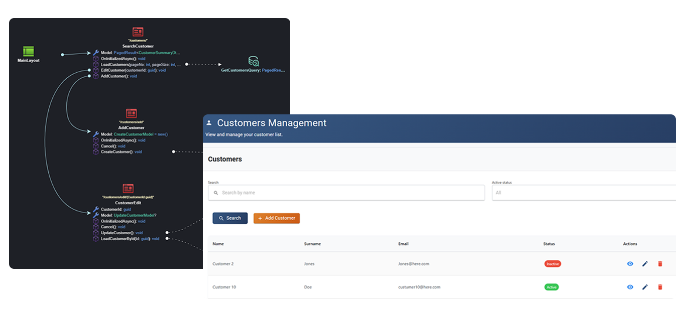

# AI-Assisted Code Generation

While Pattern-Based Code Generation automates predictable patterns, some parts of software development require creative, context-aware logic that can’t be fully predefined.  
**Intent Architect’s AI-Assisted Code Generation** bridges that gap with **AI Accelerators**, guided tools that can implement Blazor views, service implementations, unit tests, and other non-deterministic code directly from your architectural design.

Unlike traditional AI coding tools that rely on hand-crafted prompts and unpredictable output, Intent Architect performs all the **context engineering** automatically. It builds structured, detailed prompts from your blueprints, ensuring that AI generation aligns with your architecture.  

Developers remain fully in control: AI-suggested changes are presented as diffs allowing review, iteration, and safe application.

---

## Key Benefits

- **⚙️ Non-Deterministic Code Automation**  
  Use AI to generate complex logic or creative code that traditional pattern-based automation can’t predict.

- **🧠 Promptless, Predictable AI Experience**  
  Intent Architect automatically constructs detailed prompts from your architectural model, turning AI coding into a repeatable, deterministic process.

- **🛡️ Developer-in-Control Workflows**  
  Every AI-generated suggestion appears as a code diff, ensuring complete transparency and safety before applying.

- **🔄 Choose Your AI**  
  Integrate with your preferred model(s), OpenAI, Azure OpenAI, Anthropic, or others.

---

## AI Accelerators: Context-Aware Generation

Intent Architect includes several AI Accelerators, guided actions that automate tasks such as implementing Blazor views, service logic, or unit tests.
When you run an accelerator, Intent Architect reads your design context, entities, services, dependencies, naming conventions and constructs a rich AI prompt automatically.
The LLM then receives all the information it needs to generate high-quality, consistent code aligned with your architecture.

💡 You focus on intent (“Implement this service”), not on writing prompts. Intent Architect handles the context engineering for you.

As an example, by simply modeling a logical screen, i.e. give it basic details and connecting it up visually to the service you would want to interact with, Intent Architect is able to build professional UIs via an LLM in a promptless, predictable and repeatable fashion.

## AI with Guardrails

Intent Architect performs structured context engineering, it builds detailed, repeatable prompts under the hood using your models and patterns, ensuring that the generated output is predictable and aligned with your design decisions. This transforms AI assistance from a creative experiment into a deterministic, repeatable process.

AI code generation is visualized as code diffs, enuring developers have full transparency and control.

⚙️ Easy to use, deterministic AI code generation you can count on.

## Choose and Configure Your AI

You can connect Intent Architect to your preferred model provider, OpenAI, Azure OpenAI, Anthropic, or others.
AI Accelerators are designed to work well out-of-the-box for most use cases (~80% coverage), but can be customized for specialized domains or proprietary coding styles.

🧠 Flexibility for experts, simplicity for everyone else.

## Learn More

- **[Visual Modeling](xref:how-it-works.visual-modeling)**
- **[Pattern-Based Code Generation](xref:how-it-works.deterministic-codegen)**
- **[Codebase Integration](xref:how-it-works.codebase-integration)**
