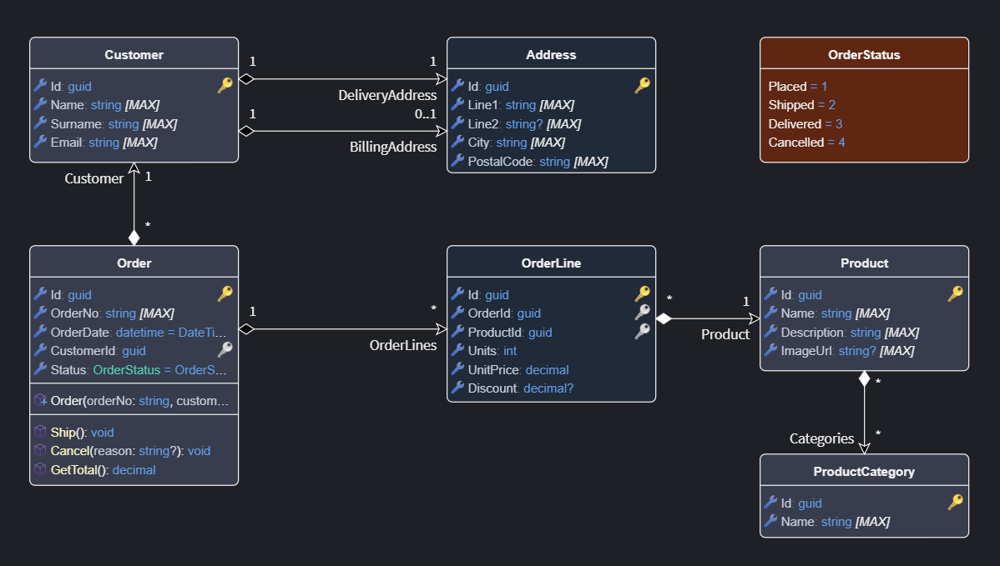
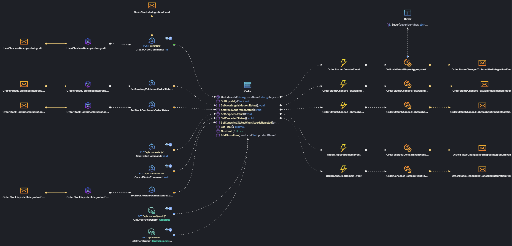
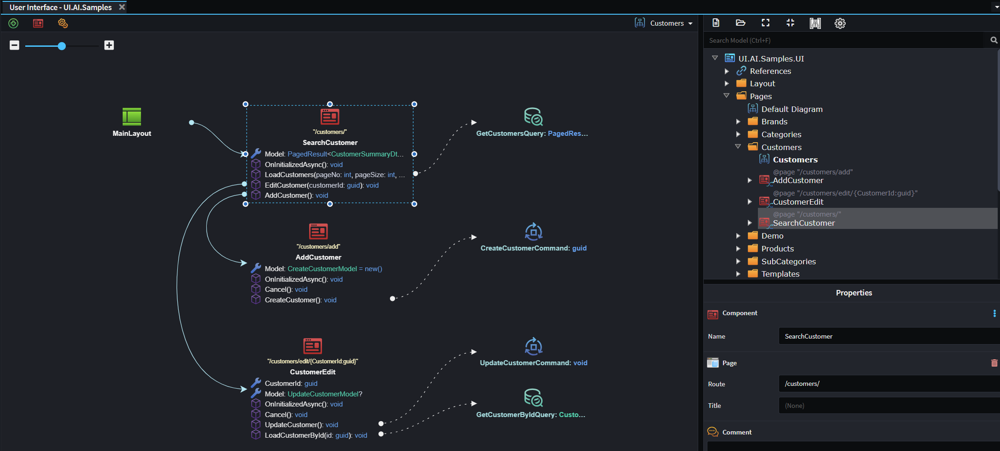

# Visual Modeling

Intent Architect provides **rich visual designers** for modeling applications, allowing you to express your architecture in a way that’s intuitive, precise, and always in sync with your codebase.  

By compressing information into visual formats (e.g. entity-relationship diagrams), the human mind can quickly interpret and digest it. Unlike static diagrams or external modeling tools, these designs are *live blueprints*: every change you make is reflected in the codebase. This makes Intent Architect not just a modeling environment, but a **living architectural workspace** where visualization and implementation stay continuously aligned.

With Intent Architect, you can design and reason about complex systems visually rather than mentally reverse-engineering structure from a codebase. It’s the difference between *seeing your architecture* and *guessing at it*.

---

## Key Benefits

- **🧠 Easier comprehension of complex systems**  
  Visualize domains, services, and relationships at a glance, no need to mentally reconstruct architecture from thousands of lines of code.

- **🤝 Collaborative design and validation**  
  Shared visual models give architects and developers a common language for discussion, review, and decision-making.

- **🗺️ Living documentation**  
  Designs are always synchronized with the codebase, what you see is a true reflection of what’s in the source, not an outdated diagram, ensures architecture stays consistent with evolving codebase.

- **🚀 Reduced onboarding friction**  
  New team members can explore and understand the system architecture visually, accelerating their ability to contribute meaningfully.

---

## Design Visually

Model your systems through Intent Architect’s visual designers, model domains, services, integrations and much more.
Each designer helps you model your applications in a structured, intuitive way. Behind the scenes, every element you draw is represented as structured metadata, saved alongside your source code in human-readable files. You’re never disconnected from your design it lives right inside your solution.

💡 Visual modeling turns complex systems into clear, collaborative blueprints for innovation.

### Domain Modeling

Visual domain modeling lets you define your system’s core entities, relationships, and logic in a clear, structured way forming the base from which your applications are built.

### Application Modeling

Visual application modeling defines how your system behaves, mapping services, contracts, and integrations that connect your applications into a unified flow

### UI Modeling

Visual UI modeling defines how users interact with your system — mapping screens, service calls, and flows that shape the end-to-end experience, with AI accelerators helping fill in the details.

## Living Synchronization with Your Codebase

The visual models aren’t just diagrams, they’re true reflections of your architecture and implementation.
When you run the Software Factory, it analyzes your design and proposes code updates to bring the solution into alignment with your modeled intent.
Developers can review and apply these changes directly within their workflow, ensuring that architectural intent is consistently and transparently reflected in the codebase.

🔄 Think of it as "design-driven development", visual models inform code generation, and generated code maintains fidelity with the design.

<!-- JOEL Image here Design -> SF -> Review and Apply -> Design  -->

## Designed for Collaboration and Clarity

Intent Architect’s modeling environment makes architecture a shared, inspectable artifact rather than a hidden understanding in developers’ heads.
Teams can annotate, discuss, and validate decisions directly within the modeling environment, so architecture reviews are visual, contextual, and actionable.

👥 No more separate whiteboards or UML tools. Your architecture lives where your code lives.

## Learn More

- **[Pattern-Based Code Generation](xref:how-it-works.deterministic-codegen)**
- **[AI-Assisted Code Generation](xref:how-it-works.non-deterministic-codegen)**
- **[Codebase Integration](xref:how-it-works.codebase-integration)**
