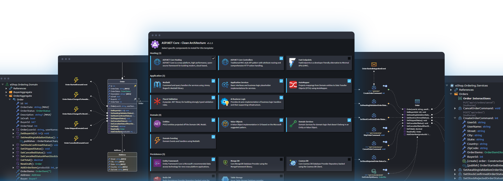

# Introduction to Intent Architect

Intent Architect is the first architecture-centric code automation platform for professional .NET developers.

It’s the platform leading .NET teams use to deliver 10X faster, standardize flawlessly at scale, and maintain systems with ease – using their preferred tech stack, IDE and LLM.

It combines cutting-edge code generation systems, such as Pattern Reuse and your favorite LLM, to continuously generate clean, production-ready code driven by your architectural intention and approved design — so your code stays standardized, consistent, and easy to maintain.

---

## Getting started

<ul class="cards-grid cards-3">
  <li>
    

      
<svg class="landing-svg" viewBox="0 0 24 24">
  <path d="M19 18a3.5 3.5 0 0 0 0 -7h-1a5 4.5 0 0 0 -11 -2a4.6 4.4 0 0 0 -2.1 8.4" />
  <path d="M12 13l0 9" />
  <path d="M9 19l3 3l3 -3" />
</svg>
      
      

        <strong class="card-title">Get Intent Architect</strong>
        
Download and install the latest Intent Architect for your environment.

      

      
    

  </li>
  <li>
    

      
<svg class="landing-svg" viewBox="0 0 24 24">
  <path d="M4 13a8 8 0 0 1 7 7a6 6 0 0 0 3 -5a9 9 0 0 0 6 -8a3 3 0 0 0 -3 -3a9 9 0 0 0 -8 6a6 6 0 0 0 -5 3" />
  <path d="M7 14a6 6 0 0 0 -3 6a6 6 0 0 0 6 -3" />
  <path d="M15 9m-1 0a1 1 0 1 0 2 0a1 1 0 1 0 -2 0" />
</svg>
      
      

        <strong class="card-title">Quick Start</strong>
        
Generate a working .NET solution in minutes and learn the core workflow.

      

      
    

  </li>
  <li>
    

      
<svg class="landing-svg" viewBox="0 0 24 24">
  <path d="M5 4m0 1a1 1 0 0 1 1 -1h2a1 1 0 0 1 1 1v14a1 1 0 0 1 -1 1h-2a1 1 0 0 1 -1 -1z" />
  <path d="M9 4m0 1a1 1 0 0 1 1 -1h2a1 1 0 0 1 1 1v14a1 1 0 0 1 -1 1h-2a1 1 0 0 1 -1 -1z" />
  <path d="M5 8h4" />
  <path d="M9 16h4" />
  <path d="M13.803 4.56l2.184 -.53c.562 -.135 1.133 .19 1.282 .732l3.695 13.418a1.02 1.02 0 0 1 -.634 1.219l-.133 .041l-2.184 .53c-.562 .135 -1.133 -.19 -1.282 -.732l-3.695 -13.418a1.02 1.02 0 0 1 .634 -1.219l.133 -.041z" />
  <path d="M14 9l4 -1" />
  <path d="M16 16l3.923 -.98" />
</svg>
      
      

        <strong class="card-title">Tutorials</strong>
        
Hands-on guides to learn the fundamentals and more.

      

      
    

  </li>
</ul>

---

## How It Works

<ul class="cards-grid cards-2x2">
  <li>
    

      
<svg class="landing-svg" viewBox="0 0 24 24">
  <path d="M11.933 5h-6.933v16h13v-8" />
  <path d="M14 17h-5" />
  <path d="M9 13h5v-4h-5z" />
  <path d="M15 5v-2" />
  <path d="M18 6l2 -2" />
  <path d="M19 9h2" />
</svg>
      
<!--      🧩-->
      

        <strong class="card-title">Visual Modeling</strong>
        
Design your systems visually. Intuitive designers make complex architectures easy to understand, turning models into living blueprints that help teams collaborate, validate, and evolve applications with confidence.

      

      
    

  </li>
  <li>
    

      
<svg class="landing-svg" viewBox="0 0 24 24">
  <path d="M20 11a8.1 8.1 0 0 0 -6.986 -6.918a8.095 8.095 0 0 0 -8.019 3.918" />
  <path d="M4 13a8.1 8.1 0 0 0 15 3" />
  <path d="M19 16m-1 0a1 1 0 1 0 2 0a1 1 0 1 0 -2 0" />
  <path d="M5 8m-1 0a1 1 0 1 0 2 0a1 1 0 1 0 -2 0" />
  <path d="M12 12m-3 0a3 3 0 1 0 6 0a3 3 0 1 0 -6 0" />
</svg>
      
      

        <strong class="card-title">Pattern-Based Code Generation</strong>
        
Pattern-based code generation automates the predictable parts of your system, up to 85% of your codebase. Each pattern applies proven practices, ensuring code is clean, consistent, and production-ready.

      

      
    

  </li>
  <li>
    

      
<svg class="landing-svg" viewBox="0 0 24 24">
  <path d="M6 4m0 2a2 2 0 0 1 2 -2h8a2 2 0 0 1 2 2v4a2 2 0 0 1 -2 2h-8a2 2 0 0 1 -2 -2z" />
  <path d="M12 2v2" />
  <path d="M9 12v9" />
  <path d="M15 12v9" />
  <path d="M5 16l4 -2" />
  <path d="M15 14l4 2" />
  <path d="M9 18h6" />
  <path d="M10 8v.01" />
  <path d="M14 8v.01" />
</svg>
      
      

        <strong class="card-title">AI-Assisted Code Generation</strong>
        
Intent Architect includes AI accelerators that automate parts of development which can't be predefined. Performing all the necessary context engineering automatically, Intent Architect integrates with LLMs providing a prompt-less, predictable AI experience.

      

      
    

  </li>
  <li>
    

      
<svg class="landing-svg" viewBox="0 0 24 24">
  <path d="M12.5 16h-8.5a1 1 0 0 1 -1 -1v-10a1 1 0 0 1 1 -1h16a1 1 0 0 1 1 1v8" />
  <path d="M7 20h4" />
  <path d="M9 16v4" />
  <path d="M20 21l2 -2l-2 -2" />
  <path d="M17 17l-2 2l2 2" />
</svg>
      
      

        <strong class="card-title">Codebase Integration</strong>
        
Intent Architect works side-by-side with your existing IDE, continuously integrating your design into your codebase, via a review process. Advanced Code Integration systems keep developers in control of the code, with full transparency. 

      

      
    

  </li>
<!--  <li>
    

      
<svg class="landing-svg" viewBox="0 0 24 24">
  <path d="M4 4m0 1a1 1 0 0 1 1 -1h4a1 1 0 0 1 1 1v4a1 1 0 0 1 -1 1h-4a1 1 0 0 1 -1 -1z" />
  <path d="M4 14m0 1a1 1 0 0 1 1 -1h4a1 1 0 0 1 1 1v4a1 1 0 0 1 -1 1h-4a1 1 0 0 1 -1 -1z" />
  <path d="M14 14m0 1a1 1 0 0 1 1 -1h4a1 1 0 0 1 1 1v4a1 1 0 0 1 -1 1h-4a1 1 0 0 1 -1 -1z" />
  <path d="M14 7l6 0" />
  <path d="M17 4l0 6" />
</svg>
      
      

        <strong class="card-title">Extensible Platform</strong>
        
Intent Architect is fully modular. Every behavior,  from code generation to design tooling, is driven by open-source modules. Build your own or extend ours to automate your proprietary patterns, endlessly customizable, entirely under your control.

      

      
    

  </li>-->
</ul>

---

## Watch a demo

<iframe src="https://intentarchitect.com/#/redirect/?category=docs-embedded&subCategory=intro-and-demo" title="Video" allowfullscreen></iframe>

If you're new to Intent Architect, the best way to understand the platform is to watch a demo. Watch this recent webinar where Gareth Baars — founder of Intent Architect — walks you through how to build enterprise-grade C# / .NET applications in a fraction of the time with Intent Architect.

What's covered in this demo:

- What is "Pattern Reuse" actually?
- A comprehensive introduction & demo of the platform, Intent Architect
- Building a working, high-quality .NET application in minutes following a Clean Architecture
- A sneak peek at how Intent Architect can leverage generative-AI to push productivity even further.

---

## Next Steps

- Continue to **[Get Intent Architect](xref:getting-started.get-the-application)**
- Jump to **[Quick start](xref:introducing.quickstart)**
- Explore **[Tutorials](xref:tutorials.fundamentals-landing-page)**

