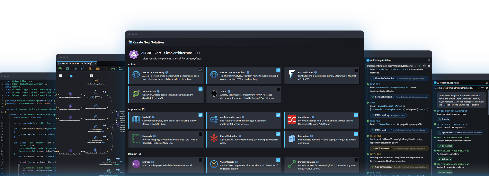

# Introduction to Intent Architect

Intent Architect is the first architecture-centric AI code automation platform for .NET developers.

It’s the platform that delivers AI-driven development speed, with built-in guardrails and uncompromised quality, at any scale.

It brings design and architectural visibility to your software development processes and unlocks a single cohesive workflow to go from specification to production-ready code up to 10X faster. Architectural adherence enforced by default. Technical and cognitive debt minimized by design.

---

## Getting started

<ul class="cards-grid cards-3">
  <li>
    

      
<svg class="landing-svg" viewBox="0 0 24 24">
  <defs><linearGradient id="grad-get" x1="0" y1="0" x2="0" y2="1"><stop offset="0%" stop-color="#09C4FF"/><stop offset="100%" stop-color="#0070C0"/></linearGradient></defs>
  <path stroke="url(#grad-get)" fill="none" stroke-width="1.5" stroke-linecap="round" stroke-linejoin="round" d="M12 3v12"/>
  <path stroke="url(#grad-get)" fill="none" stroke-width="1.5" stroke-linecap="round" stroke-linejoin="round" d="M8 11l4 4 4-4"/>
  <path stroke="url(#grad-get)" fill="none" stroke-width="1.5" stroke-linecap="round" stroke-linejoin="round" d="M4 17v1a2 2 0 0 0 2 2h12a2 2 0 0 0 2-2v-1"/>
</svg>
      
      

        <strong class="card-title">Get Intent Architect</strong>
        
Download and install the latest Intent Architect for your environment.

      

      
    

  </li>
  <li>
    

      
<svg class="landing-svg" viewBox="0 0 24 24">
  <defs><linearGradient id="grad-qs" x1="0" y1="0" x2="0" y2="1"><stop offset="0%" stop-color="#09C4FF"/><stop offset="100%" stop-color="#0070C0"/></linearGradient></defs>
  <path stroke="url(#grad-qs)" fill="none" stroke-width="1.5" stroke-linecap="round" stroke-linejoin="round" d="M13 3L4 14h7l-1 7 9-11h-7l1-7z"/>
</svg>
      
      

        <strong class="card-title">Quick Start</strong>
        
Generate a working .NET solution in minutes and learn the core workflow.

      

      
    

  </li>
  <li>
    

      
<svg class="landing-svg" viewBox="0 0 24 24">
  <defs><linearGradient id="grad-tut" x1="0" y1="0" x2="0" y2="1"><stop offset="0%" stop-color="#09C4FF"/><stop offset="100%" stop-color="#0070C0"/></linearGradient></defs>
  <path stroke="url(#grad-tut)" fill="none" stroke-width="1.5" stroke-linecap="round" stroke-linejoin="round" d="M3 19a9 9 0 0 1 9 0 9 9 0 0 1 9 0M3 6a9 9 0 0 1 9 0 9 9 0 0 1 9 0M3 6v13M12 6v13M21 6v13"/>
</svg>
      
      

        <strong class="card-title">Tutorials</strong>
        
Hands-on guides to learn the fundamentals and more.

      

      
    

  </li>
</ul>

---

## Key Concepts

<ul class="cards-grid cards-2x2">
  <li>
    

      
<svg class="landing-svg" viewBox="0 0 24 24">
  <defs><linearGradient id="grad-vdt" x1="0" y1="0" x2="0" y2="1"><stop offset="0%" stop-color="#09C4FF"/><stop offset="100%" stop-color="#0070C0"/></linearGradient></defs>
  <rect x="2" y="3" width="8" height="5" rx="1" stroke="url(#grad-vdt)" fill="none" stroke-width="1.5"/>
  <rect x="14" y="3" width="8" height="5" rx="1" stroke="url(#grad-vdt)" fill="none" stroke-width="1.5"/>
  <rect x="8" y="16" width="8" height="5" rx="1" stroke="url(#grad-vdt)" fill="none" stroke-width="1.5"/>
  <path stroke="url(#grad-vdt)" fill="none" stroke-width="1.5" stroke-linecap="round" d="M6 8v4h12V8M12 12v4"/>
</svg>
      
<!--      🧩-->
      

        <strong class="card-title">Visual Design Tools</strong>
        
Software development is going visual. Intent Architect's visual design tools let you create living blueprints of your system that realize directly as code, creating a powerful context engine to minimize technical and cognitive debt by design.

      

      
    

  </li>
  <li>
    

      
<svg class="landing-svg" viewBox="0 0 24 24">
  <defs><linearGradient id="grad-ae" x1="0" y1="0" x2="0" y2="1"><stop offset="0%" stop-color="#09C4FF"/><stop offset="100%" stop-color="#0070C0"/></linearGradient></defs>
  <path stroke="url(#grad-ae)" fill="none" stroke-width="1.5" stroke-linecap="round" stroke-linejoin="round" d="M12 2l9 4.5-9 4.5-9-4.5 9-4.5z"/>
  <path stroke="url(#grad-ae)" fill="none" stroke-width="1.5" stroke-linecap="round" stroke-linejoin="round" d="M3 11l9 4.5 9-4.5"/>
  <path stroke="url(#grad-ae)" fill="none" stroke-width="1.5" stroke-linecap="round" stroke-linejoin="round" d="M3 16l9 4.5 9-4.5"/>
</svg>
      
      

        <strong class="card-title">Architecture Enforcement</strong>
        
Guaranteed consistency and standardization, by default. Deterministic architecture enforcement systems provide strong guardrails, ensuring a consistent implementation of your design and architecture at any scale, with zero drift.

      

      
    

  </li>
  <li>
    

      
<svg class="landing-svg" xmlns="http://www.w3.org/2000/svg" viewBox="0 0 41.81 41.81">
  <defs>
    
    <linearGradient id="ai25-g0" x1="13.09" y1="24.39" x2="13.09" y2="7.98" gradientTransform="translate(0 44.5) scale(1 -1)" gradientUnits="userSpaceOnUse"><stop offset="0" stop-color="#09c4ff"/><stop offset="1" stop-color="#0070c0"/></linearGradient>
    <linearGradient id="ai25-g1" x1="15.07" y1="20.94" x2="24.84" y2="4.77" gradientTransform="translate(0 44.5) scale(1 -1)" gradientUnits="userSpaceOnUse"><stop offset="0" stop-color="#09c4ff"/><stop offset="1" stop-color="#0070c0"/></linearGradient>
    <linearGradient id="ai25-g2" x1="20.11" y1="15.68" x2="36.52" y2="15.68" gradientTransform="translate(0 44.5) scale(1 -1)" gradientUnits="userSpaceOnUse"><stop offset="0" stop-color="#09c4ff"/><stop offset="1" stop-color="#0070c0"/></linearGradient>
    <linearGradient id="ai25-g3" x1="26.05" y1="17.34" x2="42.46" y2="33.75" gradientTransform="translate(0 44.5) scale(1 -1)" gradientUnits="userSpaceOnUse"><stop offset="0" stop-color="#09c4ff"/><stop offset="1" stop-color="#0070c0"/></linearGradient>
    <linearGradient id="ai25-g4" x1="28.82" y1="22.8" x2="28.82" y2="39.22" gradientTransform="translate(0 44.5) scale(1 -1)" gradientUnits="userSpaceOnUse"><stop offset="0" stop-color="#09c4ff"/><stop offset="1" stop-color="#0070c0"/></linearGradient>
    <linearGradient id="ai25-g5" x1="27.16" y1="28.73" x2="10.75" y2="45.14" gradientTransform="translate(0 44.5) scale(1 -1)" gradientUnits="userSpaceOnUse"><stop offset="0" stop-color="#09c4ff"/><stop offset="1" stop-color="#0070c0"/></linearGradient>
    <linearGradient id="ai25-g6" x1="21.7" y1="31.41" x2="5.28" y2="31.41" gradientTransform="translate(0 44.5) scale(1 -1)" gradientUnits="userSpaceOnUse"><stop offset="0" stop-color="#09c4ff"/><stop offset="1" stop-color="#0070c0"/></linearGradient>
    <linearGradient id="ai25-g7" x1="15.82" y1="29.81" x2="-.59" y2="13.4" gradientTransform="translate(0 44.5) scale(1 -1)" gradientUnits="userSpaceOnUse"><stop offset="0" stop-color="#09c4ff"/><stop offset="1" stop-color="#0070c0"/></linearGradient>
  </defs>
  <path class="ai25-f" d="M22.78,22.78c0-.38.38,3.94-1.6,7.13-1.88,3.19-4.32,4.22-8.16,5.07-2.16.47-3.47,0-5.07-.56-2.35-.75-3.57-2.72-3.94-3.19s-.84-1.97-.56-3.38c.56-2.35,2.16-3.57,4.22-4.03.38,0,2.35-.56,4.03.38s2.35,1.6,3.94,1.97c1.6.47,3.19,0,3.94-.38,1.69-.66,3-2.53,3.19-3.19,0,0,0,.19,0,.19Z"/>
  <path class="ai25-a" d="M23.44,20.91c-.28-.28,3,2.53,3.94,6.19.94,3.66.19,6.19-2.16,9.48-1.31,1.78-2.44,2.53-3.94,3.28-2.25,1.13-4.41.56-5.07.56s-1.97-.75-2.81-1.97c-1.22-1.97-1.03-3.94,0-5.91.28-.28,1.22-1.97,3.1-2.63,1.88-.56,2.81-.56,4.13-1.41s2.25-2.25,2.53-3c.75-1.69.38-3.94,0-4.5l.28-.09Z"/>
  <path class="ai25-c" d="M22.78,19.12c-.38,0,3.94-.38,7.13,1.6,3.19,1.88,4.5,4.22,5.07,8.16.38,2.16,0,3.47-.56,5.07-.75,2.35-2.72,3.57-3.19,3.94s-1.97.84-3.38.56c-2.35-.56-3.57-2.16-4.03-4.22,0-.38-.56-2.35.38-4.03s1.6-2.35,1.97-3.94,0-3.19-.38-3.94c-.66-1.69-2.53-3-3.19-3.19,0,0,.19,0,.19,0Z"/>
  <path class="ai25-g" d="M20.91,18.47c-.28.28,2.53-3,6.19-3.94,3.66-.94,6.19-.19,9.48,2.16,1.78,1.31,2.53,2.44,3.28,3.94,1.13,2.25.56,4.41.56,5.07s-.75,1.97-1.97,2.81c-1.97,1.22-3.94,1.03-5.91,0-.28-.28-1.97-1.22-2.63-3.1s-.56-2.81-1.41-4.13-2.25-2.25-3-2.53c-1.69-.75-3.94-.38-4.5,0l-.09-.28Z"/>
  <path class="ai25-d" d="M19.12,19.12c0,.38-.38-3.94,1.6-7.13s4.22-4.5,8.16-5.07c2.16-.38,3.47,0,5.07.56,2.35.75,3.57,2.72,3.94,3.19s.84,1.97.56,3.38c-.56,2.35-2.16,3.57-4.22,4.03-.38,0-2.35.56-4.03-.38s-2.35-1.6-3.94-1.97-3.19,0-3.94.38c-1.69.66-3,2.53-3.19,3.19,0,0,0-.19,0-.19Z"/>
  <path class="ai25-b" d="M18.47,20.91c.28.28-3-2.53-3.94-6.19-.84-3.66-.19-6.19,2.16-9.48,1.31-1.78,2.44-2.53,3.94-3.28,2.25-1.13,4.41-.56,5.07-.56s1.97.75,2.81,1.97c1.22,1.97,1.03,3.94,0,5.91-.28.28-1.22,1.97-3.1,2.63s-2.81.56-4.13,1.41c-1.41.84-2.25,2.25-2.53,3-.75,1.69-.38,3.94,0,4.5l-.28.09Z"/>
  <path class="ai25-h" d="M19.12,22.78c.38,0-3.94.38-7.13-1.6s-4.5-4.22-5.07-8.16c-.38-2.16,0-3.47.56-5.07.75-2.35,2.72-3.57,3.19-3.94s1.97-.84,3.38-.56c2.35.56,3.57,2.16,4.03,4.22,0,.38.56,2.35-.38,4.03s-1.6,2.35-1.97,3.94c-.47,1.6,0,3.19.38,3.94.66,1.69,2.53,3,3.19,3.19h-.19Z"/>
  <path class="ai25-e" d="M20.91,23.44c.28-.28-2.53,3-6.19,3.94-3.66.84-6.19.19-9.48-2.16-1.78-1.31-2.53-2.44-3.28-3.94-1.13-2.25-.56-4.41-.56-5.07s.75-1.97,1.97-2.81c1.97-1.22,3.94-1.03,5.91,0,.28.28,1.97,1.22,2.63,3.1.56,1.88.56,2.81,1.41,4.13.84,1.41,2.25,2.25,3,2.53,1.69.75,3.94.38,4.5,0l.09.28Z"/>
</svg>
      
      

        <strong class="card-title">AI Agents</strong>
        
Maximize the power of AI-driven development at scale. Intent Architect's customizable context engineering systems ensure your agents execute accurately and in full conformance with your design and architecture, out-the-box. No complex setup. Just focused AI.

      

      
    

  </li>
  <li>
    

      
<svg class="landing-svg" viewBox="0 0 24 24">
  <defs><linearGradient id="grad-cc" x1="0" y1="0" x2="0" y2="1"><stop offset="0%" stop-color="#09C4FF"/><stop offset="100%" stop-color="#0070C0"/></linearGradient></defs>
  <path stroke="url(#grad-cc)" fill="none" stroke-width="1.5" stroke-linecap="round" stroke-linejoin="round" d="M7 8l-4 4 4 4M17 8l4 4-4 4M14 4l-4 16"/>
</svg>
      
      

        <strong class="card-title">Codebase Control</strong>
        
Intent Architect works in an integrated way with your existing IDE, continuously realizing your design as code through a transparent review process. Developers stay in full control, with complete visibility and the freedom to customize any generated code.

      

      
    

  </li>
<!--  <li>
    

      
<svg class="landing-svg" viewBox="0 0 24 24">
  <path d="M4 4m0 1a1 1 0 0 1 1 -1h4a1 1 0 0 1 1 1v4a1 1 0 0 1 -1 1h-4a1 1 0 0 1 -1 -1z" />
  <path d="M4 14m0 1a1 1 0 0 1 1 -1h4a1 1 0 0 1 1 1v4a1 1 0 0 1 -1 1h-4a1 1 0 0 1 -1 -1z" />
  <path d="M14 14m0 1a1 1 0 0 1 1 -1h4a1 1 0 0 1 1 1v4a1 1 0 0 1 -1 1h-4a1 1 0 0 1 -1 -1z" />
  <path d="M14 7l6 0" />
  <path d="M17 4l0 6" />
</svg>
      
      

        <strong class="card-title">Extensible Platform</strong>
        
Intent Architect is fully modular. Every behavior,  from code generation to design tooling, is driven by open-source modules. Build your own or extend ours to automate your proprietary patterns, endlessly customizable, entirely under your control.

      

      
    

  </li>-->
</ul>

---

## Watch a demo of the latest features

<iframe src="https://www.youtube.com/embed/vlEwOM8nRXo?si=QOiR0tkncDYgKxEh&rel=0" title="Video" allowfullscreen></iframe>

Watch the Intent Architect version 5.0 new features demo, a focused walkthrough of what's new in perhaps the most significant release in recent years. Gareth Baars, founder of Intent Architect, walks you through the upgraded AI-powered capabilities that bring visual modeling, deterministic generation, and customizable coding agents together in one platform.

What's covered in this demo:

- AI Coding Agents in the Software Factory, automatically implementing code within the guardrails of your architecture and design.
- A full upgrade to the AI Modeling Assistant, with file attachments, conversation history, and tool-call visualization.
- The Intent Architect MCP Server, letting external AI tools drive Intent Architect directly.
- The integrated Terminal & Tasks system with automatic AI error fixing.
- A world-class Software Factory experience with a redesigned UI and per-file control.

---

## Next Steps

- Continue to **[Get Intent Architect](xref:getting-started.get-the-application)**
- Jump to **[Quick start](xref:introducing.quickstart)**
- Explore **[Tutorials](xref:tutorials.fundamentals-landing-page)**

