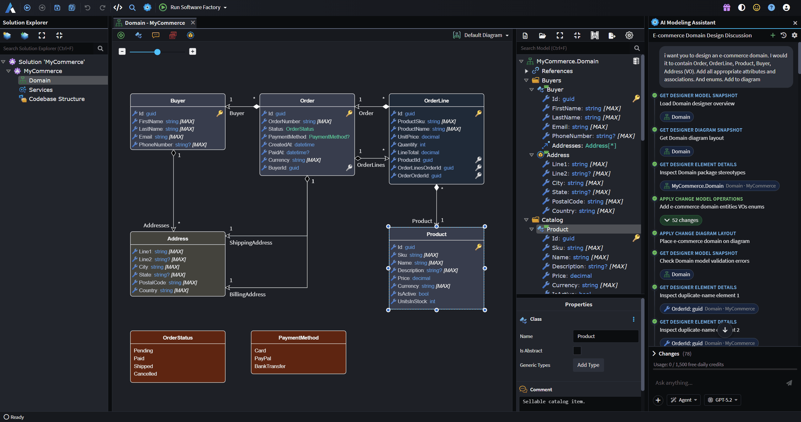

# AI Agents

Intent Architect brings AI agents into two distinct contexts: modeling and coding. Together, they allow teams to go from business requirements to visual designs to working, production-ready code – with developers focused on engineering decisions and AI agents handling implementation.

The platform pre-engineers relevant context for the agents automatically, ensuring they execute accurately and in full conformance with your design and architecture – without complex setup or excessive prompting.

The deterministic architecture enforcement system guarantees consistency across your codebase by design, while customizable AI agents take care of the rest – fully automated, developer-augmented, or manually driven – using your LLM of choice, but always within the same strong guardrails.

---

## Key benefits

- **🚀 End-to-end automation**  
  Modeling agents handle design, coding agents handle implementation – together covering the full development cycle from concept to code.

- **🧠 Sophisticated, customizable context engine**  
  Intent Architect's context engineering is fully customizable to your domain and coding standards, and pre-engineered by default to ensure adherence to your visually defined design and architecture.

- **🤖 Fully customizable agents**  
  Author your own agents, connect your preferred LLM, and tailor agent behavior to your specific needs.

- **🔌 MCP Server for External AI Control**  
  The Intent MCP Server allows for a flexible tooling configuration. This means external AI coding tools, like Claude Code, GitHub Copilot etc., can also drive Intent Architect directly to manage your design and architecture visually.

---

## The Golden Path

The ultimate goal of Intent Architect is a development workflow where the developer can focus almost entirely on engineering and design decisions, and the platform takes care of the rest.

Intent Architect's AI agents make this possible in two ways. Modeling agents operate inside the visual designers, helping you translate requirements into comprehensive system designs, faster and more accurately than working manually (all model changes are made in memory and never saved without your explicit approval). And coding agents are built into the Software Factory Execution. So, while the deterministic architecture enforcement system rolls out the architecture, infrastructure and boilerplate to guarantee consistency at scale, coding agents can take care of all the rest, even in one go.

In practice, the workflow looks like this: describe your system's design visually with AI, run the Software Factory Execution, run the coding agents, and out the other side comes working, production-ready software. Perfectly architected, consistent, and built to your standards – at any scale.

 

---

## Context Engineering

The accuracy of Intent Architect's AI agents comes down to context and guardrails. Intent Architect derives this context directly from your structured visual models, giving agents precise knowledge of your design intent – automatically.

Behind every coding agent is a customizable and sophisticated context engineering system that determines exactly which code files, architecture descriptions, use case intentions, and Skills are relevant for each task. Agents also have full support for standard context files your team is already using – CLAUDE.md, AGENTS.md, copilot-instructions.md and others, as well as Instruction Files – so your existing conventions, standards and workflows are respected automatically.

The result is AI that executes accurately and in full conformance with your design and architecture – without excessive manual context setup or prompting.

 

---

## Custom Agents and Slash Commands

For teams that want to go further, Intent Architect supports fully custom agents. Authored as .agent.md markdown files, custom agents can be tailored to your domain, technology stack, or proprietary coding standards – and configured to appear in either the modeling or coding context.

Slash commands make it easy to switch between agents and invoke skills directly from the chat interface, consistent with how modern AI development harnesses work. Skills can also be installed automatically via Intent Architect modules, dropping into your preferred AI folder (.claude, .github, .agents, etc.).

---

## The Intent MCP Server

The Intent MCP Server gives teams complete flexibility in how they configure their AI tooling. Use Intent Architect's integrated agents, your own external AI coding tools, or any combination of both – all while keeping your design and architecture managed centrally and visually in Intent Architect.

This means teams can use whichever tools suit them best, without conflicts between external agents and Intent Architect-managed code.

Details on how to configure the Intent MCP can be found in the AI Configuration dialog (xref:ai.configuration).

---

## Choose your AI

Intent Architect is designed to work with the AI providers and models your team already uses. Connect to OpenAI, Azure OpenAI, Anthropic, or other compatible providers directly from the AI Configuration dialog – which also walks you through setting up the Intent MCP Server and any additional MCP servers your agents can use.

AI agents are pre-configured to work well for most use cases, with the flexibility to customize context engineering and agent behavior for specialized domains or proprietary coding styles.

---

## Learn more

- **[Visual Design Tools](xref:key-concepts.visual-modeling)**
- **[Architecture Enforcement](xref:key-concepts.deterministic-codegen)**
- **[Codebase Control](xref:key-concepts.codebase-integration)**
