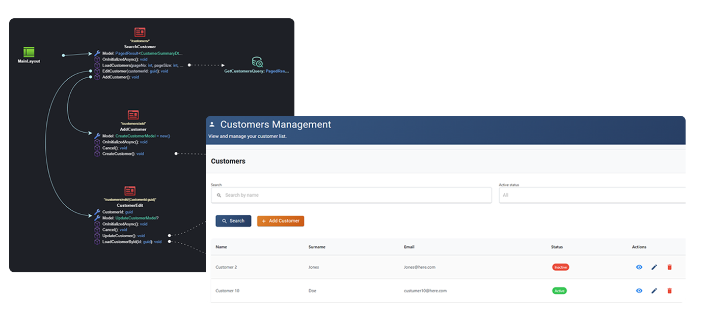

# AI Agents

Intent Architect brings AI agents into two distinct contexts: modeling and coding. Together, they allow teams to go from business requirements to visual designs to working, production-ready code – with developers doing the engineering and AI agents doing the heavy lifting.

The platform can pre-engineer all the context for the agents automatically, ensuring they execute accurately and in full conformance with your design and architecture, out-the-box. No complex context engineering setup. No excessive prompting.

The deterministic architecture enforcement system guarantees consistency across your codebase by design, while customizable AI agents take care of the rest – fully automated, developer-augmented, or manually driven – using your LLM of choice, but always within the same strong guardrails.

---

## Key benefits

- **⚙️ Non-Deterministic code automation**  
  Use AI to generate complex logic or creative code that traditional pattern-based automation can’t predict.

- **🧠 Promptless, predictable AI experience**  
  Intent Architect automatically constructs detailed prompts from your architectural model, turning AI coding into a repeatable, deterministic process.

- **🛡️ Developer-in-control workflows**  
  Every AI-generated suggestion appears as a code diff, ensuring complete transparency and safety before applying.

- **🔄 Choose your AI**  
  Integrate with your preferred model(s), OpenAI, Azure OpenAI, Anthropic, or others.

---

## AI accelerators: context-aware Generation

Intent Architect includes several AI Accelerators, guided actions that automate tasks such as implementing Blazor views, service logic, or unit tests.
When you run an accelerator, Intent Architect reads your design context, entities, services, dependencies, naming conventions and constructs a rich AI prompt automatically.

The LLM then receives all the information it needs to generate high-quality, consistent code aligned with your architecture.

As an example, by simply modeling a logical screen, i.e. give it basic details and connecting it up visually to the service you would want to interact with, Intent Architect is able to build professional UIs via an LLM in a promptless, predictable and repeatable fashion.

💡 You focus on goal (“Implement this service”), while Intent Architect handles the context engineering for you.

## AI with guardrails

Intent Architect performs structured context engineering, it builds detailed, repeatable prompts under the hood using your models and patterns, ensuring that the generated output is predictable and aligned with your design decisions. This transforms AI assistance from a creative experiment into a deterministic, repeatable process.

AI code generation is visualized as code diffs, ensuring developers have full transparency and control.

⚙️ Easy-to-use, deterministic AI code generation you can count on.

## Choose your AI

You can connect Intent Architect to your preferred model provider, OpenAI, Azure OpenAI, Anthropic, or others.
AI Accelerators are designed to work well out-of-the-box for most use cases (~80% coverage), but can be customized for specialized domains or proprietary coding styles.

🧠 Flexibility for experts, simplicity for everyone else.

## Learn more

- **[Visual modeling](xref:key-concepts.visual-modeling)**
- **[Pattern-based code generation](xref:key-concepts.deterministic-codegen)**
- **[Codebase integration](xref:key-concepts.codebase-integration)**
