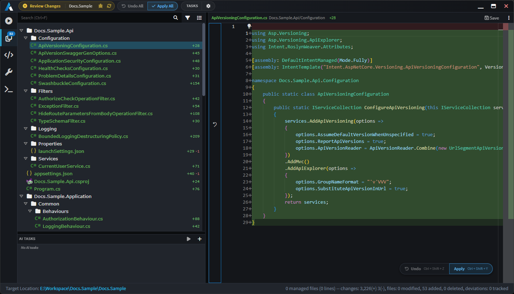
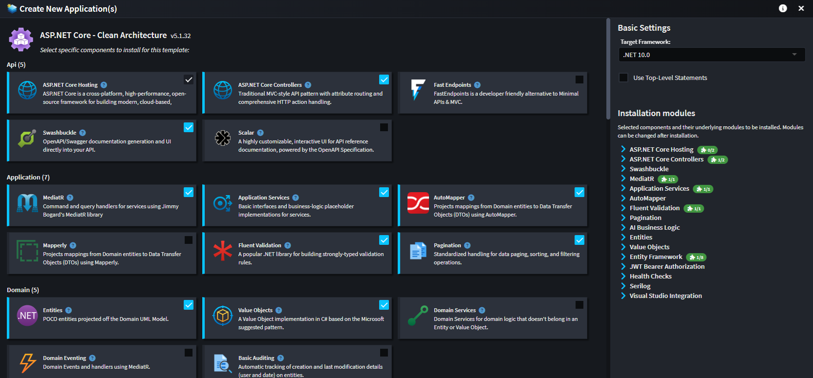

# Architecture Enforcement

Codebase standardization, consistency and architectural adherence, by default. Intent Architect's architecture enforcement system uses Modules – customizable and reusable architectural patterns – to deterministically turn your visual design intent into code, guaranteeing consistent implementation at any scale.

This is deterministic code generation: faster, 100% predictable, 100% consistent and developer-controlled – ensuring your architecture stays consistent as your system and team scale, and your codebase remains easy to maintain. It's not a black box or one-time scaffolding, it's a continuously synchronized process that evolves your architecture alongside your design. The result is strong and consistent guardrails that minimize technical debt and codebase complexity – without the need for overly complex context engineering or onerous code review processes and systems.

Because any application can be configured with a completely unique set of modules, the system accommodates all the different patterns, standards, technologies, and architectures your teams follow – at any scale.

---

## Key Benefits

- **✅ Guaranteed Consistency and Architectural Adherence, at Scale**

  Architectural and infrastructural code demands a level of precision and consistency that probabilistic generation cannot guarantee. Even small variations in how patterns are implemented across a large system compound into complexity, making the codebase harder to understand, maintain, and evolve. Intent Architect's architecture enforcement system is fully deterministic, so the code output is always consistent and as expected, with no drift and no room for interpretation – making it the best tool for the job – especially as your team and system scale.

- **🔄 System-Wide Architectural Changes in One Action**

  When an architectural pattern needs to change, whether adopting a new framework, updating a standard, or evolving a convention, updating the relevant Module propagates that change instantly across every application of that pattern throughout your entire system, consistently and without exception – helping you avoid classic legacy-system issues.

- **✏️ Seamless Customization**

  Any instance of a generated pattern can be freely customized by developers or agents at any level. The architecture enforcement system fully recognizes and respects those customizations, never overwriting them when the codebase is updated. Teams get the consistency of automation with the full flexibility to deviate where the specific context requires it. This includes the features to effectively manage these customizations across your entire system and team, so you stay in full control of architectural deviations as your system grows.

---

## Modules

Modules are the core building blocks of Intent Architect's architecture enforcement system. Each Module encodes one or more architectural patterns, translating your visual design intent into precise, consistent code. When a Module is applied, it produces the same output every time, without deviation. When a Module is updated, every instance of that pattern across your system is updated automatically.

When you run the Software Factory, it analyzes your visual design and applies your installed Modules to generate and update code across your solution, producing precisely the changes needed to bring your codebase into alignment with your design. The process is transparent, controlled, and fully deterministic.

The architecture enforcement system is particularly well-suited to managing:

- **Bootstrapping:** Microservices, Monolithic Applications, Application Modules, Identity, etc.
- **Persistence Infrastructure:** ORM Mappings, Repositories, etc.
- **Service Infrastructure:** RESTful Web Services, Data Transfer Objects, Dispatch Patterns (e.g. Mediator, Interface Dispatch), etc.
- **Eventing Infrastructure:** Events, Message Broker Configuration, Message Dispatch Infrastructure, etc.
- **Business Logic Placeholders:** Domain Entities, Service Call Handlers, Command / Query Handlers, etc.
- **Front-End Infrastructure:** Components, Service Proxies, Models, etc.
- **Workflow Design:** Workflow Infrastructure, Flow Control Systems, etc.

 

 

Intent Architect offers a library of over 100 pre-built Modules covering the most popular .NET architectural patterns and technologies, giving teams immediate access to community-tested, best-practice implementations. For teams with custom standards or specialized domains, the platform offers a powerful Module-building ecosystem, where architectural patterns can easily be authored by your architects, giving you complete control over what is automated as part of your architecture, and how it is implemented – and how it evolves.

 

---

## Non-Prescriptive by Design

Intent Architect does not impose an architecture, a framework, or a coding style. The code it manages is determined entirely by the Modules your team installs. Teams are free to design their system however suits them, automate as much or as little as they choose, and maintain full control over what is managed by the architecture enforcement systems, or what is handled by agents or by hand.

---

## No Lock-in

Intent Architect is not a framework, a runtime, or a set of libraries. It introduces no dependencies into your codebase. What it does is implement the code that realizes each architectural pattern, in exactly the way your developers or AI agents would write it, in your stack, following your conventions. This is pattern reuse, not code reuse. The knowledge of how to implement a pattern is encoded in the Module, but the output is plain, independent code that belongs entirely to your project. Teams can continue without Intent Architect at any point and the codebase is completely unaffected.

---

## Learn More

- **[Visual Design Tools](xref:key-concepts.visual-modeling)**
- **[AI Agents](xref:key-concepts.non-deterministic-codegen)**
- **[Codebase Control](xref:key-concepts.codebase-integration)**
