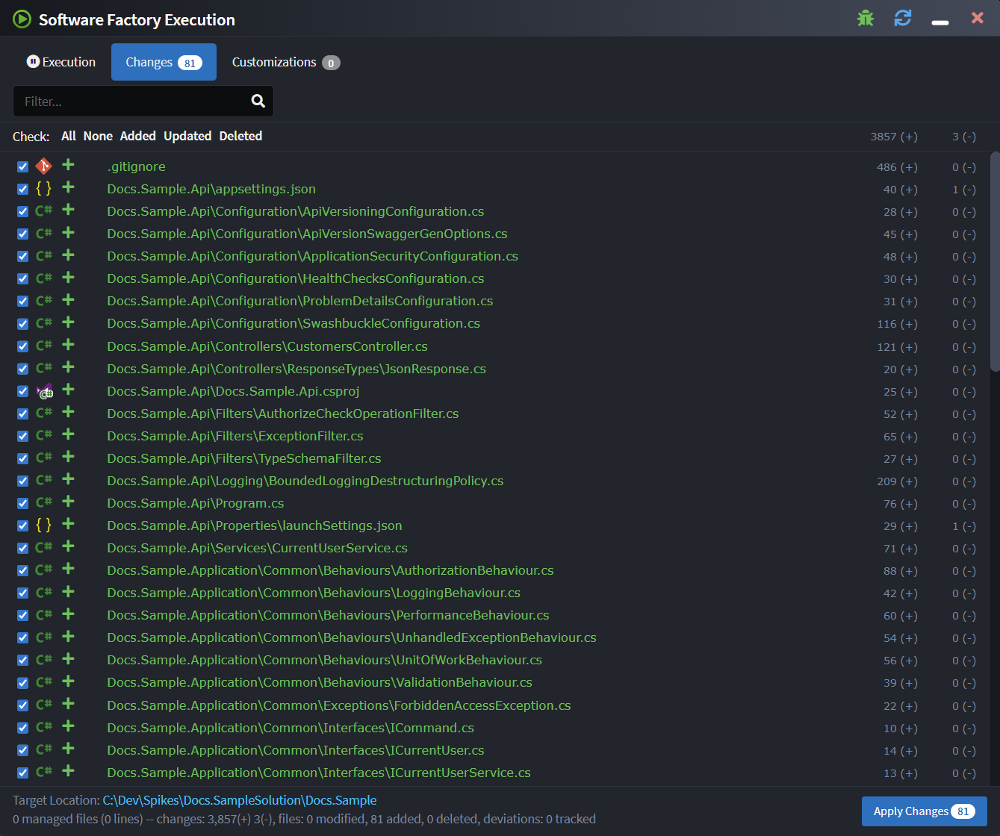
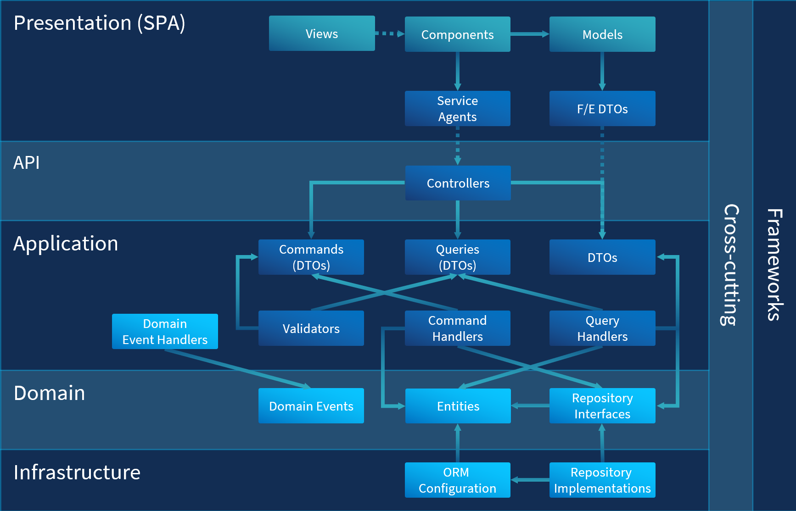
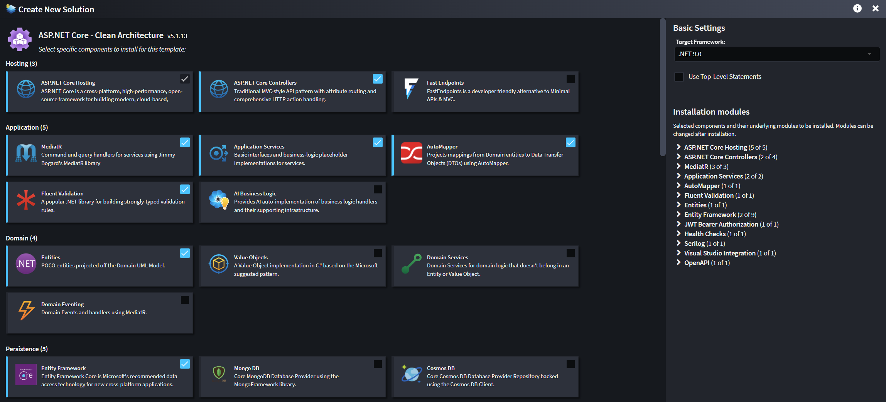

# Deterministic code generation (Pattern reuse)

Intent Architect’s **Pattern Reuse** automates the predictable parts of your system, which could represent up to 85% of your codebase. Each pattern encapsulates proven practices, from domain entities to integration messaging, or anything in between, ensuring every generated line of code is clean, consistent, and production-ready.

This is **deterministic code generation**: it's fast, predictable and developer-controlled. It’s not a black box or one-time scaffolding; it’s a continuously synchronized process that evolves your codebase alongside your architectural design. Developers remain in control, reviewing all changes before applying them.

The result is an architecture that stays consistent, extensible, and always aligned with your intent, without sacrificing flexibility or developer ownership.

---

## Key benefits

- **⚡ Faster delivery**  
  Automate up to **85% of your codebase** using pre-tested, reusable patterns, so teams can focus on meaningful business logic rather than boilerplate.

- **✅ Consistent, high-quality code**  
  Every generated file adheres to the same standards and best practices, producing clean, maintainable code by default across your solutions.

- **🔁 Agile architecture**  
  Swap frameworks, refactor layers, or evolve your architecture safely by changing configuration or modules, no rewrites required.

- **🧱 No Lock-in, It's all design time**  
  Generated code runs independently of Intent Architect. It’s your code, in your stack, written the way you would have, developer-centric, high-code, and free from lock-in.

---

## Continuous deterministic code generation

Intent Architect is ideal for automating architectural, infrastructural, and boilerplate code. Depending on the project, this type of code can make up over 85% of the codebase. Typically, the platform is used by developers to achieve the following:

- Bootstrapping - Microservices, Monolithic Applications, Application Modules, Identity, etc.
- Persistence Infrastructure - ORM Mappings, Repositories, etc.
- Service Infrastructure - RESTful Web Services, Data Transfer Objects, Dispatch Patterns (e.g. Mediator, Interface Dispatch), etc.
- Eventing Infrastructure - Events, Message Broker Configuration, Message Dispatch Infrastructure, etc.
- Business Logic Placeholders - Domain Entities, Service Call Handlers, Command / Query Handlers, etc.
- Front-End Infrastructure - Components, Service Proxies, Models, etc.
- Workflow Design - Workflow Infrastructure, Flow Control Systems, etc.

The use cases for Intent Architect really are endless. A general rule of thumb is if it can be described, it can be automated. In other words, if a developer can define a way to adequately model their design intent, they would be able to create a Module to automate that particular pattern.

💡 No boilerplate, no stale scaffolding, no surprises, just clean, consistent code that evolves with your design.

## Patterns Reuse

Software systems are made up of patterns, each instance is different, but the patterns are the same. These patterns glue the technologies to the business logic and can easily account for over 85% of a codebase. Pattern reuse is the ability to turn these patterns into artifacts that can be reused within projects and across organizations. Intent Architect's Modules serve as a collection of one or more of these artifacts and provide the mechanism to turn visual models and metadata into code.

With Intent Architect, teams can choose to build and maintain their own Modules or simply reuse modules made by other developers.

🧩 Think of architecture as the aggregation of your set of patterns.

## Non-prescriptive

Intent Architect is non-prescriptive, making it unopinionated regarding the choice of architecture, language, technologies, or even how the application's design is prescribed.

While other code generation solutions tend to generate code that works and looks in a particular way; Intent Architect is instead just a platform, and the code that is managed is determined by the particular Modules that the team has installed into any particular application.

Since Modules are typically created and managed by the architect(s) within an organization, there is no constraint on forced opt-in since the development team is completely in control of what code is managed under automation and what code they will manage by hand.

Similarly, Intent Architect does not dictate how developers design their system. Where most modelling products constrain developers to use strict UML diagrams (Class Diagrams, State Diagrams, Sequence Diagrams, etc.), Intent Architect's modelling systems are completely customizable, configurable, and extensible. Teams choose how they want to design their application and which parts of the system they want to model visually.

🛠️ Your architecture. Your patterns. Your rules.

## No lock-in

Intent Architect is not a framework or runtime platform. It does not inherently introduce any hard runtime dependencies. Because it generates and manages code (and the code is written in the same style as a developer - a key principle when creating Modules), there is no dependency on it and therefore no lock-in. Teams may choose to continue building their project without Intent Architect and all the code that was managed by Intent Architect will be no worse off than if it were originally written by hand.

🧱 The output is indistinguishable from handcrafted code, just faster, cleaner, and consistent.

## Learn more

- **[Visual modeling](xref:key-concepts.visual-modeling)**
- **[AI-Assisted code generation](xref:key-concepts.non-deterministic-codegen)**
- **[Codebase integration](xref:key-concepts.codebase-integration)**
