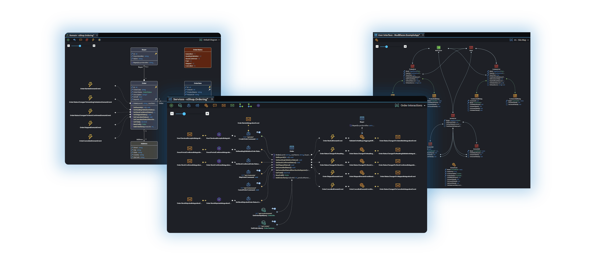

# Visual Design Tools

As developers spend less time writing code and more time architecting and engineering, software development is going visual to help us optimize our context engine and stay in control.

Intent Architect provides powerful visual designers for modeling applications, allowing you to express every layer of your system's design, from domain and services to architecture, in a way that's intuitive, precise, and always in sync with your codebase.

Visuals are a highway to the brain, and by expressing complex systems in visual formats (e.g. entity-relationship diagrams), teams can quickly interpret and reason about design and architecture that would otherwise require deep codebase immersion. Unlike static diagrams or external modeling tools, these designs are living blueprints: every change you make is reflected in the codebase, minimizing cognitive debt by design. Beyond providing visibility, they form the platform's powerful context engine, driving all AI agents and code generation systems.

With Intent Architect, you can design and reason about complex systems visually rather than reverse-engineering structure from code. It's the difference between seeing your system's design and guessing at it.

---

## Key Benefits

- **🧭 Built for how developers work today**

  As developers spend less time writing and internalizing code, Intent Architect's structured visual models bring design and architectural decisions to the forefront, from architectural patterns to domain entities and service contracts, to UI flows and integrations. Every developer and stakeholder shares a single, inspectable artifact for design review, discussion, and decision-making that is far easier for the human mind to process than code, eliminating suboptimal and inconsistent implementations, and minimizing technical and cognitive debt. When every developer and agent works from the same precise design, teams stay in control at any scale.

- **⚡ The Optimal Context Engine**

  Every model you create becomes part of the platform's context engine, a structured, always-current source of design intent that drives AI agents and deterministic architecture enforcement systems downstream.

- **📋 Reduced Cognitive Debt and Code Review Overhead**

  A visual representation of your system that is always synchronized with your codebase gives reviewers an accurate, immediate reference point. Rather than reconstructing intent from code, teams can validate changes against the design directly, reducing code review overhead and downstream resolution times significantly.

---

## The Designers

The Domain Designer lets you model your system's core entities, relationships, and data structures, the structural foundation from which your application is built. The Services Designer defines how your system behaves: use cases, contracts, and the integrations that connect your applications. The UI Designer captures user flows, screens, and data interactions from end to end.

Each designer targets a different layer of your architecture. Together, they give you a complete, structured picture of your entire system at any scale.

---

## Designing with AI

One of the most powerful ways to use the visual designers is alongside Intent Architect's AI Modeling Assistant. Rather than building designs from scratch, you describe your requirements in natural language and the AI proposes the full design within the visual environment, entities, relationships, services, and more. All changes are made in memory and never saved without your explicit approval, so you stay in full control of every design decision.

 

---

## The Context Engine

When you design in Intent Architect, every element you place, an entity, a service, a relationship, is saved as structured metadata alongside your source code. Collectively, this metadata forms the platform's context engine, a precise, always-current representation of your system's design intent.

This is what makes automation reliable at scale. AI coding agents and architecture enforcement systems all work from this same structured source of truth. Rather than inferring design intent from code, which is imprecise and incomplete, every downstream system works from the exact design decisions you have made, visually, in the designers. Your intent is never lost in translation.

---

## Living Documentation

Because designs are stored as structured metadata alongside your source code, they are always synchronized with your codebase, reflecting the current state of your system's design and architecture. New team members can explore the full system architecture visually rather than reverse-engineering it from thousands of lines of code, significantly accelerating the time it takes to contribute meaningfully.

---

## Learn More

- **[Architecture Enforcement](xref:key-concepts.deterministic-codegen)**
- **[AI Agents](xref:key-concepts.non-deterministic-codegen)**
- **[Codebase Control](xref:key-concepts.codebase-integration)**
