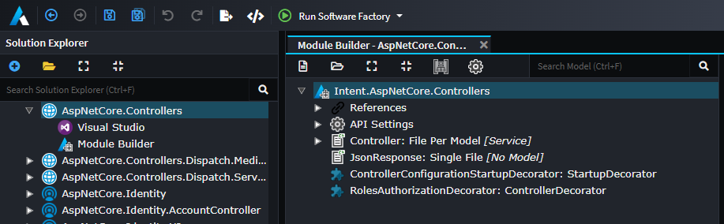

# About the Module Builder

The `Intent.ModuleBuilder` [Module](xref:application-development.applications-and-solutions.about-modules) provides a designer for modelling Intent Architect Modules along with their components such as:

- [Templates](xref:module-building.templates-csharp.about-csharp-templates)
- [Designers](xref:application-development.modelling.about-designers)
- [Designer Extensions](xref:module-building.designer-extensions.about-designer-extensions)
- [Decorators](xref:module-building.decorators.about-decorators)
- [Factory Extensions](xref:application-development.software-factory.about-software-factory-execution)
- [Stereotypes](xref:application-development.modelling.about-stereotypes)

See the following to learn more about Module Building:

- 
- 
- 
- 
- 
  