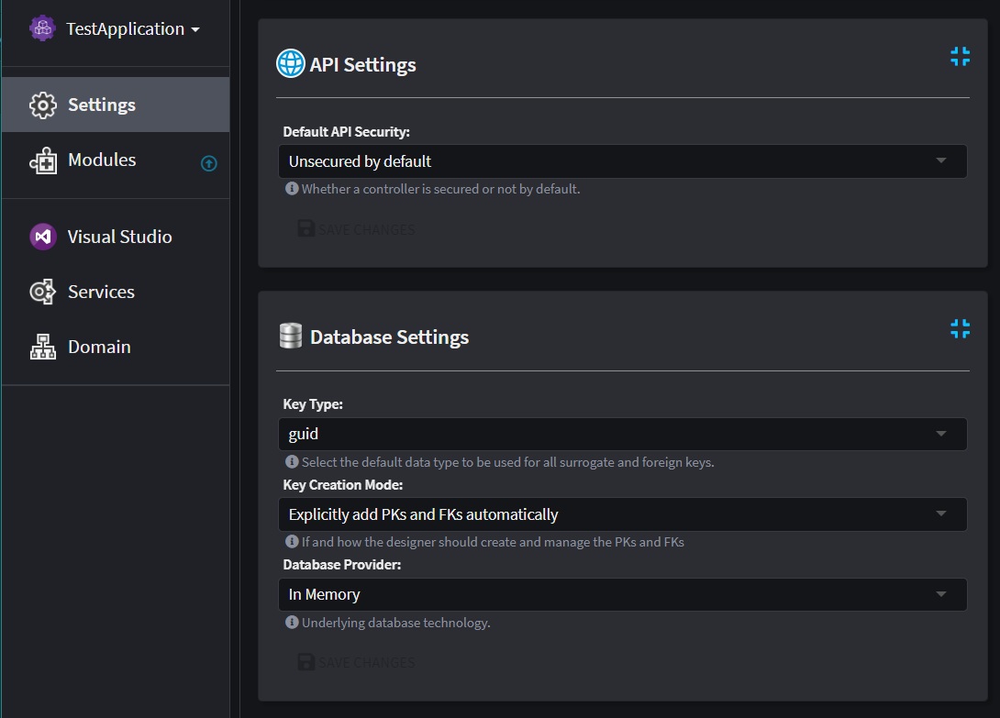

# Application Settings

Application Settings offer Modules the ability to let end-users customize certain parts and behaviors within Intent Architect. These settings can be located on the `Settings` screen within your Application. Modules can create (or extend existing) `Settings Groups` which compose of Settings that are related and can be accessed by other Modules too.



## Creating Application Settings for your Module

Open the Module Builder for your Module do the following:

- Right click on the Package element at the top of the tree-view and select `New Settings Group`.
- Give the `Settings Group` a name which will reflect on the Application Settings screen (for example `My Module Settings`).
- Add a field by right clicking on the newly created `Settings Group` and give it a name (i.e. `Enable My Setting`) and choose a Type (i.e. `Checkbox`).

## Consuming Application Settings inside your Module

Open up the Module's Visual Studio solution. The newly created Setting will have code generated inside your Module under the `Settings` folder and can be used by first accessing the `ExecutionContext.Settings` properties inside your Template code and then using the `GetMyModuleSettings()` extension method you can read the value of `Enable My Setting` by using the `EnableMySetting()` extension method.

```csharp
private bool IsMySettingEnabled()
{
    return ExecutionContext.Settings.GetMyModuleSettings().EnableMySetting();
}
```

If you want to read the same Setting inside a Factory Extension, you can use it by first accessing the supplied `application` parameter and then accessing the `Settings` property.

```csharp
protected override void OnBeforeTemplateExecution(IApplication application)
{
    var isMySettingEnabled = application.Settings.GetMyModuleSettings().EnableMySetting();
}
```