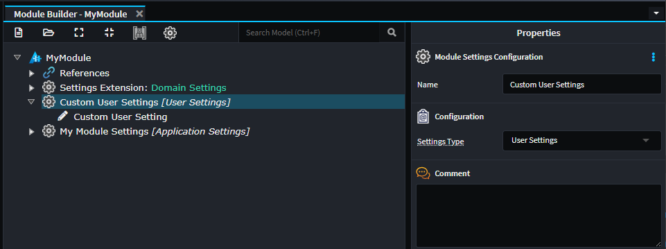
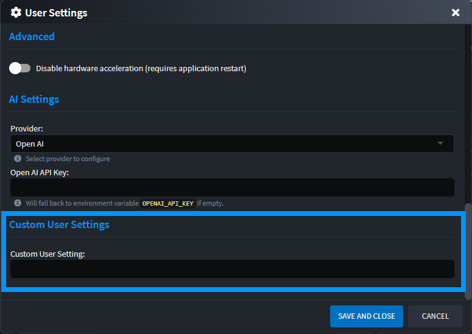

# Application Settings

Application Settings allow Modules to provide configuration options that end-users can customize within Intent Architect. These settings help enable flexible, modular behavior without requiring code changes. Settings can be accessed through the Application's context menu option `Settings`. Modules can create new `Settings Groups` (collections of related settings) or extend existing ones from other modules.


## Creating Application Settings for your Module

To create a new settings group for your module, open the Module Builder and follow these steps:

1. Right-click on the **Package** element at the top of the tree view and select `New Settings Group`.
2. Enter a name for the settings group that will appear on the Application Settings screen (for example, `My Module Settings`).
3. Right-click on the new `Settings Group` and select `Add Field`.
4. Enter a field name (for example, `Enable My Setting`) and choose a field type (for example, `Switch`).


Once the Module is installed in your target Application, the new `Settings Group` will appear on the Application's Settings screen.


> [!TIP]
> To change the icon displayed for your settings group, open the Settings page for your Module Builder application and change the module's icon.
>
> 

## Consuming Application Settings inside your Module

The generated Setting code is available in your Module's Visual Studio solution under the `Settings` folder. To use a setting in your Template code:

1. Access `ExecutionContext.Settings` in your template
2. Use the generated extension method (for example, `GetMyModuleSettings()`)
3. Call the property accessor method (for example, `EnableMySetting()`)

```csharp
private bool IsMySettingEnabled()
{
    return ExecutionContext.Settings.GetMyModuleSettings().EnableMySetting();
}
```

To read the same setting inside a Factory Extension, access it through the supplied `application` parameter:

```csharp
protected override void OnBeforeTemplateExecution(IApplication application)
{
    var isMySettingEnabled = application.Settings.GetMyModuleSettings().EnableMySetting();
}
```

## Extending an existing Module Settings Group

You can extend settings groups created by other modules. First, install the target module with the settings group you want to extend (ensure only the `Install Designer Metadata` option is checked). For example, install `Intent.Modelers.Domain`.

Then, in your Module Builder, follow these steps:

1. Right-click on the **Package** element and select `New Settings Extension`.
2. Enter a distinct name for the `Settings Extension`.
3. In the **Type** dropdown, select the `Settings Group` you want to extend (for example, `Domain Settings`).
4. Right-click on the new `Settings Extension` and select `Add Field`.
5. Enter a field name (for example, `Custom Settings Field`) and choose a field type (for example, `Switch`).
6. Optionally, fill in the **Hint** property to explain what this setting does.

Once your module is installed in an Application, your new field will be added to the selected `Settings Group`.


## User Settings

User Settings are similar to Application Settings, but they are scoped to individual users rather than the entire application. These settings persist across multiple applications and allow users to configure module behavior according to their personal preferences.

### Creating User Settings for your Module

To create a new user settings group for your module, open the Module Builder and follow these steps:

1. Right-click on the **Package** element at the top of the tree view and select `New Settings Group`.
2. Enter a name for the settings group (for example, `Custom User Settings`).
3. Right-click on the new `Settings Group` and select `Add Field`.
4. Enter a field name (for example, `Custom User Setting`) and choose a field type `Text Box`.

The difference from Application Settings is in how these are accessed and where they appear in the user interface. User Settings appear in the **User Settings** dialog, which is accessible by left-clicking on the profile icon at the top-right corner of the Intent Architect window.



Once your module is installed, these settings will appear in the **User Settings** dialog:



### Consuming User Settings inside your Module

User Settings are accessed similarly to Application Settings. In your Template code, you can read user settings by:

1. Accessing `ExecutionContext.Settings` in your template
2. Using the generated extension method (for example, `GetCustomUserSettings()`)
3. Calling the property accessor method (for example, `CustomSettingsField()`)

```csharp
private string GetUserPreference()
{
    return ExecutionContext.Settings.GetCustomUserSettings().CustomUserSetting();
}
```

To read user settings inside a Factory Extension, access them through the supplied `application` parameter:

```csharp
protected override void OnBeforeTemplateExecution(IApplication application)
{
    var customUserSetting = application.Settings.GetCustomUserSettings().CustomUserSetting();
}
```

## Related Topics

- [Application Settings in Application Templates](xref:module-building.application-templates.how-to-create-application-templates#for-module-settings)