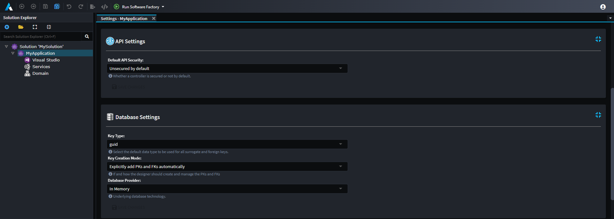

# Application Settings

Application Settings offer Modules the ability to let end-users customize certain parts and behaviors of it within Intent Architect. These Settings can be located through the Application's context menu option `Settings`. Modules can create (or extend existing) `Settings Groups` which compose of Settings that are related and can be accessed by other Modules too.



## Creating Application Settings for your Module

Open the Module Builder for your Module and do the following:

- Right click on the Package element at the top of the tree-view and select `New Settings Group`.
- Give the `Settings Group` a name which will reflect on the Application Settings screen (for example `My Module Settings`).
- Right click on the `Settings Group` and select `Add Field` and give it a name (i.e. `Enable My Setting`) and choose a Type (i.e. `Checkbox`).


Once the Module is installed in your target Application, it will introduce this `Settings Group` on the Application's Settings screen.


> [!TIP]
> You can change the icon for the Setting by setting the icon for that Module.
>
> 

## Consuming Application Settings inside your Module

Open up the Module's Visual Studio solution. The newly created Setting will have code generated inside your Module under the `Settings` folder and can be used by first accessing the `ExecutionContext.Settings` properties inside your Template code and then using the `GetMyModuleSettings()` extension method you can read the value of `Enable My Setting` by using the `EnableMySetting()` extension method.

```csharp
private bool IsMySettingEnabled()
{
    return ExecutionContext.Settings.GetMyModuleSettings().EnableMySetting();
}
```

If you want to read the same Setting inside a Factory Extension, you can use it by first accessing the supplied `application` parameter and then accessing the `Settings` property.

```csharp
protected override void OnBeforeTemplateExecution(IApplication application)
{
    var isMySettingEnabled = application.Settings.GetMyModuleSettings().EnableMySetting();
}
```

## Extending an existing Module Settings Group

Install the target Module with the `Settings Group` that you would like to extend (also ensuring the `Install Metadata only` option is checked). For example install the `Intent.Modelers.Domain` module.

Open the Module Builder for your Module and do the following:

- Right click on the Package element at the top of the tree-view and select `New Settings Extension`.
- Specify a distinct name for that `Settings Extension`.
- Choose the `Settings Group` that you would like to extend in the Type drop-down (i.e. `Domain Settings`).
- Right click on the newly created `Settings Extension` and select `Add Field`. Give it the name `Custom Settings Field` and choose the control type of `Checkbox`.
- Fill in the `Hint` property to provide information about what this setting does.

Once the Module is installed in your target Application, it will add your new field to the `Domain Settings` Group.


See also:

- [](xref:module-building.application-templates.how-to-create-application-templates#for-module-settings)